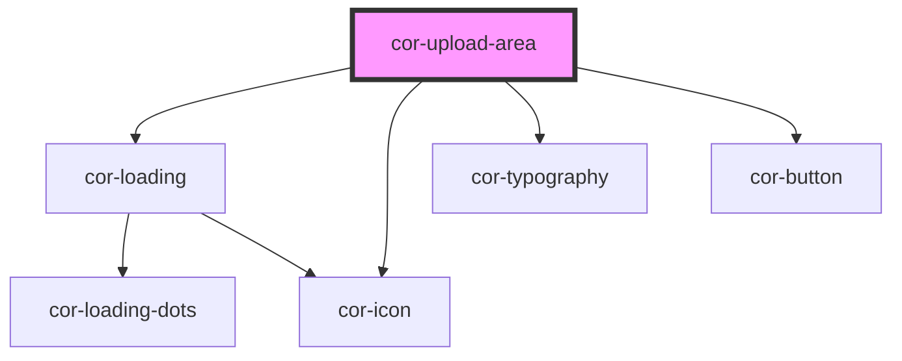

# cor-upload-area

<!-- Auto Generated Below -->

## Overview

A drag-and-drop file upload area. Event-driven and partially controlled.

The component owns: drag state, slot detection.
The consumer owns: upload progress, file status, retry logic.

## Properties

| Property          | Attribute          | Description                                                                                                                                                                                                                                                                                    | Type                                             | Default                  |
| ----------------- | ------------------ | ---------------------------------------------------------------------------------------------------------------------------------------------------------------------------------------------------------------------------------------------------------------------------------------------- | ------------------------------------------------ | ------------------------ |
| `accept`          | `accept`           | `accept` attribute forwarded to the hidden `<input type="file">`. Comma-separated list of file extensions or MIME types. Examples: '.jpg,.png,.pdf', 'image/*', 'application/pdf', 'video/*', 'audio/*', '.doc,.docx' See: https://developer.mozilla.org/en-US/docs/Web/HTML/Attributes/accept | `string`                                         | `''`                     |
| `browseLabel`     | `browse-label`     | Label for the browse button (default state).                                                                                                                                                                                                                                                   | `string`                                         | `'Browse files'`         |
| `cancelLabel`     | `cancel-label`     | Label for the cancel button (uploading state, single variant).                                                                                                                                                                                                                                 | `string`                                         | `'Cancel'`               |
| `constraints`     | --                 | Validation constraints applied during file selection and drop.                                                                                                                                                                                                                                 | `CorUploadConstraints \| undefined`              | `undefined`              |
| `generatePreview` | `generate-preview` | When `true`, generates `previewUrl` via `URL.createObjectURL` for image files.                                                                                                                                                                                                                 | `boolean`                                        | `true`                   |
| `isUploading`     | `is-uploading`     | When `true`, the drop zone switches to uploading state. For `variant='single'`: shows spinner + progress message + cancel button. For `variant='multiple'`: shows the drop zone normally; file items appear below.                                                                             | `boolean`                                        | `false`                  |
| `progress`        | `progress`         | Overall upload progress (0–100). Shown as percentage in single-upload state.                                                                                                                                                                                                                   | `number`                                         | `0`                      |
| `uploadStyle`     | `upload-style`     | Regular (tall, centered) or compact (horizontal) layout.                                                                                                                                                                                                                                       | `UploadStyle.COMPACT \| UploadStyle.REGULAR`     | `UploadStyle.REGULAR`    |
| `variant`         | `variant`          | Single or multiple file selection.                                                                                                                                                                                                                                                             | `UploadVariant.MULTIPLE \| UploadVariant.SINGLE` | `UploadVariant.MULTIPLE` |

## Events

| Event              | Description                                                                                   | Type                                         |
| ------------------ | --------------------------------------------------------------------------------------------- | -------------------------------------------- |
| `corBrowseClick`   | Emitted when the browse button is clicked.                                                    | `CustomEvent<void>`                          |
| `corCancelClick`   | Emitted when the cancel button is clicked.                                                    | `CustomEvent<void>`                          |
| `corDragEnter`     | Emitted when a drag enters the drop zone.                                                     | `CustomEvent<void>`                          |
| `corDragLeave`     | Emitted when a drag leaves the drop zone.                                                     | `CustomEvent<void>`                          |
| `corDrop`          | Emitted when files are dropped. Payload contains the raw FileList.                            | `CustomEvent<{ files: FileList; }>`          |
| `corFilesRejected` | Emitted when one or more files fail validation. Payload contains rejected files with reasons. | `CustomEvent<{ files: CorRejectedFile[]; }>` |
| `corFilesSelected` | Emitted after file validation succeeds. Payload contains accepted files.                      | `CustomEvent<{ files: CorUploadFile[]; }>`   |

## Slots

| Slot                 | Description                                                                   |
| -------------------- | ----------------------------------------------------------------------------- |
|                      | Default slot: place `cor-upload-file-item` elements here.                     |
| `"hint"`             | Secondary hint/description text.                                              |
| `"label"`            | Primary label above the hint text.                                            |
| `"progress-message"` | Text shown during single-file upload (replaces default "Files uploading..."). |

## Dependencies

### Depends on

- [cor-loading](../cor-loading)
- [cor-icon](../cor-icon)
- [cor-typography](../cor-typography)
- [cor-button](../cor-button)

### Graph

----------------------------------------------

*Built with [StencilJS](https://stenciljs.com/)*
