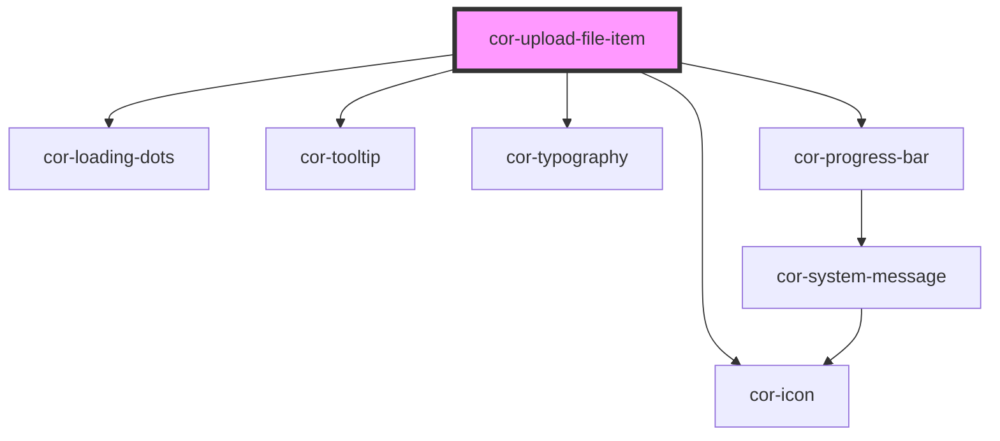

# cor-upload-file-item

<!-- Auto Generated Below -->

## Overview

A single file row component for upload state display.
Fully externally controlled via props — no internal upload logic.

Supports three states: uploading, uploaded, error.
Supports two layout modes: framed (default) and card.

## Properties

| Property       | Attribute       | Description                                                                                                                                         | Type                                                                       | Default                   |
| -------------- | --------------- | --------------------------------------------------------------------------------------------------------------------------------------------------- | -------------------------------------------------------------------------- | ------------------------- |
| `card`         | `card`          | Card mode: forces full border, adds rounded background to icon area, and positions the remove button absolutely (top-right, visible on hover only). | `boolean`                                                                  | `false`                   |
| `errorMessage` | `error-message` | Error message shown below the progress bar in error state.                                                                                          | `string`                                                                   | `''`                      |
| `fileName`     | `file-name`     | File name with extension (e.g. `Document.docx`).                                                                                                    | `string`                                                                   | `''`                      |
| `fileState`    | `file-state`    | Visual state of the file item.                                                                                                                      | `FileItemState.ERROR \| FileItemState.UPLOADED \| FileItemState.UPLOADING` | `FileItemState.UPLOADING` |
| `previewUrl`   | `preview-url`   | Consumer-provided image preview URL. When set and the file extension is an image type, renders an `` thumbnail in the icon area.               | `string`                                                                   | `''`                      |
| `progress`     | `progress`      | Per-file progress percentage (0–100). Shown only when `fileState='uploading'`.                                                                      | `number`                                                                   | `0`                       |
| `withFrame`    | `with-frame`    | When `true`, renders a full border and rounded corners. When `false`, renders a top border only with reduced padding.                               | `boolean`                                                                  | `true`                    |

## Events

| Event           | Description                                    | Type                                 |
| --------------- | ---------------------------------------------- | ------------------------------------ |
| `corRemoveFile` | Emitted when the remove (×) button is clicked. | `CustomEvent<{ fileName: string; }>` |

## Dependencies

### Depends on

- [cor-loading-dots](../cor-loading-dots)
- [cor-icon](../cor-icon)
- [cor-tooltip](../cor-tooltip)
- [cor-typography](../cor-typography)
- [cor-progress-bar](../cor-progress-bar)

### Graph

----------------------------------------------

*Built with [StencilJS](https://stenciljs.com/)*
