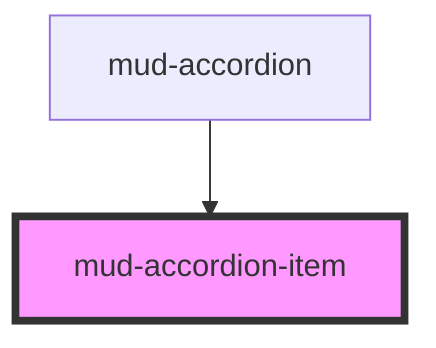

# mud-accordion-item

<!-- Auto Generated Below -->

## Overview

Accordion item — a single collapsible row inside `mud-accordion`.

Pattern B (atom-interactive): renders its own header `<button>` and a
`
` panel inside shadow DOM. The container manages
exclusivity in `mode="single"`; the item owns its visual state.

Disabled state and slotted content: while the item is disabled it sets
`disabled` on the elements you place DIRECTLY in the `heading`, `supporting`
and `trailing` slots, and it removes it again only from the elements it set it
on. A control you ship already disabled stays disabled — the component keeps a
record of its own writes rather than clearing the attribute wholesale, which is
what used to re-enable your control behind your back (issue #17).

Directly slotted elements only. A control nested inside a slotted wrapper
(`
<button>`) receives nothing: the component does not claim
DOM that was never handed to a slot. Such a control is blocked from the mouse by
a `pointer-events` rule in this component's stylesheet, but it stays
keyboard-reachable while the item is disabled. Put controls directly in the slot.

## Properties

| Property         | Attribute         | Description                                                                                                                                                                                                                                                                    | Type                         | Default     |
| ---------------- | ----------------- | ------------------------------------------------------------------------------------------------------------------------------------------------------------------------------------------------------------------------------------------------------------------------------ | ---------------------------- | ----------- |
| `appearance`     | `appearance`      | Visual treatment. - `default` — flat header, neutral background - `trail-sites` — open header gets a brand-tint background per Figma "Trail Sites"  Set by the parent `mud-accordion` via attribute; consumers should set `appearance` on the parent, not on individual items. | `"default" \| "trail-sites"` | `'default'` |
| `breakpoint`     | `breakpoint`      | Layout breakpoint (desktop ≥ 768px, mobile below). Owned by the parent `mud-accordion`, which assigns it on load and on every viewport crossing — setting it on an item is overwritten. Configure it on the parent instead.                                                    | `"desktop" \| "mobile"`      | `'desktop'` |
| `disabled`       | `disabled`        | Marks the item non-interactive. Header receives `aria-disabled`.                                                                                                                                                                                                               | `boolean`                    | `false`     |
| `heading`        | `heading`         | Header text. Overridden by the `heading` slot when provided.                                                                                                                                                                                                                   | `string \| undefined`        | `undefined` |
| `iconPosition`   | `icon-position`   | Trigger-icon placement relative to the header content. Set by the parent `mud-accordion`.                                                                                                                                                                                      | `"left" \| "right"`          | `'right'`   |
| `itemId`         | `item-id`         | Stable identifier used by the parent `mud-accordion` when emitting `mudChange`. Auto-generated if omitted.                                                                                                                                                                     | `string \| undefined`        | `undefined` |
| `open`           | `open`            | Whether the item is currently expanded.                                                                                                                                                                                                                                        | `boolean`                    | `false`     |
| `size`           | `size`            | Visual size rung — controls header height, font size, icon size, padding. Set by the parent `mud-accordion` via `size`; consumers should configure size at the container level.                                                                                                | `"md" \| "sm"`               | `'md'`      |
| `supportingText` | `supporting-text` | Secondary text shown beneath the heading. Overridden by the `supporting` slot.                                                                                                                                                                                                 | `string \| undefined`        | `undefined` |

## Events

| Event                 | Description                                                                                                                                                                                                   | Type                                              |
| --------------------- | ------------------------------------------------------------------------------------------------------------------------------------------------------------------------------------------------------------- | ------------------------------------------------- |
| `mudAccordionItemKey` | Emitted on Arrow/Home/End keypress on the header. Consumed by the parent `mud-accordion` to implement WAI-ARIA Accordion Pattern traversal. Internal contract — consumers typically don't subscribe directly. | `CustomEvent<{ key: string; itemId: string; }>`   |
| `mudToggle`           | Emitted after the item has already toggled itself. The parent `mud-accordion` reacts by collapsing the other items in `mode="single"`; it cannot refuse or reverse this item's own change.                    | `CustomEvent<{ open: boolean; itemId: string; }>` |

## Methods

### `focusHeader() => Promise<void>`

Returns the focusable header element so the parent can implement the
Arrow/Home/End traversal contract from WAI-ARIA Accordion Pattern.

#### Returns

Type: `Promise<void>`

### `setOpen(open: boolean) => Promise<void>`

Programmatically toggle the item. Bypasses the click pipeline so the
parent `mud-accordion` does not receive a `mudToggle` event — used by
the parent itself to coordinate `mode="single"` exclusivity.

#### Parameters

| Name   | Type      | Description |
| ------ | --------- | ----------- |
| `open` | `boolean` |             |

#### Returns

Type: `Promise<void>`

## Slots

| Slot           | Description                                                                                                                                                                                           |
| -------------- | ----------------------------------------------------------------------------------------------------------------------------------------------------------------------------------------------------- |
|                | (default) Panel body. Always in the DOM; the panel carries `hidden` while the item is closed, so slotted media still loads when collapsed.                                                            |
| `"heading"`    | Optional rich heading content. Overrides the `heading` prop.                                                                                                                                          |
| `"icon-start"` | Optional leading icon (`mud-icon` recommended).                                                                                                                                                       |
| `"supporting"` | Optional supporting text. Overrides the `supportingText` prop.                                                                                                                                        |
| `"trailing"`   | Optional trailing content (`mud-badge`, `mud-button`, label).             Sits between the heading group and the open/close trigger.             Disabled along with the item while directly slotted. |

## Shadow Parts

| Part       | Description                          |
| ---------- | ------------------------------------ |
| `"header"` | The button that toggles open/closed. |
| `"panel"`  | The region revealed when open.       |

## Dependencies

### Used by

 - [mud-accordion](../mud-accordion)

### Graph

----------------------------------------------

*Built with [StencilJS](https://stenciljs.com/)*
