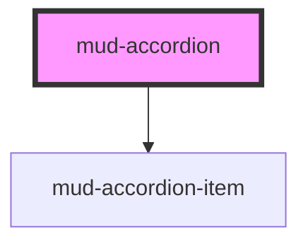

# mud-accordion

<!-- Auto Generated Below -->

## Overview

Accordion — vertical stack of collapsible regions per WAI-ARIA Accordion Pattern.

Pattern A (slot container): coordinates child `mud-accordion-item` elements,
enforces `mode="single"` exclusivity, manages keyboard traversal across
headers (Arrow Up/Down, Home, End), and dispatches `mudChange` whenever the
active set changes.

Consumers may either:
  1. Slot `<mud-accordion-item>` children directly (declarative, recommended), or
  2. Pass an `items` array (data-driven; the accordion renders the items for you).

## Properties

| Property       | Attribute       | Description                                                                                                                                                                                    | Type                                     | Default      |
| -------------- | --------------- | ---------------------------------------------------------------------------------------------------------------------------------------------------------------------------------------------- | ---------------------------------------- | ------------ |
| `appearance`   | `appearance`    | Visual treatment forwarded to every child item.                                                                                                                                                | `"default" \| "trail-sites"`             | `'default'`  |
| `breakpoint`   | `breakpoint`    | Layout breakpoint forwarded to every child item. Controls heading type size and vertical padding. Omit to let the responsive `@media` rule in the host CSS drive the value (768px breakpoint). | `"desktop" \| "mobile" \| undefined`     | `undefined`  |
| `iconPosition` | `icon-position` | Trigger-icon placement forwarded to every child item. - `right` (default) — FAQ-style - `left` — sidebar-nav style                                                                             | `"left" \| "right"`                      | `'right'`    |
| `items`        | --              | Declarative data source. When set, the accordion renders the items for you; the default slot is ignored. Items can still be slotted for advanced use cases — choose one approach per instance. | `AccordionItemDescriptor[] \| undefined` | `undefined`  |
| `label`        | `label`         | Accessible name forwarded to `aria-label` on the host (paired with `role="group"`). Use when the surrounding heading is not adjacent.                                                          | `string \| undefined`                    | `undefined`  |
| `mode`         | `mode`          | Coordination mode. - `multiple` (default) — items expand/collapse independently - `single` — opening one item collapses the others                                                             | `"multiple" \| "single"`                 | `'multiple'` |
| `size`         | `size`          | Size rung forwarded to every child item. Independent of `breakpoint` (responsive); set explicitly when you need a compact accordion regardless of viewport. Mirrors the legacy `size` prop.    | `"md" \| "sm"`                           | `'md'`       |

## Events

| Event       | Description                            | Type                                  |
| ----------- | -------------------------------------- | ------------------------------------- |
| `mudChange` | Emitted whenever the open set changes. | `CustomEvent<{ openIds: string[]; }>` |

## Slots

| Slot | Description                                  |
| ---- | -------------------------------------------- |
|      | One or more `<mud-accordion-item>` elements. |

## Dependencies

### Depends on

- [mud-accordion-item](../mud-accordion-item)

### Graph

----------------------------------------------

*Built with [StencilJS](https://stenciljs.com/)*
