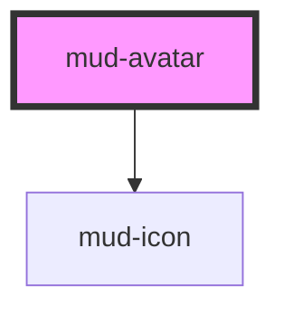

# mud-avatar

<!-- Auto Generated Below -->

## Overview

Avatar — represents a user via a photo, initials, or a generic person icon.

Pattern A (atom-display): wraps a single piece of slottable content (an
optional notification badge) and otherwise renders its own internal DOM.

The component picks its visual mode from the `type` prop:
- `photo` — renders `` from `src`; if the image fails to load, falls
  back to initials (when `name`/`initials` is set) or the person icon.
- `initials` — renders 1–2 uppercase letters derived from `initials` or
  `name`. If neither is set, the icon fallback kicks in.
- `icon` — renders a `mud-icon` (default `person`).

## Properties

| Property   | Attribute   | Description                                                                                                                                                                            | Type                                                                                                                                                                                                                                                                                                                                                                                                                                                                                                                                                                                                                                                                                                                                                                                                                                                                                                                                                                                                                                                                                                                                                                                                                                                                                                                                                                                                                                                                                                                                                                                                                                                                                                                                                                                                                                                                                                                                                                                                                                                                                                                                                                                                                                                                                                                                                                                                                                                                                                                                                                                                                                                                                                     | Default      |
| ---------- | ----------- | -------------------------------------------------------------------------------------------------------------------------------------------------------------------------------------- | -------------------------------------------------------------------------------------------------------------------------------------------------------------------------------------------------------------------------------------------------------------------------------------------------------------------------------------------------------------------------------------------------------------------------------------------------------------------------------------------------------------------------------------------------------------------------------------------------------------------------------------------------------------------------------------------------------------------------------------------------------------------------------------------------------------------------------------------------------------------------------------------------------------------------------------------------------------------------------------------------------------------------------------------------------------------------------------------------------------------------------------------------------------------------------------------------------------------------------------------------------------------------------------------------------------------------------------------------------------------------------------------------------------------------------------------------------------------------------------------------------------------------------------------------------------------------------------------------------------------------------------------------------------------------------------------------------------------------------------------------------------------------------------------------------------------------------------------------------------------------------------------------------------------------------------------------------------------------------------------------------------------------------------------------------------------------------------------------------------------------------------------------------------------------------------------------------------------------------------------------------------------------------------------------------------------------------------------------------------------------------------------------------------------------------------------------------------------------------------------------------------------------------------------------------------------------------------------------------------------------------------------------------------------------------------------------------- | ------------ |
| `alt`      | `alt`       | Alt text for the underlying `` when `type="photo"`. Falls back to `name` so screen readers always get a description; pass an empty string to mark the photo as purely decorative. | `string \| undefined`                                                                                                                                                                                                                                                                                                                                                                                                                                                                                                                                                                                                                                                                                                                                                                                                                                                                                                                                                                                                                                                                                                                                                                                                                                                                                                                                                                                                                                                                                                                                                                                                                                                                                                                                                                                                                                                                                                                                                                                                                                                                                                                                                                                                                                                                                                                                                                                                                                                                                                                                                                                                                                                                                    | `undefined`  |
| `iconName` | `icon-name` | Icon glyph for `type="icon"`. Defaults to the generic `person` symbol.                                                                                                                 | `"add-cart" \| "alarm" \| "arrow-down" \| "arrow-left" \| "arrow-right" \| "arrow-up" \| "arrow-up-right" \| "asterisk" \| "attachment" \| "award" \| "backspace" \| "barcode" \| "barrier" \| "book" \| "bookmark" \| "bubble-alert" \| "bubble-heart" \| "bubble-question" \| "building" \| "bullet-list" \| "business" \| "calculator" \| "calendar" \| "calendar-add" \| "calendar-edit" \| "calendar-remove" \| "car" \| "card-link" \| "carousel" \| "cart" \| "chart" \| "check-all" \| "checklist" \| "checkmark-large" \| "checkmark-small" \| "chevron-bottom" \| "chevron-bottom-medium" \| "chevron-bottom-small" \| "chevron-grabber" \| "chevron-left" \| "chevron-left-small" \| "chevron-right" \| "chevron-right-small" \| "chevron-top" \| "chevron-top-small" \| "child" \| "circle-checkmark" \| "circle-download" \| "circle-error" \| "circle-info" \| "clock" \| "cloud-upload" \| "coins" \| "contacts" \| "copy" \| "credit-card" \| "cross-large" \| "cross-small" \| "data-access" \| "delete" \| "direction" \| "dislike" \| "document" \| "document-info" \| "dot" \| "dot-grid" \| "download" \| "drag" \| "edit" \| "education" \| "electronic-signature" \| "empty-bin" \| "envelope" \| "exclamation" \| "external-link" \| "eye-open" \| "face-id" \| "facebook" \| "faq" \| "feedback" \| "file-download" \| "filter" \| "flag" \| "flash" \| "flash-off" \| "globe" \| "group" \| "hashtag" \| "health" \| "help" \| "history" \| "home-line" \| "home-round-door" \| "house" \| "id-card" \| "identity" \| "image" \| "instagram" \| "judge-gavel" \| "light-bulb" \| "like" \| "linkedin" \| "lock" \| "logout" \| "map-pin" \| "mark-all" \| "menu" \| "minus-small" \| "mobile-phone" \| "moon" \| "more-horizontal" \| "more-vertical" \| "notification" \| "old-man" \| "organisation" \| "page-add" \| "page-child" \| "page-download" \| "page-house" \| "page-text" \| "page-text-lock" \| "page-upload" \| "passport" \| "pdf-file" \| "people" \| "people-like" \| "permission" \| "person" \| "phone" \| "pin" \| "plus-large" \| "plus-small" \| "qr-code" \| "receipt-bill" \| "receipt-check" \| "reorder" \| "reschedule" \| "resize" \| "rotate-arrow" \| "scan" \| "search" \| "services" \| "settings" \| "share-android" \| "share-ios" \| "shield" \| "shield-keyhole" \| "shield-user" \| "sidebar" \| "signal" \| "signature" \| "sort" \| "sparkles" \| "stamp" \| "store" \| "suitcase" \| "suitcase-2" \| "sun" \| "support" \| "templates" \| "tiktok" \| "time" \| "tree" \| "umbrella" \| "unlocked" \| "upload" \| "user-account" \| "vacation" \| "visiting-card" \| "voucher" \| "wallet" \| "warning" \| "wheelchair" \| "youtube"` | `'person'`   |
| `initials` | `initials`  | Pre-computed initials. When omitted, `name` is used to derive them. Trimmed to two characters and uppercased before rendering.                                                         | `string \| undefined`                                                                                                                                                                                                                                                                                                                                                                                                                                                                                                                                                                                                                                                                                                                                                                                                                                                                                                                                                                                                                                                                                                                                                                                                                                                                                                                                                                                                                                                                                                                                                                                                                                                                                                                                                                                                                                                                                                                                                                                                                                                                                                                                                                                                                                                                                                                                                                                                                                                                                                                                                                                                                                                                                    | `undefined`  |
| `name`     | `name`      | Full name of the represented person. Used to (a) derive `initials` when none are provided and (b) seed `alt` for the photo so the avatar is always announced.                          | `string \| undefined`                                                                                                                                                                                                                                                                                                                                                                                                                                                                                                                                                                                                                                                                                                                                                                                                                                                                                                                                                                                                                                                                                                                                                                                                                                                                                                                                                                                                                                                                                                                                                                                                                                                                                                                                                                                                                                                                                                                                                                                                                                                                                                                                                                                                                                                                                                                                                                                                                                                                                                                                                                                                                                                                                    | `undefined`  |
| `size`     | `size`      | Visual size rung. Matches the Figma scale (xs=24, sm=32, md=40, lg=48, xl=72).                                                                                                         | `"lg" \| "md" \| "sm" \| "xl" \| "xs"`                                                                                                                                                                                                                                                                                                                                                                                                                                                                                                                                                                                                                                                                                                                                                                                                                                                                                                                                                                                                                                                                                                                                                                                                                                                                                                                                                                                                                                                                                                                                                                                                                                                                                                                                                                                                                                                                                                                                                                                                                                                                                                                                                                                                                                                                                                                                                                                                                                                                                                                                                                                                                                                                   | `'md'`       |
| `src`      | `src`       | Source URL for `type="photo"`. Ignored otherwise.                                                                                                                                      | `string \| undefined`                                                                                                                                                                                                                                                                                                                                                                                                                                                                                                                                                                                                                                                                                                                                                                                                                                                                                                                                                                                                                                                                                                                                                                                                                                                                                                                                                                                                                                                                                                                                                                                                                                                                                                                                                                                                                                                                                                                                                                                                                                                                                                                                                                                                                                                                                                                                                                                                                                                                                                                                                                                                                                                                                    | `undefined`  |
| `type`     | `type`      | Visual mode. `photo` renders `src`, `initials` renders 1–2 letters, `icon` renders the person glyph.                                                                                   | `"icon" \| "initials" \| "photo"`                                                                                                                                                                                                                                                                                                                                                                                                                                                                                                                                                                                                                                                                                                                                                                                                                                                                                                                                                                                                                                                                                                                                                                                                                                                                                                                                                                                                                                                                                                                                                                                                                                                                                                                                                                                                                                                                                                                                                                                                                                                                                                                                                                                                                                                                                                                                                                                                                                                                                                                                                                                                                                                                        | `'initials'` |

## Slots

| Slot      | Description                                                                                                                                            |
| --------- | ------------------------------------------------------------------------------------------------------------------------------------------------------ |
| `"badge"` | Optional notification badge composed on the top-right edge         (e.g. `<mud-badge slot="badge" type="dot" />`), sized to the         avatar's rung. |

## Shadow Parts

| Part      | Description |
| --------- | ----------- |
| `"badge"` |             |

## Dependencies

### Depends on

- [mud-icon](../mud-icon)

### Graph

----------------------------------------------

*Built with [StencilJS](https://stenciljs.com/)*
