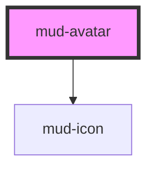

# mud-avatar

<!-- Auto Generated Below -->

## Overview

Avatar — represents a user via a photo, initials, or a generic person icon.

Pattern A (atom-display): wraps a single piece of slottable content (an
optional notification badge) and otherwise renders its own internal DOM.

The component picks its visual mode from the `type` prop:
- `photo` — renders `` from `src`; if the image fails to load, falls
  back to initials (when `name`/`initials` is set) or the person icon.
- `initials` — renders 1–2 uppercase letters derived from `initials` or
  `name`. If neither is set, the icon fallback kicks in.
- `icon` — renders a `mud-icon` (default `person`).

## Properties

| Property    | Attribute    | Description                                                                                                                                                                                                                                                                                                                                                                                                                                                                                                                                                                             | Type                                   | Default      |
| ----------- | ------------ | --------------------------------------------------------------------------------------------------------------------------------------------------------------------------------------------------------------------------------------------------------------------------------------------------------------------------------------------------------------------------------------------------------------------------------------------------------------------------------------------------------------------------------------------------------------------------------------- | -------------------------------------- | ------------ |
| `alt`       | `alt`        | Alt text for the underlying `` when `type="photo"`. Falls back to `name` so screen readers always get a description; pass an empty string to mark the photo as purely decorative.                                                                                                                                                                                                                                                                                                                                                                                                  | `string \| undefined`                  | `undefined`  |
| `ariaLabel` | `aria-label` | Accessible label override. When set, becomes the host's `aria-label` and the avatar is exposed to AT as a single labelled element. When omitted the component picks a sensible default (the name, the initials, or "User avatar").  No `attribute: 'aria-label'` mapping — the Host writes `aria-label` on every render with a derived value, and an explicit attribute observer would map that write back into this prop mid-render (Stencil warns "state/prop changed during rendering"). Stencil's implicit kebab→camel mapping still lets consumers set `aria-label="…"` from HTML. | `string \| undefined`                  | `undefined`  |
| `iconName`  | `icon-name`  | Icon glyph for `type="icon"`. Defaults to the generic `person` symbol.                                                                                                                                                                                                                                                                                                                                                                                                                                                                                                                  | `string`                               | `'person'`   |
| `initials`  | `initials`   | Pre-computed initials. When omitted, `name` is used to derive them. Trimmed to two characters and uppercased before rendering.                                                                                                                                                                                                                                                                                                                                                                                                                                                          | `string \| undefined`                  | `undefined`  |
| `name`      | `name`       | Full name of the represented person. Used to (a) derive `initials` when none are provided and (b) seed `alt` for the photo so the avatar is always announced.                                                                                                                                                                                                                                                                                                                                                                                                                           | `string \| undefined`                  | `undefined`  |
| `size`      | `size`       | Visual size rung. Matches the Figma scale (xs=24, sm=32, md=40, lg=48, xl=72).                                                                                                                                                                                                                                                                                                                                                                                                                                                                                                          | `"lg" \| "md" \| "sm" \| "xl" \| "xs"` | `'md'`       |
| `src`       | `src`        | Source URL for `type="photo"`. Ignored otherwise.                                                                                                                                                                                                                                                                                                                                                                                                                                                                                                                                       | `string \| undefined`                  | `undefined`  |
| `type`      | `type`       | Visual mode. `photo` renders `src`, `initials` renders 1–2 letters, `icon` renders the person glyph.                                                                                                                                                                                                                                                                                                                                                                                                                                                                                    | `"icon" \| "initials" \| "photo"`      | `'initials'` |

## Slots

| Slot      | Description                                                                                                           |
| --------- | --------------------------------------------------------------------------------------------------------------------- |
| `"badge"` | Optional notification badge composed at the top-right corner         (e.g. ``). |

## Shadow Parts

| Part      | Description |
| --------- | ----------- |
| `"badge"` |             |

## Dependencies

### Depends on

- [mud-icon](../mud-icon)

### Graph

----------------------------------------------

*Built with [StencilJS](https://stenciljs.com/)*
