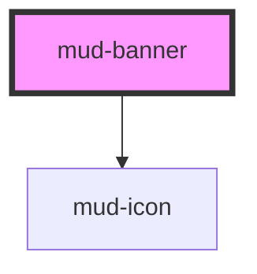

# mud-banner

<!-- Auto Generated Below -->

## Overview

Banner — full-width, top-of-page system message.

A persistent, non-contextual notification that spans the width of its
container and informs users of important system-wide events (scheduled
maintenance, outages, announcements). Draws attention without blocking
interaction; remains visible until dismissed or resolved.

Pattern B (atom-display + interactive close): the optional close affordance
lives in shadow DOM with a real `button` role. The body is not interactive
apart from the optional inline link.

`variant` selects the semantic color family — `info`, `warning`, or `error`
(Figma exposes no `success` for banners). `emphasis` selects the surface
treatment — `subtle` (tinted) or `strong` (filled, on-color foreground).

Live-region routing follows WCAG status/alert conventions:
- `info` → `role="status"` + `aria-live="polite"`
- `warning` / `error` → `role="alert"` + `aria-live="assertive"`

## Properties

| Property      | Attribute     | Description                                                                                                                                           | Type                                                                                                                                                                                                                                                                                                                                                                                                                                                                                                                                                                                                                                                                                                                                                                                                                                                                                                                                                                                                                                                                                                                                                                                                                                                                                                                                                                                                                                                                                                                                                                                                                                                                                                                                                                                                                                                                                                                                                                                                                                                                                                                                                                                                                                                                                                                                                                                                                                                                                                                                                                                                                                                                                                                                                                                                                                                                                                                                                                                                                                                                                                                                                                                                                                                                                          | Default     |
| ------------- | ------------- | ----------------------------------------------------------------------------------------------------------------------------------------------------- | --------------------------------------------------------------------------------------------------------------------------------------------------------------------------------------------------------------------------------------------------------------------------------------------------------------------------------------------------------------------------------------------------------------------------------------------------------------------------------------------------------------------------------------------------------------------------------------------------------------------------------------------------------------------------------------------------------------------------------------------------------------------------------------------------------------------------------------------------------------------------------------------------------------------------------------------------------------------------------------------------------------------------------------------------------------------------------------------------------------------------------------------------------------------------------------------------------------------------------------------------------------------------------------------------------------------------------------------------------------------------------------------------------------------------------------------------------------------------------------------------------------------------------------------------------------------------------------------------------------------------------------------------------------------------------------------------------------------------------------------------------------------------------------------------------------------------------------------------------------------------------------------------------------------------------------------------------------------------------------------------------------------------------------------------------------------------------------------------------------------------------------------------------------------------------------------------------------------------------------------------------------------------------------------------------------------------------------------------------------------------------------------------------------------------------------------------------------------------------------------------------------------------------------------------------------------------------------------------------------------------------------------------------------------------------------------------------------------------------------------------------------------------------------------------------------------------------------------------------------------------------------------------------------------------------------------------------------------------------------------------------------------------------------------------------------------------------------------------------------------------------------------------------------------------------------------------------------------------------------------------------------------------------------------- | ----------- |
| `ariaLabel`   | `aria-label`  | Forwarded to the host as `aria-label`.                                                                                                                | `string \| undefined`                                                                                                                                                                                                                                                                                                                                                                                                                                                                                                                                                                                                                                                                                                                                                                                                                                                                                                                                                                                                                                                                                                                                                                                                                                                                                                                                                                                                                                                                                                                                                                                                                                                                                                                                                                                                                                                                                                                                                                                                                                                                                                                                                                                                                                                                                                                                                                                                                                                                                                                                                                                                                                                                                                                                                                                                                                                                                                                                                                                                                                                                                                                                                                                                                                                                         | `undefined` |
| `closeLabel`  | `close-label` | Close-button accessible label. Defaults to the Romanian "Închide".                                                                                    | `string`                                                                                                                                                                                                                                                                                                                                                                                                                                                                                                                                                                                                                                                                                                                                                                                                                                                                                                                                                                                                                                                                                                                                                                                                                                                                                                                                                                                                                                                                                                                                                                                                                                                                                                                                                                                                                                                                                                                                                                                                                                                                                                                                                                                                                                                                                                                                                                                                                                                                                                                                                                                                                                                                                                                                                                                                                                                                                                                                                                                                                                                                                                                                                                                                                                                                                      | `'Închide'` |
| `dismissible` | `dismissible` | When `true`, renders a trailing close (×) button. Activating it emits `mudDismiss`; the consumer is responsible for removing the banner from the DOM. | `boolean`                                                                                                                                                                                                                                                                                                                                                                                                                                                                                                                                                                                                                                                                                                                                                                                                                                                                                                                                                                                                                                                                                                                                                                                                                                                                                                                                                                                                                                                                                                                                                                                                                                                                                                                                                                                                                                                                                                                                                                                                                                                                                                                                                                                                                                                                                                                                                                                                                                                                                                                                                                                                                                                                                                                                                                                                                                                                                                                                                                                                                                                                                                                                                                                                                                                                                     | `false`     |
| `emphasis`    | `emphasis`    | Surface treatment: `subtle` (tinted background, dark text) or `strong` (filled background, on-color text).                                            | `"strong" \| "subtle"`                                                                                                                                                                                                                                                                                                                                                                                                                                                                                                                                                                                                                                                                                                                                                                                                                                                                                                                                                                                                                                                                                                                                                                                                                                                                                                                                                                                                                                                                                                                                                                                                                                                                                                                                                                                                                                                                                                                                                                                                                                                                                                                                                                                                                                                                                                                                                                                                                                                                                                                                                                                                                                                                                                                                                                                                                                                                                                                                                                                                                                                                                                                                                                                                                                                                        | `'subtle'`  |
| `iconName`    | `icon-name`   | Override the default `mud-icon` name for the variant. Ignored when the `icon-start` slot is populated.                                                | `"add-cart" \| "alarm" \| "arrow-down" \| "arrow-left" \| "arrow-right" \| "arrow-up" \| "arrow-up-right" \| "asterisk" \| "attachment" \| "award" \| "backspace" \| "barcode" \| "barrier" \| "book" \| "bookmark" \| "bubble-alert" \| "bubble-heart" \| "bubble-question" \| "building" \| "bullet-list" \| "business" \| "business-filled" \| "calculator" \| "calendar" \| "calendar-add" \| "calendar-edit" \| "calendar-filled" \| "calendar-remove" \| "calendar-remove-filled" \| "car" \| "card-link" \| "carousel" \| "cart" \| "chart" \| "check-all" \| "checklist" \| "checkmark-large" \| "checkmark-small" \| "chevron-bottom" \| "chevron-bottom-filled" \| "chevron-bottom-medium" \| "chevron-bottom-small" \| "chevron-grabber" \| "chevron-left" \| "chevron-left-small" \| "chevron-right" \| "chevron-right-small" \| "chevron-top" \| "chevron-top-small" \| "child" \| "circle-checkmark-filled" \| "circle-download" \| "circle-error" \| "circle-error-filled" \| "circle-info" \| "circle-info-filled" \| "clock" \| "cloud-upload" \| "coins" \| "contacts" \| "copy" \| "credit-card" \| "cross-large" \| "cross-small" \| "data-access" \| "delete" \| "delete-filled" \| "direction" \| "dislike" \| "document" \| "document-filled" \| "document-info-filled" \| "dot" \| "dot-grid" \| "download" \| "drag" \| "edit" \| "education" \| "electronic-signature" \| "empty-bin" \| "envelope" \| "envelope-filled" \| "exclamation" \| "external-link" \| "eye-open" \| "face-id" \| "facebook-filled" \| "faq" \| "feedback" \| "file-download" \| "filter" \| "flag" \| "flash-filled" \| "flash-off-filled" \| "globe" \| "group" \| "group-filled" \| "hashtag" \| "health" \| "help" \| "history" \| "home-line" \| "home-line-filled" \| "home-round-door" \| "house" \| "id-card" \| "id-card-filled" \| "identity" \| "image" \| "instagram-filled" \| "judge-gavel" \| "light-bulb" \| "like" \| "linkedin-filled" \| "lock" \| "logout" \| "map-pin" \| "map-pin-filled" \| "mark-all" \| "menu" \| "minus-small" \| "mobile-phone" \| "moon" \| "more-horizontal" \| "more-vertical" \| "notification" \| "old-man" \| "organisation" \| "page-add" \| "page-child" \| "page-download" \| "page-download-filled" \| "page-house" \| "page-text" \| "page-text-lock" \| "page-upload" \| "page-upload-filled" \| "passport" \| "pdf-file" \| "people" \| "people-like" \| "permission" \| "person" \| "phone" \| "phone-filled" \| "pin" \| "plus-large" \| "plus-small" \| "qr-code" \| "receipt-bill" \| "receipt-check" \| "receipt-check-filled" \| "reorder" \| "reschedule" \| "resize" \| "rotate-arrow" \| "scan" \| "search" \| "services" \| "settings" \| "share-android" \| "share-ios" \| "shield" \| "shield-keyhole" \| "shield-user" \| "sidebar" \| "sidebar-filled" \| "signal" \| "signature" \| "sort" \| "sparkles-filled" \| "stamp" \| "store" \| "suitcase" \| "suitcase-2" \| "sun" \| "support" \| "templates" \| "tiktok" \| "time" \| "time-filled" \| "tree" \| "umbrella" \| "unlocked-filled" \| "upload" \| "user-account" \| "user-account-filled" \| "vacation" \| "visiting-card" \| "voucher" \| "wallet" \| "wallet-filled" \| "warning" \| "warning-filled" \| "wheelchair" \| "youtube-filled" \| undefined` | `undefined` |
| `linkHref`    | `link-href`   | Href for the optional inline link. Defaults to `#` when omitted.                                                                                      | `string \| undefined`                                                                                                                                                                                                                                                                                                                                                                                                                                                                                                                                                                                                                                                                                                                                                                                                                                                                                                                                                                                                                                                                                                                                                                                                                                                                                                                                                                                                                                                                                                                                                                                                                                                                                                                                                                                                                                                                                                                                                                                                                                                                                                                                                                                                                                                                                                                                                                                                                                                                                                                                                                                                                                                                                                                                                                                                                                                                                                                                                                                                                                                                                                                                                                                                                                                                         | `undefined` |
| `linkText`    | `link-text`   | Optional inline link text rendered after the message (the Figma "Click here" affordance). Pair with `linkHref` for a real destination.                | `string \| undefined`                                                                                                                                                                                                                                                                                                                                                                                                                                                                                                                                                                                                                                                                                                                                                                                                                                                                                                                                                                                                                                                                                                                                                                                                                                                                                                                                                                                                                                                                                                                                                                                                                                                                                                                                                                                                                                                                                                                                                                                                                                                                                                                                                                                                                                                                                                                                                                                                                                                                                                                                                                                                                                                                                                                                                                                                                                                                                                                                                                                                                                                                                                                                                                                                                                                                         | `undefined` |
| `variant`     | `variant`     | Semantic color family. Per Figma the banner exposes `info`, `warning`, and `error` (no `success`).                                                    | `"error" \| "info" \| "warning"`                                                                                                                                                                                                                                                                                                                                                                                                                                                                                                                                                                                                                                                                                                                                                                                                                                                                                                                                                                                                                                                                                                                                                                                                                                                                                                                                                                                                                                                                                                                                                                                                                                                                                                                                                                                                                                                                                                                                                                                                                                                                                                                                                                                                                                                                                                                                                                                                                                                                                                                                                                                                                                                                                                                                                                                                                                                                                                                                                                                                                                                                                                                                                                                                                                                              | `'info'`    |

## Events

| Event        | Description                                                                                                                | Type                |
| ------------ | -------------------------------------------------------------------------------------------------------------------------- | ------------------- |
| `mudDismiss` | Fires when the user activates the close button. Payload is `void` — the consumer owns the dismiss animation / DOM removal. | `CustomEvent<void>` |

## Slots

| Slot           | Description                                                                                                                                            |
| -------------- | ------------------------------------------------------------------------------------------------------------------------------------------------------ |
|                | (default) The banner message. Plain text or rich inline content.                                                                                       |
| `"icon-start"` | Optional override for the leading icon. When supplied,              suppresses both the `iconName` prop and the per-variant              default icon. |

## Shadow Parts

| Part        | Description |
| ----------- | ----------- |
| `"close"`   |             |
| `"link"`    |             |
| `"message"` |             |

## Dependencies

### Depends on

- [mud-icon](../mud-icon)

### Graph

----------------------------------------------

*Built with [StencilJS](https://stenciljs.com/)*
