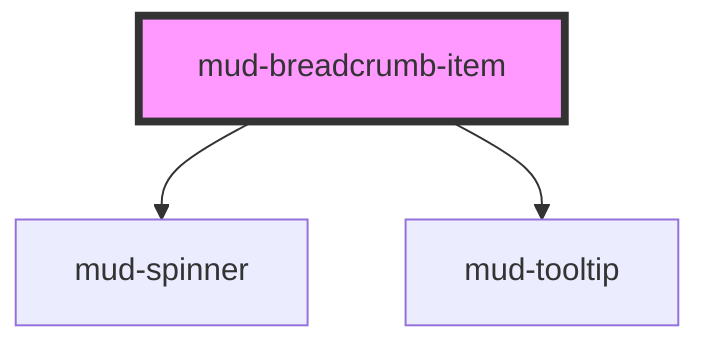

# mud-breadcrumb-item

<!-- Auto Generated Below -->

## Overview

A single crumb inside `mud-breadcrumb`. Renders an anchor when `href` is set,
otherwise plain text. The active crumb renders as text with `aria-current="page"`,
regardless of `href`.

Use this directly when the markup variant of the breadcrumb is preferred over
the `items` prop on `mud-breadcrumb`. Both APIs are equivalent in behavior.

## Properties

| Property   | Attribute  | Description                                                                                                                                                                                                                                                                 | Type                  | Default     |
| ---------- | ---------- | --------------------------------------------------------------------------------------------------------------------------------------------------------------------------------------------------------------------------------------------------------------------------- | --------------------- | ----------- |
| `active`   | `active`   | Marks this crumb as the current page. Adds `aria-current="page"`, switches to medium font weight, and disables navigation (renders as text).                                                                                                                                | `boolean`             | `false`     |
| `disabled` | `disabled` | Disables interaction and applies the disabled text color.                                                                                                                                                                                                                   | `boolean`             | `false`     |
| `href`     | `href`     | Optional navigation target. Renders as `<a>` when set, otherwise as ``. Ignored when `active` is true (active crumb is always rendered as text).                                                                                                                      | `string \| undefined` | `undefined` |
| `label`    | `label`    | Accessible-name fallback when the default slot is empty (e.g. icon-only crumb). If the slot contains visible text, that text is the accessible name — this prop is NOT applied as an `aria-label` override on the rendered element to preserve the slot-first content rule. | `string \| undefined` | `undefined` |
| `loading`  | `loading`  | Replaces the label with a spinner while keeping the crumb width. Used for async navigation where the parent page hasn't loaded yet.                                                                                                                                         | `boolean`             | `false`     |
| `visited`  | `visited`  | Visited link styling — text turns magenta (`--color-text-brand-visited`). Maps to the CSS pseudo-state for declarative use cases.                                                                                                                                           | `boolean`             | `false`     |

## Events

| Event       | Description                                                                                                                                        | Type                                                          |
| ----------- | -------------------------------------------------------------------------------------------------------------------------------------------------- | ------------------------------------------------------------- |
| `mudSelect` | Fired when the crumb is activated (click or Enter/Space on a non-link crumb). Cancelable — `preventDefault()` lets the consumer handle navigation. | `CustomEvent<{ label: string; href?: string \| undefined; }>` |

## Slots

| Slot           | Description                                                                        |
| -------------- | ---------------------------------------------------------------------------------- |
|                | (default) Label content. Use plain text or inline elements (`<strong>`, ``). |
| `"icon-start"` | Optional leading icon (use `<mud-icon>`).                                          |

## Dependencies

### Depends on

- [mud-spinner](../mud-spinner)
- [mud-tooltip](../mud-tooltip)

### Graph

----------------------------------------------

*Built with [StencilJS](https://stenciljs.com/)*
