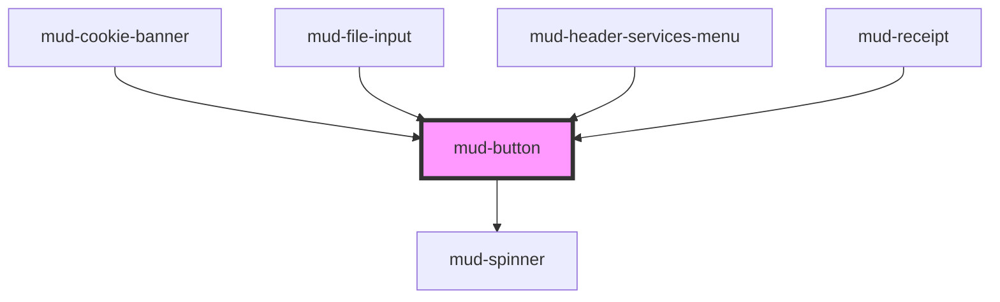

# mud-button

<!-- Auto Generated Below -->

## Overview

Button — interactive control.

Pattern B (atom-interactive): renders its own `<button>` (or `<a>` when `href`
is set) inside shadow DOM. Form participation works via `formAssociated` +
`ElementInternals`.

## Properties

| Property     | Attribute    | Description                                                                                                                                                                                                                                                                                                                                                                                                                                          | Type                                                                 | Default         |
| ------------ | ------------ | ---------------------------------------------------------------------------------------------------------------------------------------------------------------------------------------------------------------------------------------------------------------------------------------------------------------------------------------------------------------------------------------------------------------------------------------------------- | -------------------------------------------------------------------- | --------------- |
| `appearance` | `appearance` | Visual treatment. - `filled` (default) — solid background per variant - `outlined` — 1.5px border with transparent fill in default/focus; hover/active fill solid (matches filled) - `text` — no border, transparent fill, hover/active tint background; designed for inline use  `outlined` and `text` only support `primary`, `strict`, and `destructive` variants. Other variants fall back to `primary` visuals with a dev-time console warning. | `"filled" \| "outlined" \| "text"`                                   | `'filled'`      |
| `disabled`   | `disabled`   | Disables interactivity. When set the internal control receives `aria-disabled` and (for `<button>`) the native `disabled` attribute.                                                                                                                                                                                                                                                                                                                 | `boolean`                                                            | `false`         |
| `fullWidth`  | `full-width` | Makes the button expand to fill the inline-size of its container. The host becomes a block-level flex container and the internal control stretches to 100% width — designed for use inside `mud-button-group` (vertical orientation) or in narrow form layouts.                                                                                                                                                                                      | `boolean`                                                            | `false`         |
| `href`       | `href`       | If set, the button renders as `<a href="…">` and behaves as a link. `type`, `name`, and `value` are ignored in this mode.                                                                                                                                                                                                                                                                                                                            | `string \| undefined`                                                | `undefined`     |
| `iconOnly`   | `icon-only`  | Switches the button into icon-only mode: the container becomes square with equal zero-padding, and `icon-start`/`icon-end`/default-slot content is suppressed. Icon content should be placed in `slot="icon"`. Requires `label` (or `aria-label`) for screen readers.                                                                                                                                                                                | `boolean`                                                            | `false`         |
| `label`      | `label`      | Accessible name. Required when the button has no visible text label (icon-only). Forwarded to `aria-label` on the internal control.                                                                                                                                                                                                                                                                                                                  | `string \| undefined`                                                | `undefined`     |
| `loading`    | `loading`    | Renders a centred spinner and blocks interactivity while preserving the accessible name. Sets `aria-busy` on the internal control.                                                                                                                                                                                                                                                                                                                   | `boolean`                                                            | `false`         |
| `name`       | `name`       | Form-control `name`. Used when `type="submit"` and a value is submitted.                                                                                                                                                                                                                                                                                                                                                                             | `string \| undefined`                                                | `undefined`     |
| `rel`        | `rel`        | `rel` for the anchor when `href` is set.                                                                                                                                                                                                                                                                                                                                                                                                             | `string \| undefined`                                                | `undefined`     |
| `shape`      | `shape`      | Container silhouette. `circular` produces a fully-rounded pill; combine with an icon-only label to render a circle.                                                                                                                                                                                                                                                                                                                                  | `"circular" \| "rectangular"`                                        | `'rectangular'` |
| `size`       | `size`       | Visual size rung.                                                                                                                                                                                                                                                                                                                                                                                                                                    | `"lg" \| "md" \| "sm"`                                               | `'md'`          |
| `target`     | `target`     | `target` for the anchor when `href` is set.                                                                                                                                                                                                                                                                                                                                                                                                          | `string \| undefined`                                                | `undefined`     |
| `type`       | `type`       | Native button `type` attribute. Ignored when `href` is set.                                                                                                                                                                                                                                                                                                                                                                                          | `"button" \| "reset" \| "submit"`                                    | `'button'`      |
| `value`      | `value`      | Form-control `value` submitted alongside `name`.                                                                                                                                                                                                                                                                                                                                                                                                     | `string \| undefined`                                                | `undefined`     |
| `variant`    | `variant`    | Color treatment.                                                                                                                                                                                                                                                                                                                                                                                                                                     | `"destructive" \| "neutral" \| "primary" \| "secondary" \| "strict"` | `'primary'`     |

## Slots

| Slot           | Description                                                                                                                                                                                                                                                   |
| -------------- | ------------------------------------------------------------------------------------------------------------------------------------------------------------------------------------------------------------------------------------------------------------- |
|                | (default) The label content. Plain text or rich inline content.                                                                                                                                                                                               |
| `"icon"`       | When filled, switches the button into icon-only mode: the         container becomes square with equal zero-padding, and any         `icon-start`, `icon-end`, or default-slot label content         is suppressed. Requires `label` (or `aria-label`) for AT. |
| `"icon-end"`   | Optional `mud-icon` rendered after the label.                                                                                                                                                                                                                 |
| `"icon-start"` | Optional `mud-icon` rendered before the label.                                                                                                                                                                                                                |

## Dependencies

### Used by

 - [mud-cookie-banner](../mud-cookie-banner)
 - [mud-file-input](../mud-file-input)
 - [mud-header-services-menu](../mud-header)
 - [mud-receipt](../mud-receipt)

### Depends on

- [mud-spinner](../mud-spinner)

### Graph

----------------------------------------------

*Built with [StencilJS](https://stenciljs.com/)*
