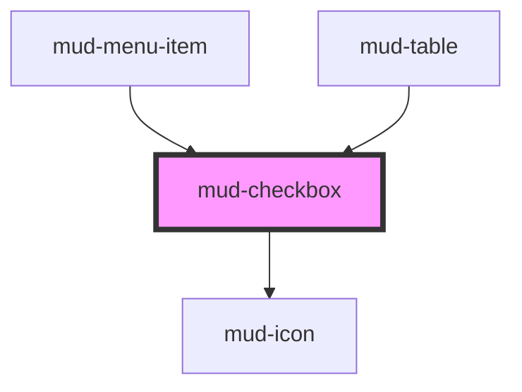

# mud-checkbox

<!-- Auto Generated Below -->

## Overview

Checkbox — boolean / tri-state form control.

Pattern B (atom-interactive, form-associated): renders its own visual box
inside shadow DOM plus a screen-reader-friendly `<input type="checkbox">`.
Form participation works via `formAssociated` + `ElementInternals`.

Visual states mirror Figma `Mode × State × Size`:
  Mode  = Unchecked | Checked | Indeterminate
  State = Default | Focus | Error (`invalid`) | Disabled
  Size  = Medium (24px) | Small (20px)

Indeterminate is a visual-only third state — `checked` semantics are unchanged.

## Properties

| Property         | Attribute         | Description                                                                                                                                                                                                                                                                                           | Type                  | Default     |
| ---------------- | ----------------- | ----------------------------------------------------------------------------------------------------------------------------------------------------------------------------------------------------------------------------------------------------------------------------------------------------- | --------------------- | ----------- |
| `ariaLabel`      | `aria-label`      | Accessible name override. Used when no visible label is present.                                                                                                                                                                                                                                      | `string \| undefined` | `undefined` |
| `ariaLabelledby` | `aria-labelledby` | Accessible name id reference. Forwarded to the internal control.                                                                                                                                                                                                                                      | `string \| undefined` | `undefined` |
| `checked`        | `checked`         | Checked state. Mutable — toggled by user interaction and reflected as the `checked` host attribute. Read in `change` listeners via `event.target.checked`.                                                                                                                                            | `boolean`             | `false`     |
| `disabled`       | `disabled`        | Disables interactivity. Sets `aria-disabled` and the native `disabled`.                                                                                                                                                                                                                               | `boolean`             | `false`     |
| `errorText`      | `error-text`      | Plain-text error message shown below the label when `invalid` is set. Pairs with the `circle-error-filled` icon and is wired to the control via `aria-describedby`. When present (and `invalid`) it replaces the supporting text. Mirrors the `errorText` convention of `mud-input` / `mud-textarea`. | `string \| undefined` | `undefined` |
| `indeterminate`  | `indeterminate`   | Tri-state visual marker. When `true`, the box renders a dash glyph regardless of `checked`. Indeterminate is a purely visual hint — the submitted form value still follows `checked`.                                                                                                                 | `boolean`             | `false`     |
| `invalid`        | `invalid`         | Forces destructive visuals (red border, red fill on checked). Sets `aria-invalid="true"`.                                                                                                                                                                                                             | `boolean`             | `false`     |
| `label`          | `label`           | Accessible-name fallback. Used as `aria-label` on the internal input when no `label` slot is provided. Does NOT render visible text — use the `label` slot for that. Matches the `mud-button` convention.                                                                                             | `string \| undefined` | `undefined` |
| `name`           | `name`            | Form-control `name`. Used during form submission.                                                                                                                                                                                                                                                     | `string \| undefined` | `undefined` |
| `readonly`       | `readonly`        | Renders read-only — checkbox keeps focus but ignores toggles.                                                                                                                                                                                                                                         | `boolean`             | `false`     |
| `required`       | `required`        | Marks the field as mandatory for form validation. Adds `aria-required="true"`.                                                                                                                                                                                                                        | `boolean`             | `false`     |
| `size`           | `size`            | Visual size rung.                                                                                                                                                                                                                                                                                     | `"md" \| "sm"`        | `'md'`      |
| `supportingText` | `supporting-text` | Accessible-description fallback. Reserved for future use as `aria-describedby` source when no `supporting-text` slot is provided. Does NOT render visible text — use the `supporting-text` slot for that.                                                                                             | `string \| undefined` | `undefined` |
| `value`          | `value`           | Form value submitted when `checked`. Defaults to `'on'` like native checkboxes.                                                                                                                                                                                                                       | `string \| undefined` | `undefined` |

## Events

| Event       | Description                                                                     | Type                                |
| ----------- | ------------------------------------------------------------------------------- | ----------------------------------- |
| `mudBlur`   | Fires when the control loses focus. The native `FocusEvent` is forwarded as-is. | `CustomEvent<FocusEvent>`           |
| `mudChange` | Fires when `checked` (or `indeterminate`) changes from a user action.           | `CustomEvent<CheckboxChangeDetail>` |
| `mudFocus`  | Fires when the control gains focus. The native `FocusEvent` is forwarded as-is. | `CustomEvent<FocusEvent>`           |

## Slots

| Slot                | Description                                                 |
| ------------------- | ----------------------------------------------------------- |
| `"label"`           | Rich label content. Replaces the `label` prop when present. |
| `"supporting-text"` | Rich supporting/helper text below the label.                |

## Shadow Parts

| Part           | Description |
| -------------- | ----------- |
| `"box"`        |             |
| `"control"`    |             |
| `"error"`      |             |
| `"label"`      |             |
| `"native"`     |             |
| `"root"`       |             |
| `"supporting"` |             |
| `"text"`       |             |

## Dependencies

### Used by

 - [mud-menu-item](../mud-menu)
 - [mud-table](../mud-table)

### Depends on

- [mud-icon](../mud-icon)

### Graph

----------------------------------------------

*Built with [StencilJS](https://stenciljs.com/)*
