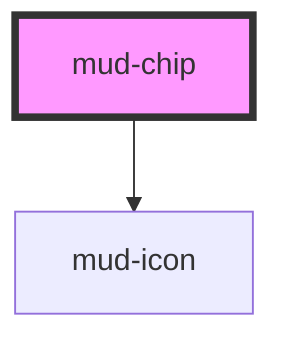

# mud-chip

<!-- Auto Generated Below -->

## Overview

Chip — compact, pill-shaped control for filter selection or token display.

Pattern B (atom-interactive): renders its own `<button>` inside shadow DOM
so it participates in tab order and exposes a real accessible role.

Two modes:
- `type="filter"` (default) — toggleable filter chip. Click flips `selected`
  and emits `mudSelect`. Best used inside a chip group for mono- or
  multi-selection filtering.
- `type="input"` — a discrete value entered by a user (e.g. a tag inside
  a search field). When `removable`, a trailing close button is rendered;
  activating it emits `mudRemove`.

## Properties

| Property        | Attribute        | Description                                                                                                                                                                                                                                                                           | Type                  | Default     |
| --------------- | ---------------- | ------------------------------------------------------------------------------------------------------------------------------------------------------------------------------------------------------------------------------------------------------------------------------------- | --------------------- | ----------- |
| `count`         | `count`          | Optional numeric badge rendered after the label (e.g. a result count). It is the design system's light counter badge — white pill, dark digits — on both the default and the selected chip, which is what keeps it legible on either surface. Omit (or pass a non-number) to hide it. | `number \| undefined` | `undefined` |
| `disabled`      | `disabled`       | Disables interactivity. Reflects `aria-disabled` and removes the chip from pointer/keyboard activation paths.                                                                                                                                                                         | `boolean`             | `false`     |
| `label`         | `label`          | Accessible-name fallback. Used as `aria-label` on the internal `<button>` when the default slot is empty (and no explicit `aria-label` is set). Does NOT render visible text — use the default slot for that. Matches the `mud-button` convention.                                    | `string \| undefined` | `undefined` |
| `removable`     | `removable`      | When `type="input"`, renders a trailing close button that emits `mudRemove` on activation. Ignored when `type="filter"`.                                                                                                                                                              | `boolean`             | `false`     |
| `removeLabel`   | `remove-label`   | Accessible label for the remove button. The chip's own text is appended to it, so a chip reading "Ion Popescu" gets "Elimină Ion Popescu". Romanian by default, like every other user-facing string in the system.                                                                    | `string`              | `'Elimină'` |
| `selected`      | `selected`       | Selected state for `type="filter"`. Ignored when `type="input"`.                                                                                                                                                                                                                      | `boolean`             | `false`     |
| `selectionMode` | `selection-mode` | Selection behaviour for `type="filter"`. In `multi` mode a leading ✓ is rendered automatically when `selected` (no need to slot a checkmark icon). Ignored when `type="input"`.                                                                                                       | `"mono" \| "multi"`   | `'mono'`    |
| `size`          | `size`           | Visual size rung.                                                                                                                                                                                                                                                                     | `"md" \| "sm"`        | `'md'`      |
| `type`          | `type`           | Behavioral mode. - `filter` — toggle on click, emits `mudSelect` - `input` — represents a user-entered value; combine with `removable` for a trailing × button                                                                                                                        | `"filter" \| "input"` | `'filter'`  |

## Events

| Event       | Description                                                                    | Type                                 |
| ----------- | ------------------------------------------------------------------------------ | ------------------------------------ |
| `mudRemove` | Fires when the user activates the remove button on a `type="input"` chip.      | `CustomEvent<void>`                  |
| `mudSelect` | Fires when `type="filter"` is toggled. Payload reports the new selected state. | `CustomEvent<ChipSelectEventDetail>` |

## Slots

| Slot           | Description                                                                                                                                                                                                                                                                                                                       |
| -------------- | --------------------------------------------------------------------------------------------------------------------------------------------------------------------------------------------------------------------------------------------------------------------------------------------------------------------------------- |
|                | (default) The label content. Plain text or rich inline content.         Falls back to the `label` prop when empty.                                                                                                                                                                                                                |
| `"avatar"`     | Optional leading avatar (`mud-avatar size="xs"` or ``).         Figma 203:2082 gives this chip its own surface — white, outlined         — with a 24px avatar inset 6px, so pass the `xs` rung: the slot         pins the box to 24px, but an avatar built for a larger rung         keeps that rung's typography inside it. |
| `"icon-start"` | Optional leading visual: `mud-icon` or any 20×20 element.         Inherits text color via `currentColor`.                                                                                                                                                                                                                         |

## Shadow Parts

| Part      | Description |
| --------- | ----------- |
| `"count"` |             |

## Dependencies

### Depends on

- [mud-icon](../mud-icon)

### Graph

----------------------------------------------

*Built with [StencilJS](https://stenciljs.com/)*
