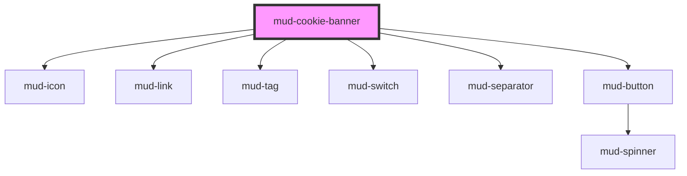

# mud-cookie-banner

<!-- Auto Generated Below -->

## Overview

Cookie banner — GDPR consent surface (molecule).

Pattern B (composed molecule): renders its own header / body / categories /
footer in shadow DOM. Composes `mud-button`, `mud-switch`, `mud-icon`,
`mud-tag` and `mud-separator` for the interactive pieces. The host is a
non-modal dialog (`role="dialog" aria-modal="false"`) anchored to the bottom
or top edge of the viewport — it does NOT trap focus so the page underneath
stays operable.

Two variants share one element:

- `variant="simple"` (default) — three CTAs (`Personalizează` / `Refuză toate`
  / `Accept toate`). The "Personalizează" button switches the banner to
  expanded mode.
- `variant="detailed"` — same collapsed footprint, but expanding reveals a
  category list (necessary / analytics / marketing by default) with per-row
  `mud-switch`. Required categories render a fixed check-mark instead.

Romanian voice ships as defaults; every label is overridable via the public
`@Prop` surface for localisation.

## Properties

| Property       | Attribute       | Description                                                                                                                                                                                                                | Type                                     | Default     |
| -------------- | --------------- | -------------------------------------------------------------------------------------------------------------------------------------------------------------------------------------------------------------------------- | ---------------------------------------- | ----------- |
| `acceptLabel`  | `accept-label`  | "Accept all" button label.                                                                                                                                                                                                 | `string \| undefined`                    | `undefined` |
| `ariaLabel`    | `aria-label`    | Forwarded to the host as `aria-label`. Use this when the visible title is not descriptive enough for screen-reader users.                                                                                                  | `string \| undefined`                    | `undefined` |
| `body`         | `body`          | Plain-text body. Defaults to Romanian disclosure copy. Override via `body` slot for rich content.                                                                                                                          | `string \| undefined`                    | `undefined` |
| `categories`   | --              | Category catalogue rendered in detailed/expanded mode. Falls back to a three-bucket Romanian default (necessary / analytics / marketing) when omitted. Ignored when the `categories` slot is populated.                    | `readonly CookieCategory[] \| undefined` | `undefined` |
| `closeLabel`   | `close-label`   | Close button accessible label. Defaults to Romanian "Închide".                                                                                                                                                             | `string \| undefined`                    | `undefined` |
| `expanded`     | `expanded`      | Whether the banner is currently expanded (preferences view).                                                                                                                                                               | `boolean`                                | `false`     |
| `manageLabel`  | `manage-label`  | "Customise / Manage cookies" button label.                                                                                                                                                                                 | `string \| undefined`                    | `undefined` |
| `position`     | `position`      | Edge the banner is anchored to.                                                                                                                                                                                            | `"bottom" \| "top"`                      | `'bottom'`  |
| `privacyHref`  | `privacy-href`  | Optional href for the inline privacy-policy link.                                                                                                                                                                          | `string \| undefined`                    | `undefined` |
| `privacyLabel` | `privacy-label` | Privacy-policy link label. Defaults to Romanian "Politica de confidențialitate".                                                                                                                                           | `string \| undefined`                    | `undefined` |
| `rejectLabel`  | `reject-label`  | "Reject all" button label.                                                                                                                                                                                                 | `string \| undefined`                    | `undefined` |
| `saveLabel`    | `save-label`    | "Save preferences" button label (shown only in detailed/expanded).                                                                                                                                                         | `string \| undefined`                    | `undefined` |
| `titleText`    | `title-text`    | Plain-text title. Defaults to Romanian "Folosim cookie-uri".                                                                                                                                                               | `string \| undefined`                    | `undefined` |
| `variant`      | `variant`       | Layout flavour. - `simple` (default) — three footer buttons, no category list on expand. - `detailed` — adds a category list with per-row toggles in the expanded   state and a single "Salvează preferințele" footer CTA. | `"detailed" \| "simple"`                 | `'simple'`  |

## Events

| Event                | Description                                                                    | Type                                                    |
| -------------------- | ------------------------------------------------------------------------------ | ------------------------------------------------------- |
| `mudAccept`          | Fires when the user accepts every (non-required) category.                     | `CustomEvent<{ categories: Record<string, boolean>; }>` |
| `mudDismiss`         | Fires when the banner transitions from expanded → collapsed (via close / Esc). | `CustomEvent<void>`                                     |
| `mudExpand`          | Fires when the banner transitions from collapsed → expanded.                   | `CustomEvent<void>`                                     |
| `mudReject`          | Fires when the user rejects every non-required category.                       | `CustomEvent<{ categories: Record<string, boolean>; }>` |
| `mudSavePreferences` | Fires when the user saves a custom selection (detailed/expanded only).         | `CustomEvent<{ categories: Record<string, boolean>; }>` |

## Slots

| Slot           | Description                                                                                                                                                                                        |
| -------------- | -------------------------------------------------------------------------------------------------------------------------------------------------------------------------------------------------- |
| `"body"`       | Rich body copy. Overrides the `body` prop when populated.                                                                                                                                          |
| `"categories"` | Custom category UI. Replaces the built-in category list              when populated (the consumer takes full ownership of the              `mud-switch` wiring and the resulting consent payload). |

## Shadow Parts

| Part                     | Description |
| ------------------------ | ----------- |
| `"body"`                 |             |
| `"categories"`           |             |
| `"category"`             |             |
| `"category-description"` |             |
| `"category-label"`       |             |
| `"close"`                |             |
| `"container"`            |             |
| `"footer"`               |             |
| `"header"`               |             |
| `"title"`                |             |

## Dependencies

### Depends on

- [mud-icon](../mud-icon)
- [mud-link](../mud-link)
- [mud-tag](../mud-tag)
- [mud-switch](../mud-switch)
- [mud-separator](../mud-separator)
- [mud-button](../mud-button)

### Graph

----------------------------------------------

*Built with [StencilJS](https://stenciljs.com/)*
