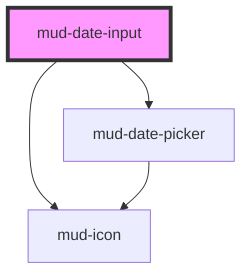

# mud-date-input

<!-- Auto Generated Below -->

## Overview

Date Input — segment-masked date entry molecule.

Pattern B (atom-interactive, form-associated): renders its own `<input>`
inside shadow DOM and overlays a ghost format hint that lets the unfilled
`DD/MM/YYYY` segments stay visible while the user types — matching the
"focus: date-populated / month-populated / fully-populated" Figma states.

## Properties

| Property            | Attribute             | Description                                                                                                                                                                                                                                                                                                                                                                                                                  | Type                                           | Default                                                 |
| ------------------- | --------------------- | ---------------------------------------------------------------------------------------------------------------------------------------------------------------------------------------------------------------------------------------------------------------------------------------------------------------------------------------------------------------------------------------------------------------------------- | ---------------------------------------------- | ------------------------------------------------------- |
| `ariaLabel`         | `aria-label`          | Accessible name. Mirrors to the internal control's `aria-label` when no visible label is present.                                                                                                                                                                                                                                                                                                                            | `string \| undefined`                          | `undefined`                                             |
| `breakpoint`        | `breakpoint`          | Calendar-popover placement. `auto` opens a desktop dropdown on wide viewports and a full-width bottom sheet on narrow ones; `desktop` / `mobile` force one layout.                                                                                                                                                                                                                                                           | `"auto" \| "desktop" \| "mobile"`              | `'auto'`                                                |
| `clearLabel`        | `clear-label`         | Accessible label for the clear (×) button.                                                                                                                                                                                                                                                                                                                                                                                   | `string`                                       | `'Șterge'`                                              |
| `clearable`         | `clearable`           | Shows a trailing clear (×) button while the field holds a value, wiping the entry in one click. Matches the Figma `clearButton` axis shown in the Focus / Filled states. The button never appears while the field is empty, disabled, or read-only. Opt-in, mirroring the Figma boolean axis.                                                                                                                                | `boolean`                                      | `false`                                                 |
| `dateErrorText`     | `date-error-text`     | Message shown when a complete date does not exist (e.g. `31/02/2025`).                                                                                                                                                                                                                                                                                                                                                       | `string`                                       | `'Introduceți o dată validă'`                           |
| `dayErrorText`      | `day-error-text`      | Message shown when a complete day segment is outside 01–31.                                                                                                                                                                                                                                                                                                                                                                  | `string`                                       | `'Ziua trebuie să fie între 01 și 31'`                  |
| `disabled`          | `disabled`            | Disables interactivity. The internal control receives `aria-disabled` and the native `disabled` attribute.                                                                                                                                                                                                                                                                                                                   | `boolean`                                      | `false`                                                 |
| `errorText`         | `error-text`          | Plain-text error message shown below the control when `invalid` is set. When present it replaces `helperText` and pairs with the error icon.                                                                                                                                                                                                                                                                                 | `string \| undefined`                          | `undefined`                                             |
| `format`            | `format`              | Display format. The component accepts only the digits the format permits and rewrites the value with the separator inline as the user types.                                                                                                                                                                                                                                                                                 | `"DD/MM/YYYY" \| "MM/DD/YYYY" \| "YYYY-MM-DD"` | `'DD/MM/YYYY'`                                          |
| `helperText`        | `helper-text`         | Plain-text helper / hint shown below the control.                                                                                                                                                                                                                                                                                                                                                                            | `string \| undefined`                          | `undefined`                                             |
| `invalid`           | `invalid`             | Forces destructive visuals regardless of `variant`. Sets `aria-invalid`. Use together with `errorText` to surface the message.                                                                                                                                                                                                                                                                                               | `boolean`                                      | `false`                                                 |
| `label`             | `label`               | Plain-text label. Use the `label` slot for richer content.                                                                                                                                                                                                                                                                                                                                                                   | `string \| undefined`                          | `undefined`                                             |
| `max`               | `max`                 | Inclusive upper bound in ISO `YYYY-MM-DD`. The validator rejects entries above this date with an `out-of-range` error.                                                                                                                                                                                                                                                                                                       | `string \| undefined`                          | `undefined`                                             |
| `min`               | `min`                 | Inclusive lower bound in ISO `YYYY-MM-DD`. The validator rejects entries below this date with an `out-of-range` error.                                                                                                                                                                                                                                                                                                       | `string \| undefined`                          | `undefined`                                             |
| `monthErrorText`    | `month-error-text`    | Message shown when a complete month segment is outside 01–12.                                                                                                                                                                                                                                                                                                                                                                | `string`                                       | `'Luna trebuie să fie între 01 și 12'`                  |
| `name`              | `name`                | Form-control `name`. Used during form submission.                                                                                                                                                                                                                                                                                                                                                                            | `string \| undefined`                          | `undefined`                                             |
| `orderErrorText`    | `order-error-text`    | `type="date-range"`: message shown when the end date is before the start date.                                                                                                                                                                                                                                                                                                                                               | `string`                                       | `'Data de sfârșit trebuie să fie după data de început'` |
| `pickerLabel`       | `picker-label`        | Accessible name of the calendar dialog.                                                                                                                                                                                                                                                                                                                                                                                      | `string`                                       | `'Selectează data'`                                     |
| `placeholder`       | `placeholder`         | Placeholder shown when the control is empty. Defaults to the format pattern (`DD/MM/YYYY` / `MM/DD/YYYY` / `YYYY-MM-DD`).                                                                                                                                                                                                                                                                                                    | `string \| undefined`                          | `undefined`                                             |
| `rangeErrorText`    | `range-error-text`    | Message shown when a complete date is outside `min` / `max`.                                                                                                                                                                                                                                                                                                                                                                 | `string`                                       | `'Data este în afara intervalului permis'`              |
| `readonly`          | `readonly`            | Renders the field read-only. The control remains focusable and copyable.                                                                                                                                                                                                                                                                                                                                                     | `boolean`                                      | `false`                                                 |
| `required`          | `required`            | Marks the field as mandatory. Adds a red asterisk to the label and sets `aria-required` on the internal control.                                                                                                                                                                                                                                                                                                             | `boolean`                                      | `false`                                                 |
| `requiredErrorText` | `required-error-text` | Message shown when a `required` field is empty and a form submit found it so. The same text is the form's validation message.                                                                                                                                                                                                                                                                                                | `string`                                       | `'Introduceți data'`                                    |
| `size`              | `size`                | Visual size rung.                                                                                                                                                                                                                                                                                                                                                                                                            | `"lg" \| "md"`                                 | `'md'`                                                  |
| `type`              | `type`                | The date-input type of the Figma Date Picker page (Types, 470:32035): - `default` — one date; the calendar has a "Month Year" title. - `advanced` — one date; the calendar has month and year dropdown chips. - `date-range` — a start and an end date in one field   (`18/01/2025 - 22/01/2025`); the value changes once both ends are picked.  The mobile bottom sheet always uses the chips, as in the Figma Breakpoints. | `"advanced" \| "date-range" \| "default"`      | `'default'`                                             |
| `value`             | `value`               | Current display value, matching the configured `format` (e.g. `15/04/2025`). Reflects to the host attribute. Internal entry rewrites this prop as the user types — consumers can read it back at any time.                                                                                                                                                                                                                   | `string`                                       | `''`                                                    |
| `variant`           | `variant`             | Color treatment. `destructive` is forced when `invalid` is set.                                                                                                                                                                                                                                                                                                                                                              | `"default" \| "destructive"`                   | `'default'`                                             |
| `yearErrorText`     | `year-error-text`     | Message shown when a complete year is outside the allowed years.                                                                                                                                                                                                                                                                                                                                                             | `string`                                       | `'Introduceți un an valid'`                             |

## Events

| Event       | Description                                                                                                                                                                                                         | Type                                 |
| ----------- | ------------------------------------------------------------------------------------------------------------------------------------------------------------------------------------------------------------------- | ------------------------------------ |
| `mudBlur`   | Fires when the internal control loses focus. The native `FocusEvent` is forwarded as-is.                                                                                                                            | `CustomEvent<FocusEvent>`            |
| `mudChange` | Fires when the value is committed (typically on `blur` or `Enter`). `detail.value` is the committed display value; `detail.isoValue` is the ISO `YYYY-MM-DD` when fully populated and valid, otherwise `null`.      | `CustomEvent<DateInputChangeDetail>` |
| `mudClear`  | Fires when the user empties the field via the clear (×) button.                                                                                                                                                     | `CustomEvent<void>`                  |
| `mudFocus`  | Fires when the internal control gains focus. The native `FocusEvent` is forwarded as-is.                                                                                                                            | `CustomEvent<FocusEvent>`            |
| `mudInput`  | Fires on every keystroke. `detail.value` is the current display value; `detail.isoValue` is the ISO `YYYY-MM-DD` when fully populated and valid, otherwise `null`. `detail.segment` is the segment under the caret. | `CustomEvent<DateInputTypingDetail>` |

## Slots

| Slot       | Description                                                                                             |
| ---------- | ------------------------------------------------------------------------------------------------------- |
| `"helper"` | Rich helper / hint content, replaces the `helper-text` prop. Hidden when invalid + error-text is shown. |
| `"label"`  | Rich label content, replaces the `label` prop when present.                                             |

## Shadow Parts

| Part                | Description |
| ------------------- | ----------- |
| `"clear-button"`    |             |
| `"control"`         |             |
| `"error"`           |             |
| `"ghost"`           |             |
| `"helper"`          |             |
| `"label"`           |             |
| `"native"`          |             |
| `"picker-backdrop"` |             |
| `"picker-popover"`  |             |
| `"required-mark"`   |             |
| `"trailing-icon"`   |             |

## Dependencies

### Depends on

- [mud-icon](../mud-icon)
- [mud-date-picker](../mud-date-picker)

### Graph

----------------------------------------------

*Built with [StencilJS](https://stenciljs.com/)*
