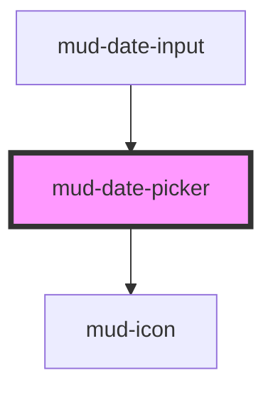

# mud-date-picker

<!-- Auto Generated Below -->

## Overview

Romanian date picker — locale-aware calendar molecule.

Three modes:
- `single` — pick exactly one date. `value` is `string` (ISO YYYY-MM-DD) or empty.
- `range` — pick a start + end. Click once to set `rangeStart`, click again to set `rangeEnd`;
  click outside the range to start a new range.
- `multi` — toggle individual dates. `value` is `string[]`.

Three breakpoints (visual modes):
- `desktop` — 320px elevated card with shadow.
- `mobile` — full-width bottom-sheet style with drag handle.
- `docked` — compact (no shadow) intended to attach beneath a `mud-date-input`.

All weekday + month labels come from `Intl.DateTimeFormat` so the locale prop drives the language —
no hard-coded strings. Romanian (`ro-RO`) is the default.

Keyboard:
- Arrow keys move focus by day
- PageUp/PageDown change month
- Shift+PageUp/PageDown change year
- Home/End jump to the start/end of the visible week
- Enter/Space selects the focused day

## Properties

| Property            | Attribute             | Description                                                                                                                                                                                                                                                                                                                                                      | Type                                | Default     |
| ------------------- | --------------------- | ---------------------------------------------------------------------------------------------------------------------------------------------------------------------------------------------------------------------------------------------------------------------------------------------------------------------------------------------------------------- | ----------------------------------- | ----------- |
| `breakpoint`        | `breakpoint`          | Visual breakpoint / placement.                                                                                                                                                                                                                                                                                                                                   | `"desktop" \| "docked" \| "mobile"` | `'desktop'` |
| `disabledDates`     | --                    | ISO `YYYY-MM-DD` strings that should be marked disabled (e.g. holidays).                                                                                                                                                                                                                                                                                         | `string[] \| undefined`             | `undefined` |
| `firstDayOfWeek`    | `first-day-of-week`   | Week starts on this day of the week (0 = Sunday, 1 = Monday). Defaults to 1 (Monday) which matches the Romanian + most European convention.                                                                                                                                                                                                                      | `number`                            | `1`         |
| `hideTodayShortcut` | `hide-today-shortcut` | Hide the "Today" quick-jump shortcut. Default keeps it visible.                                                                                                                                                                                                                                                                                                  | `boolean`                           | `false`     |
| `label`             | `label`               | Accessible label for the entire picker. Set the `aria-label` attribute on the host (or use this prop) and the component captures it on connect into `resolvedAriaLabel`, then strips the host attribute to avoid Stencil's attribute-observer / render-loop antipattern (same pattern as mud-radio / mud-switch / mud-tooltip / mud-accordion / mud-breadcrumb). | `string \| undefined`               | `undefined` |
| `locale`            | `locale`              | BCP-47 locale tag for weekday/month rendering. Defaults to Romanian.                                                                                                                                                                                                                                                                                             | `string`                            | `'ro-RO'`   |
| `max`               | `max`                 | Inclusive upper bound (ISO `YYYY-MM-DD`). Dates after this are disabled.                                                                                                                                                                                                                                                                                         | `string \| undefined`               | `undefined` |
| `min`               | `min`                 | Inclusive lower bound (ISO `YYYY-MM-DD`). Dates before this are disabled.                                                                                                                                                                                                                                                                                        | `string \| undefined`               | `undefined` |
| `mode`              | `mode`                | Selection mode.                                                                                                                                                                                                                                                                                                                                                  | `"multi" \| "range" \| "single"`    | `'single'`  |
| `rangeEnd`          | `range-end`           | Range mode: end date (ISO `YYYY-MM-DD`). Set together with `rangeStart`.                                                                                                                                                                                                                                                                                         | `string \| undefined`               | `undefined` |
| `rangeStart`        | `range-start`         | Range mode: start date (ISO `YYYY-MM-DD`). Set together with `rangeEnd`.                                                                                                                                                                                                                                                                                         | `string \| undefined`               | `undefined` |
| `value`             | `value`               | Selected value: - `single` → ISO `YYYY-MM-DD` string (or empty) - `range` → ISO array `[start, end]` (use `rangeStart`/`rangeEnd` for explicit access) - `multi` → array of ISO strings                                                                                                                                                                          | `string \| string[] \| undefined`   | `undefined` |
| `viewDate`          | `view-date`           | ISO `YYYY-MM-DD` date that controls the initially displayed month without affecting selection. Useful for tests and controlled scenarios where you need a specific month in view.                                                                                                                                                                                | `string \| undefined`               | `undefined` |

## Events

| Event            | Description                                                                                                                                                                 | Type                                       |
| ---------------- | --------------------------------------------------------------------------------------------------------------------------------------------------------------------------- | ------------------------------------------ |
| `mudChange`      | Fires whenever the selection changes. For `range` mode, `detail.rangeStart` / `detail.rangeEnd` carry the canonical ISO strings; for `multi`, `detail.value` is `string[]`. | `CustomEvent<DatePickerChangeDetail>`      |
| `mudMonthChange` | Fires when the visible month changes (arrows, swipe, keyboard). `month` is 0-indexed.                                                                                       | `CustomEvent<DatePickerMonthChangeDetail>` |

## Shadow Parts

| Part             | Description |
| ---------------- | ----------- |
| `"day-cell"`     |             |
| `"day-grid"`     |             |
| `"day-label"`    |             |
| `"day-labels"`   |             |
| `"drag-handle"`  |             |
| `"footer"`       |             |
| `"header"`       |             |
| `"month-cell"`   |             |
| `"month-grid"`   |             |
| `"nav-button"`   |             |
| `"title"`        |             |
| `"today-button"` |             |
| `"year-cell"`    |             |
| `"year-grid"`    |             |

## Dependencies

### Used by

 - [mud-date-input](../mud-date-input)

### Depends on

- [mud-icon](../mud-icon)

### Graph

----------------------------------------------

*Built with [StencilJS](https://stenciljs.com/)*
