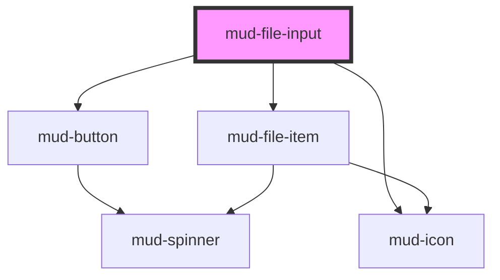

# mud-file-input

<!-- Auto Generated Below -->

## Overview

File Input — drag-and-drop / click-to-browse file selection molecule.

Pattern B (molecule, internal DOM, form-associated): the host owns a hidden
native `<input type="file">` for the browse path, manages the drop zone
affordance, validates by `accept` / `maxSize` / `maxFiles`, and renders a
per-file list of `mud-file-item` rows. Citizens get keyboard parity (Tab
to focus, Enter/Space to open the picker) and a `role="status"` live region
that announces add / remove / reject events.

The component owns SELECTION + VALIDATION + DISPLAY. Real upload (progress,
network errors, retries) is consumer-driven via the `mudChange` event.

State model (no style axis — Figma is state-only):
  default → hover → focus → active (drag-over) → disabled
  `invalid` is a separate validation flag that recolors the dashed border red
  without introducing a style variant.

## Properties

| Property               | Attribute                | Description                                                                                                                                                                                                                                                                                                                                                                                                                        | Type                     | Default                         |
| ---------------------- | ------------------------ | ---------------------------------------------------------------------------------------------------------------------------------------------------------------------------------------------------------------------------------------------------------------------------------------------------------------------------------------------------------------------------------------------------------------------------------- | ------------------------ | ------------------------------- |
| `accept`               | `accept`                 | Native HTML `accept` attribute — MIME types and/or extensions, comma-separated.                                                                                                                                                                                                                                                                                                                                                    | `string \| undefined`    | `undefined`                     |
| `ariaLabel`            | `aria-label`             | Accessible name; mirrors to the drop zone's `aria-label` when no visible label is provided. Setting `aria-label` directly on the host also works — captured on connect into `resolvedAriaLabel` and stripped to avoid Stencil's attribute-observer / render-loop antipattern (same pattern as mud-radio / mud-switch / mud-tooltip / mud-accordion / mud-breadcrumb / mud-date-picker / mud-modal / mud-pagination / mud-receipt). | `string \| undefined`    | `undefined`                     |
| `chooseFilesText`      | `choose-files-text`      | Label for the inline "choose files" link. Rendered as an underlined brand-blue button that opens the native file picker.                                                                                                                                                                                                                                                                                                           | `string`                 | `'Alege fișiere'`               |
| `ctaText`              | `cta-text`               | Lead-in CTA body text inside the drop area at rest. Renders BEFORE the brand-blue inline link. The trailing space is intentional — the link follows on the same line.                                                                                                                                                                                                                                                              | `string`                 | `'Trage și plasează sau '`      |
| `disabled`             | `disabled`               | Disables interactivity — drop zone ignores drops, button is blocked.                                                                                                                                                                                                                                                                                                                                                               | `boolean`                | `false`                         |
| `dropzoneActiveText`   | `dropzone-active-text`   | Body text shown while a drag is over the drop zone (Figma "Active" state). Replaces the resting body + hides the icon for the duration of the drag.                                                                                                                                                                                                                                                                                | `string`                 | `'Eliberează pentru a încărca'` |
| `errorText`            | `error-text`             | Plain-text error message shown below the drop zone when `invalid` is set.                                                                                                                                                                                                                                                                                                                                                          | `string \| undefined`    | `undefined`                     |
| `files`                | --                       | Currently accepted files. Two-way bound: assigning a new array rerenders the list, the citizen interacting fires events that the consumer may use to mutate this array externally.                                                                                                                                                                                                                                                 | `File[]`                 | `[]`                            |
| `helperText`           | `helper-text`            | Plain-text helper / hint shown below the drop zone.                                                                                                                                                                                                                                                                                                                                                                                | `string \| undefined`    | `undefined`                     |
| `invalid`              | `invalid`                | Renders the red-border error treatment + wires `aria-invalid`.                                                                                                                                                                                                                                                                                                                                                                     | `boolean`                | `false`                         |
| `label`                | `label`                  | Plain-text label. Use the `label` slot for richer content.                                                                                                                                                                                                                                                                                                                                                                         | `string \| undefined`    | `undefined`                     |
| `maxFiles`             | `max-files`              | Maximum number of files accepted when `multiple` is set.                                                                                                                                                                                                                                                                                                                                                                           | `number \| undefined`    | `undefined`                     |
| `maxSize`              | `max-size`               | Maximum per-file size in bytes; files above are rejected with `code='size'`.                                                                                                                                                                                                                                                                                                                                                       | `number \| undefined`    | `undefined`                     |
| `maxSizeText`          | `max-size-text`          | Top-right caption inside the field row, shown below the dropzone. When unset and `maxSize` is provided, this is derived from `maxSize` (bytes) as `Mărime maximă: 100 MB`. Explicit prop wins.                                                                                                                                                                                                                                     | `string \| undefined`    | `undefined`                     |
| `multiple`             | `multiple`               | Allow selecting more than one file.                                                                                                                                                                                                                                                                                                                                                                                                | `boolean`                | `false`                         |
| `name`                 | `name`                   | Form-control `name`. Used during form submission.                                                                                                                                                                                                                                                                                                                                                                                  | `string \| undefined`    | `undefined`                     |
| `required`             | `required`               | Marks the field as mandatory. Adds the red asterisk + `aria-required`.                                                                                                                                                                                                                                                                                                                                                             | `boolean`                | `false`                         |
| `size`                 | `size`                   | Visual size rung. Drives drop-zone min-height + label / icon scale.                                                                                                                                                                                                                                                                                                                                                                | `"lg" \| "md"`           | `'md'`                          |
| `supportedFormatsText` | `supported-formats-text` | Top-left caption inside the field row, shown below the dropzone. When unset and `accept` is provided, this is derived from `accept` as `Formate acceptate: jpg, png, pdf`. Explicit prop wins.                                                                                                                                                                                                                                     | `string \| undefined`    | `undefined`                     |
| `variant`              | `variant`                | Presentation. `dropzone` (default) shows the dashed drag-and-drop area; `button` shows a plain "Choose file" button (the Figma "Upload Button"). Both share the same file list, captions and validation.                                                                                                                                                                                                                           | `"button" \| "dropzone"` | `'dropzone'`                    |

## Events

| Event          | Description                                                                          | Type                                 |
| -------------- | ------------------------------------------------------------------------------------ | ------------------------------------ |
| `mudChange`    | Fires when the accepted file list changes (browse OR drop OR remove).                | `CustomEvent<FileInputChangeDetail>` |
| `mudDragEnter` | Fires when a drag enters the drop zone.                                              | `CustomEvent<DragEvent>`             |
| `mudDragLeave` | Fires when the drag leaves the drop zone.                                            | `CustomEvent<DragEvent>`             |
| `mudDrop`      | Fires after a drop, with the accepted / rejected split + the first rejection reason. | `CustomEvent<FileInputDropDetail>`   |
| `mudError`     | Fires for every rejected file (size / type / count). One event per file.             | `CustomEvent<FileInputErrorDetail>`  |
| `mudRemove`    | Fires when a file is removed from the inline list.                                   | `CustomEvent<FileInputRemoveDetail>` |

## Slots

| Slot       | Description                                                                                                    |
| ---------- | -------------------------------------------------------------------------------------------------------------- |
| `"helper"` | Rich helper / hint content, replaces the `helper-text` prop.                                                   |
| `"icon"`   | Override the centre drop-zone icon-glyph inside the circle.        Defaults to `mud-icon name="cloud-upload"`. |
| `"label"`  | Rich label content, replaces the `label` prop when present.                                                    |

## Shadow Parts

| Part                  | Description |
| --------------------- | ----------- |
| `"captions"`          |             |
| `"captions-formats"`  |             |
| `"captions-max-size"` |             |
| `"choose-files-link"` |             |
| `"dropzone"`          |             |
| `"dropzone-body"`     |             |
| `"dropzone-cta"`      |             |
| `"dropzone-icon"`     |             |
| `"dropzone-text"`     |             |
| `"error"`             |             |
| `"file-list"`         |             |
| `"helper"`            |             |
| `"label"`             |             |
| `"required-mark"`     |             |
| `"upload-button"`     |             |

## Dependencies

### Depends on

- [mud-button](../mud-button)
- [mud-icon](../mud-icon)
- [mud-file-item](../mud-file-item)

### Graph

----------------------------------------------

*Built with [StencilJS](https://stenciljs.com/)*
