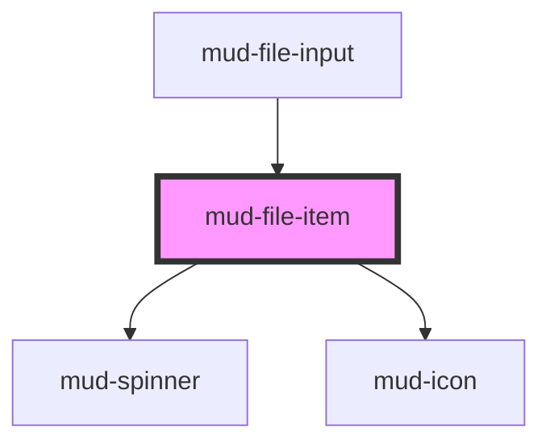

# mud-file-item

<!-- Auto Generated Below -->

## Overview

File Item — single-file row inside `mud-file-input` (or any file list surface).

Pattern B (atom, internal DOM): renders filename + meta (size / error message)
+ state icon + remove button. The remove button is the only interactive
element; the row itself is not focusable so it cannot trap citizens who tab
past a long list.

## Properties

| Property      | Attribute      | Description                                                                                                                                                                                                         | Type                                                | Default              |
| ------------- | -------------- | ------------------------------------------------------------------------------------------------------------------------------------------------------------------------------------------------------------------- | --------------------------------------------------- | -------------------- |
| `disabled`    | `disabled`     | Disables the remove button.                                                                                                                                                                                         | `boolean`                                           | `false`              |
| `errorText`   | `error-text`   | Per-item error message. Replaces the size meta line when `state="error"`.                                                                                                                                           | `string \| undefined`                               | `undefined`          |
| `filename`    | `filename`     | Visible filename.                                                                                                                                                                                                   | `string`                                            | `''`                 |
| `noRemove`    | `no-remove`    | Hide the remove button entirely (e.g. read-only summary lists).                                                                                                                                                     | `boolean`                                           | `false`              |
| `previewSrc`  | `preview-src`  | Optional image-preview URL (object URL or data URI). When set, a thumbnail renders in place of the leading file-type icon (the Figma "image-preview" variation). Falls back to the icon if the image fails to load. | `string \| undefined`                               | `undefined`          |
| `removeLabel` | `remove-label` | Accessible label for the remove button. Provided in Romanian by default to match the institutional voice.                                                                                                           | `string`                                            | `'Elimină fișierul'` |
| `size`        | `size`         | Optional file size in bytes — rendered as a human-readable string.                                                                                                                                                  | `number \| undefined`                               | `undefined`          |
| `state`       | `state`        | Lifecycle state. Drives leading icon color and border treatment. Matches Figma's 4-state model: `uploaded` (resting), `uploading`, `success`, `error`.                                                              | `"error" \| "success" \| "uploaded" \| "uploading"` | `'uploaded'`         |

## Events

| Event       | Description                                                                                                       | Type                                |
| ----------- | ----------------------------------------------------------------------------------------------------------------- | ----------------------------------- |
| `mudRemove` | Fires when the citizen presses the remove control. The host is responsible for splicing the file out of its list. | `CustomEvent<FileItemRemoveDetail>` |

## Slots

| Slot     | Description                                                    |
| -------- | -------------------------------------------------------------- |
| `"icon"` | Override the leading file-type icon. Defaults to `attachment`. |

## Shadow Parts

| Part                 | Description |
| -------------------- | ----------- |
| `"body"`             |             |
| `"error-message"`    |             |
| `"filename"`         |             |
| `"filename-tooltip"` |             |
| `"leading-icon"`     |             |
| `"meta"`             |             |
| `"remove"`           |             |
| `"row"`              |             |
| `"spinner"`          |             |
| `"thumbnail"`        |             |
| `"trailing"`         |             |

## Dependencies

### Used by

 - [mud-file-input](../mud-file-input)

### Depends on

- [mud-spinner](../mud-spinner)
- [mud-icon](../mud-icon)

### Graph

----------------------------------------------

*Built with [StencilJS](https://stenciljs.com/)*
