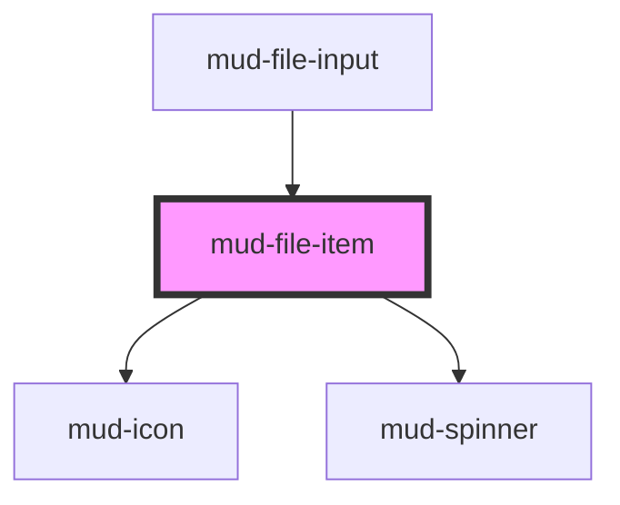

# mud-file-item

<!-- Auto Generated Below -->

## Overview

File Item — single-file row inside `mud-file-input` (or any file list surface).

Pattern B (atom, internal DOM): renders filename + meta (size / error message)
+ state icon + remove button. The remove button is the only interactive
element; the row itself is not focusable so it cannot trap citizens who tab
past a long list.

## Properties

| Property         | Attribute         | Description                                                                                                                                                                                                                                                       | Type                                                        | Default      |
| ---------------- | ----------------- | ----------------------------------------------------------------------------------------------------------------------------------------------------------------------------------------------------------------------------------------------------------------- | ----------------------------------------------------------- | ------------ |
| `disabled`       | `disabled`        | Disables the remove button.                                                                                                                                                                                                                                       | `boolean`                                                   | `false`      |
| `errorLabel`     | `error-label`     | Text announced when the row turns to `error` and has no `error-text` of its own (with one, the message itself is announced as an alert). Overrides the `locale`'s copy when set to a non-empty string.                                                            | `string \| undefined`                                       | `undefined`  |
| `errorText`      | `error-text`      | Per-item error message. Replaces the size meta line when `state="error"`.                                                                                                                                                                                         | `string \| undefined`                                       | `undefined`  |
| `filename`       | `filename`        | Visible filename.                                                                                                                                                                                                                                                 | `string`                                                    | `''`         |
| `issuedLabel`    | `issued-label`    | System variant: label before the issue date (already localised, e.g. "Emis").                                                                                                                                                                                     | `string \| undefined`                                       | `undefined`  |
| `issuedOn`       | `issued-on`       | System variant: issue date, pre-formatted by the host (e.g. "12.03.2026").                                                                                                                                                                                        | `string \| undefined`                                       | `undefined`  |
| `issuer`         | `issuer`          | System variant: issuing authority (e.g. "EVO").                                                                                                                                                                                                                   | `string \| undefined`                                       | `undefined`  |
| `locale`         | `locale`          | Language of the built-in copy. Unset, the component follows the closest ancestor `lang` (`<html lang>` included), else `ro-MD`.                                                                                                                                   | `"en-US" \| "ro-MD" \| "ru-MD" \| string & {} \| undefined` | `undefined`  |
| `noRemove`       | `no-remove`       | Hide the remove button entirely (e.g. read-only summary lists).                                                                                                                                                                                                   | `boolean`                                                   | `false`      |
| `previewSrc`     | `preview-src`     | Optional image-preview URL (object URL or data URI). When set, a thumbnail renders in place of the leading file-type icon (the Figma "image-preview" variation). Falls back to the icon if the image fails to load.                                               | `string \| undefined`                                       | `undefined`  |
| `progress`       | `progress`        | Upload variant: progress of an uploading row, 0–100. Left unset, the bar is indeterminate. Ignored in other states and variants.                                                                                                                                  | `number \| undefined`                                       | `undefined`  |
| `removeLabel`    | `remove-label`    | Accessible label for the remove button. Overrides the `locale`'s copy when set to a non-empty string.                                                                                                                                                             | `string \| undefined`                                       | `undefined`  |
| `selectable`     | `selectable`      | System variant: render as a selectable list option (Figma "system-files-item-selectable") — white bordered row, no remove button. The owner handles click / keyboard and sets `selected`.                                                                         | `boolean`                                                   | `false`      |
| `selected`       | `selected`        | Selectable rows: marks the chosen option with the brand border.                                                                                                                                                                                                   | `boolean`                                                   | `false`      |
| `size`           | `size`            | Optional file size in bytes — rendered as a human-readable string.                                                                                                                                                                                                | `number \| undefined`                                       | `undefined`  |
| `state`          | `state`           | Lifecycle state. Drives leading icon color and border treatment. Matches Figma's 4-state model: `uploaded` (resting), `uploading`, `success`, `error`.                                                                                                            | `"error" \| "success" \| "uploaded" \| "uploading"`         | `'uploaded'` |
| `successLabel`   | `success-label`   | Text announced when an upload finishes (`success`, or `uploaded` right after `uploading`). Overrides the `locale`'s copy when set to a non-empty string.                                                                                                          | `string \| undefined`                                       | `undefined`  |
| `uploadingLabel` | `uploading-label` | Text announced to assistive technology when the row starts uploading (the state is otherwise only a spinner). Overrides the `locale`'s copy when set to a non-empty string.                                                                                       | `string \| undefined`                                       | `undefined`  |
| `variant`        | `variant`         | Visual variant. `system` renders the Figma "system-files-item" card: a taller grey card, a blue document glyph and an info row (`issued-label` `issued-on` • `issuer`) in place of the size meta. Use it for documents issued by a registry rather than uploaded. | `"default" \| "system" \| "upload"`                         | `'default'`  |

## Events

| Event       | Description                                                                                                       | Type                                |
| ----------- | ----------------------------------------------------------------------------------------------------------------- | ----------------------------------- |
| `mudRemove` | Fires when the citizen presses the remove control. The host is responsible for splicing the file out of its list. | `CustomEvent<FileItemRemoveDetail>` |

## Slots

| Slot     | Description                                                    |
| -------- | -------------------------------------------------------------- |
| `"icon"` | Override the leading file-type icon. Defaults to `attachment`. |

## Shadow Parts

| Part                 | Description |
| -------------------- | ----------- |
| `"body"`             |             |
| `"error-message"`    |             |
| `"filename"`         |             |
| `"filename-tooltip"` |             |
| `"info"`             |             |
| `"leading-icon"`     |             |
| `"leading-status"`   |             |
| `"meta"`             |             |
| `"progress"`         |             |
| `"remove"`           |             |
| `"row"`              |             |
| `"spinner"`          |             |
| `"thumbnail"`        |             |
| `"trailing"`         |             |

## Dependencies

### Used by

 - [mud-file-input](../mud-file-input)

### Depends on

- [mud-icon](../mud-icon)
- [mud-spinner](../mud-spinner)

### Graph

```mermaid
graph TD;
  mud-file-item --> mud-icon
  mud-file-item --> mud-spinner
  mud-file-input --> mud-file-item
  style mud-file-item fill:#f9f,stroke:#333,stroke-width:4px
```

----------------------------------------------

*Built with [StencilJS](https://stenciljs.com/)*
