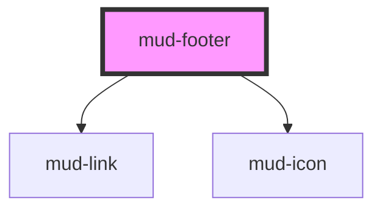

# mud-footer

<!-- Auto Generated Below -->

## Overview

Page footer — civic, multi-section organism for AGE / EVO platforms.

Pattern B (composed organism): renders all sections inside shadow DOM and
composes `mud-link`, `mud-logo`, and `mud-icon` for atomic pieces. The host
carries `role="contentinfo"` so screen readers announce it as the page
footer landmark.

Two variants share one element:

- `variant="evo"` (default) — full EVO platform footer: branding headline,
  link columns (Servicii guvernamentale / Despre / Asistență / Legal),
  contact info, social rows, partner logos, accessibility statement, and a
  black legal bar with copyright + license link.
- `variant="simple"` — slim variant: only the black legal bar with the
  copyright text and license/terms links. Used inside scoped flows
  (modals, embedded apps) where the full footer is too tall.

Romanian voice ships as defaults; every visible string is overridable via
the public `@Prop` surface or the `branding` / `sections` slots.

## Properties

| Property            | Attribute            | Description                                                                                                                                                                                               | Type                                                                                                        | Default     |
| ------------------- | -------------------- | --------------------------------------------------------------------------------------------------------------------------------------------------------------------------------------------------------- | ----------------------------------------------------------------------------------------------------------- | ----------- |
| `accessibilityHref` | `accessibility-href` | Optional href for the accessibility statement link in the legal bar.                                                                                                                                      | `string \| undefined`                                                                                       | `undefined` |
| `ariaLabel`         | `aria-label`         | Forwarded to the host as `aria-label`. Defaults to Romanian "Subsol pagină".                                                                                                                              | `string \| undefined`                                                                                       | `undefined` |
| `contact`           | --                   | Contact block (email / phone / address). When undefined, the section is hidden. Pass an empty object to opt out of the Romanian defaults.                                                                 | `undefined \| { email?: string \| undefined; phone?: string \| undefined; address?: string \| undefined; }` | `undefined` |
| `copyrightText`     | `copyright-text`     | Plain-text copyright line shown in the legal bar. Defaults to Romanian.                                                                                                                                   | `string \| undefined`                                                                                       | `undefined` |
| `licenseHref`       | `license-href`       | Optional href for the privacy/license link in the legal bar.                                                                                                                                              | `string \| undefined`                                                                                       | `undefined` |
| `locale`            | `locale`             | Currently-selected locale for the language switcher. When undefined, the locale switcher is hidden.                                                                                                       | `"en" \| "ro" \| "ru" \| undefined`                                                                         | `undefined` |
| `partnerLogos`      | --                   | Partner logo list. Each entry renders as a text badge (or anchor when `href` is set). Use the `branding` slot for custom logo SVGs.                                                                       | `readonly FooterPartner[] \| undefined`                                                                     | `undefined` |
| `sections`          | --                   | Declarative link columns. Each entry renders as a titled `<nav>` with a vertical link list. Ignored when the `sections` slot is populated. Defaults to the Romanian four-column catalogue.                | `readonly FooterSection[] \| undefined`                                                                     | `undefined` |
| `social`            | --                   | Social link list. Each entry renders as a circular icon button. When undefined, the section is hidden.                                                                                                    | `readonly FooterSocial[] \| undefined`                                                                      | `undefined` |
| `variant`           | `variant`            | Layout flavour. - `evo` (default) — full EVO platform footer with branding, columns, contact, social, partners, legal bar. - `simple` — slim variant with only the legal bar (copyright + license links). | `"evo" \| "simple"`                                                                                         | `'evo'`     |

## Events

| Event             | Description                                                                                                                   | Type                                             |
| ----------------- | ----------------------------------------------------------------------------------------------------------------------------- | ------------------------------------------------ |
| `mudLocaleChange` | Fires when the user selects a new locale from the language switcher. Consumers update their app-level i18n state in response. | `CustomEvent<{ locale: "ro" \| "ru" \| "en"; }>` |

## Slots

| Slot         | Description                                                                                                                                               |
| ------------ | --------------------------------------------------------------------------------------------------------------------------------------------------------- |
| `"branding"` | Override the default branding headline. When populated,            replaces the headline+tagline pair (e.g. consumer-supplied            `mud-logo` row). |
| `"sections"` | Override the declarative `sections` prop with custom JSX.            Use when columns need rich content beyond plain links.                               |

## Shadow Parts

| Part                  | Description |
| --------------------- | ----------- |
| `"accessibility"`     |             |
| `"branding"`          |             |
| `"branding-headline"` |             |
| `"column"`            |             |
| `"column-title"`      |             |
| `"columns"`           |             |
| `"contact"`           |             |
| `"contact-heading"`   |             |
| `"legal-bar"`         |             |
| `"legal-copyright"`   |             |
| `"locale"`            |             |
| `"partners"`          |             |
| `"partners-heading"`  |             |
| `"primary"`           |             |
| `"social"`            |             |
| `"social-heading"`    |             |

## Dependencies

### Depends on

- [mud-link](../mud-link)
- [mud-icon](../mud-icon)

### Graph

----------------------------------------------

*Built with [StencilJS](https://stenciljs.com/)*
