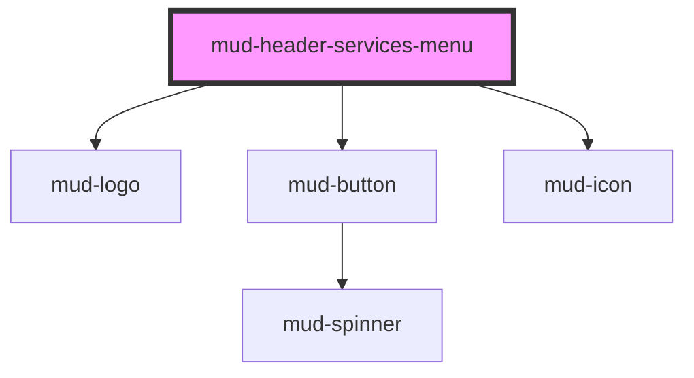

# mud-header-services-menu

<!-- Auto Generated Below -->

## Overview

Header services menu — the "Platforme utile" dropdown.

A 2-column grid of platform cards (each a brand logo) over a "discover all"
button. Data-driven via `platforms`; toggle visibility with `open`. Reuses
`mud-logo` for platforms it ships (mpay/msign/mpower/mnotify) and accepts a
`logoSrc` image for the rest (epermits/econsulat).

## Properties

| Property        | Attribute        | Description                                            | Type                         | Default                   |
| --------------- | ---------------- | ------------------------------------------------------ | ---------------------------- | ------------------------- |
| `ariaLabel`     | `aria-label`     | Accessible name for the panel (defaults to `heading`). | `string \| undefined`        | `undefined`               |
| `discoverHref`  | `discover-href`  | Destination of the "discover all" button.              | `string \| undefined`        | `undefined`               |
| `discoverLabel` | `discover-label` | Label of the full-width "discover all" button.         | `string`                     | `'Descoperă-le pe toate'` |
| `heading`       | `heading`        | Panel heading.                                         | `string`                     | `'Platforme utile'`       |
| `open`          | `open`           | Whether the panel is shown.                            | `boolean`                    | `false`                   |
| `platforms`     | --               | Platform cards.                                        | `readonly ServicePlatform[]` | `[]`                      |

## Events

| Event              | Description                                        | Type                                     |
| ------------------ | -------------------------------------------------- | ---------------------------------------- |
| `mudDiscover`      | Fired when the "discover all" button is activated. | `CustomEvent<void>`                      |
| `mudServiceSelect` | Fired when a platform card is activated.           | `CustomEvent<HeaderServiceSelectDetail>` |

## Shadow Parts

| Part         | Description        |
| ------------ | ------------------ |
| `"services"` | The panel surface. |

## Dependencies

### Depends on

- [mud-logo](../mud-logo)
- [mud-button](../mud-button)
- [mud-icon](../mud-icon)

### Graph

----------------------------------------------

*Built with [StencilJS](https://stenciljs.com/)*
