# mud-icon

<!-- Auto Generated Below -->

## Overview

Icon — renders an inline SVG fetched on-demand from per-size asset files.

Names follow the Material Symbols convention: append `-filled` to the base name
to request the filled variant (e.g. `check` outlined vs `check-filled`).

When the exact `size`/`name` combination is missing from the manifest, the
provider falls back to the closest larger size (preferred) and then to the
largest smaller size before giving up.

## Properties

| Property            | Attribute     | Description                                                                                     | Type                                                                                                                                                                                                                                                                                                                                                                                                                                                                                                                                                                                                                                                                                                                                                                                                                                                                                                                                                                                                                                                                                                                                                                                                                                                                                                                                                                                                                                                                                                                                                                                                                                                                                                                                                                                                                                                                                                                                                                                                                                                                                                                                                                                                                                                                                                                                                                                                                                                                                                                                                                                                                                                                                                                                                                                                                                                                                                                                                                                                                                                                                                                                                                                                                                                                             | Default          |
| ------------------- | ------------- | ----------------------------------------------------------------------------------------------- | -------------------------------------------------------------------------------------------------------------------------------------------------------------------------------------------------------------------------------------------------------------------------------------------------------------------------------------------------------------------------------------------------------------------------------------------------------------------------------------------------------------------------------------------------------------------------------------------------------------------------------------------------------------------------------------------------------------------------------------------------------------------------------------------------------------------------------------------------------------------------------------------------------------------------------------------------------------------------------------------------------------------------------------------------------------------------------------------------------------------------------------------------------------------------------------------------------------------------------------------------------------------------------------------------------------------------------------------------------------------------------------------------------------------------------------------------------------------------------------------------------------------------------------------------------------------------------------------------------------------------------------------------------------------------------------------------------------------------------------------------------------------------------------------------------------------------------------------------------------------------------------------------------------------------------------------------------------------------------------------------------------------------------------------------------------------------------------------------------------------------------------------------------------------------------------------------------------------------------------------------------------------------------------------------------------------------------------------------------------------------------------------------------------------------------------------------------------------------------------------------------------------------------------------------------------------------------------------------------------------------------------------------------------------------------------------------------------------------------------------------------------------------------------------------------------------------------------------------------------------------------------------------------------------------------------------------------------------------------------------------------------------------------------------------------------------------------------------------------------------------------------------------------------------------------------------------------------------------------------------------------------------------------- | ---------------- |
| `ariaLabel`         | `aria-label`  | Accessible label. When provided, the icon is announced; when omitted it is decorative.          | `string \| undefined`                                                                                                                                                                                                                                                                                                                                                                                                                                                                                                                                                                                                                                                                                                                                                                                                                                                                                                                                                                                                                                                                                                                                                                                                                                                                                                                                                                                                                                                                                                                                                                                                                                                                                                                                                                                                                                                                                                                                                                                                                                                                                                                                                                                                                                                                                                                                                                                                                                                                                                                                                                                                                                                                                                                                                                                                                                                                                                                                                                                                                                                                                                                                                                                                                                                            | `undefined`      |
| `color`             | `color`       | Color token suffix (mapped to `--color-{value}`), or `currentColor` to inherit text color.      | `string`                                                                                                                                                                                                                                                                                                                                                                                                                                                                                                                                                                                                                                                                                                                                                                                                                                                                                                                                                                                                                                                                                                                                                                                                                                                                                                                                                                                                                                                                                                                                                                                                                                                                                                                                                                                                                                                                                                                                                                                                                                                                                                                                                                                                                                                                                                                                                                                                                                                                                                                                                                                                                                                                                                                                                                                                                                                                                                                                                                                                                                                                                                                                                                                                                                                                         | `'currentColor'` |
| `disabled`          | `disabled`    | Reflects to `[disabled]` and visually disables the icon.                                        | `boolean`                                                                                                                                                                                                                                                                                                                                                                                                                                                                                                                                                                                                                                                                                                                                                                                                                                                                                                                                                                                                                                                                                                                                                                                                                                                                                                                                                                                                                                                                                                                                                                                                                                                                                                                                                                                                                                                                                                                                                                                                                                                                                                                                                                                                                                                                                                                                                                                                                                                                                                                                                                                                                                                                                                                                                                                                                                                                                                                                                                                                                                                                                                                                                                                                                                                                        | `false`          |
| `interactive`       | `interactive` | Enables interactive treatment (cursor, hover, focus ring, keyboard activation).                 | `boolean`                                                                                                                                                                                                                                                                                                                                                                                                                                                                                                                                                                                                                                                                                                                                                                                                                                                                                                                                                                                                                                                                                                                                                                                                                                                                                                                                                                                                                                                                                                                                                                                                                                                                                                                                                                                                                                                                                                                                                                                                                                                                                                                                                                                                                                                                                                                                                                                                                                                                                                                                                                                                                                                                                                                                                                                                                                                                                                                                                                                                                                                                                                                                                                                                                                                                        | `false`          |
| `name` _(required)_ | `name`        | Icon identifier (kebab-case), one of `ICON_NAMES`. Suffix `-filled` selects the filled variant. | `"add-cart" \| "alarm" \| "arrow-down" \| "arrow-left" \| "arrow-right" \| "arrow-up" \| "arrow-up-right" \| "asterisk" \| "attachment" \| "award" \| "backspace" \| "barcode" \| "barrier" \| "book" \| "bookmark" \| "bubble-alert" \| "bubble-heart" \| "bubble-question" \| "building" \| "bullet-list" \| "business" \| "business-filled" \| "calculator" \| "calendar" \| "calendar-add" \| "calendar-edit" \| "calendar-filled" \| "calendar-remove" \| "calendar-remove-filled" \| "car" \| "card-link" \| "carousel" \| "cart" \| "chart" \| "check-all" \| "checklist" \| "checkmark-large" \| "checkmark-small" \| "chevron-bottom" \| "chevron-bottom-filled" \| "chevron-bottom-medium" \| "chevron-bottom-small" \| "chevron-grabber" \| "chevron-left" \| "chevron-left-small" \| "chevron-right" \| "chevron-right-small" \| "chevron-top" \| "chevron-top-small" \| "child" \| "circle-checkmark-filled" \| "circle-download" \| "circle-error" \| "circle-error-filled" \| "circle-info" \| "circle-info-filled" \| "clock" \| "cloud-upload" \| "coins" \| "contacts" \| "copy" \| "credit-card" \| "cross-large" \| "cross-small" \| "data-access" \| "delete" \| "delete-filled" \| "direction" \| "dislike" \| "document" \| "document-filled" \| "document-info-filled" \| "dot" \| "dot-grid" \| "download" \| "drag" \| "edit" \| "education" \| "electronic-signature" \| "empty-bin" \| "envelope" \| "envelope-filled" \| "exclamation" \| "external-link" \| "eye-open" \| "face-id" \| "facebook-filled" \| "faq" \| "feedback" \| "file-download" \| "filter" \| "flag" \| "flash-filled" \| "flash-off-filled" \| "globe" \| "group" \| "group-filled" \| "hashtag" \| "health" \| "help" \| "history" \| "home-line" \| "home-line-filled" \| "home-round-door" \| "house" \| "id-card" \| "id-card-filled" \| "identity" \| "image" \| "instagram-filled" \| "judge-gavel" \| "light-bulb" \| "like" \| "linkedin-filled" \| "lock" \| "logout" \| "map-pin" \| "map-pin-filled" \| "mark-all" \| "menu" \| "minus-small" \| "mobile-phone" \| "moon" \| "more-horizontal" \| "more-vertical" \| "notification" \| "old-man" \| "organisation" \| "page-add" \| "page-child" \| "page-download" \| "page-download-filled" \| "page-house" \| "page-text" \| "page-text-lock" \| "page-upload" \| "page-upload-filled" \| "passport" \| "pdf-file" \| "people" \| "people-like" \| "permission" \| "person" \| "phone" \| "phone-filled" \| "pin" \| "plus-large" \| "plus-small" \| "qr-code" \| "receipt-bill" \| "receipt-check" \| "receipt-check-filled" \| "reorder" \| "reschedule" \| "resize" \| "rotate-arrow" \| "scan" \| "search" \| "services" \| "settings" \| "share-android" \| "share-ios" \| "shield" \| "shield-keyhole" \| "shield-user" \| "sidebar" \| "sidebar-filled" \| "signal" \| "signature" \| "sort" \| "sparkles-filled" \| "stamp" \| "store" \| "suitcase" \| "suitcase-2" \| "sun" \| "support" \| "templates" \| "tiktok" \| "time" \| "time-filled" \| "tree" \| "umbrella" \| "unlocked-filled" \| "upload" \| "user-account" \| "user-account-filled" \| "vacation" \| "visiting-card" \| "voucher" \| "wallet" \| "wallet-filled" \| "warning" \| "warning-filled" \| "wheelchair" \| "youtube-filled"` | `undefined`      |
| `size`              | `size`        | Pixel size, aligned with Figma Foundations: 12 / 16 / 20 / 24.                                  | `12 \| 16 \| 20 \| 24`                                                                                                                                                                                                                                                                                                                                                                                                                                                                                                                                                                                                                                                                                                                                                                                                                                                                                                                                                                                                                                                                                                                                                                                                                                                                                                                                                                                                                                                                                                                                                                                                                                                                                                                                                                                                                                                                                                                                                                                                                                                                                                                                                                                                                                                                                                                                                                                                                                                                                                                                                                                                                                                                                                                                                                                                                                                                                                                                                                                                                                                                                                                                                                                                                                                           | `16`             |

## Dependencies

### Used by

 - [mud-avatar](../mud-avatar)
 - [mud-banner](../mud-banner)
 - [mud-breadcrumb](../mud-breadcrumb)
 - [mud-checkbox](../mud-checkbox)
 - [mud-chip](../mud-chip)
 - [mud-cookie-banner](../mud-cookie-banner)
 - [mud-date-input](../mud-date-input)
 - [mud-date-picker](../mud-date-picker)
 - [mud-file-input](../mud-file-input)
 - [mud-file-item](../mud-file-item)
 - [mud-footer](../mud-footer)
 - [mud-header-mobile](../mud-header)
 - [mud-header-nav-item](../mud-header)
 - [mud-header-services-menu](../mud-header)
 - [mud-info-box](../mud-info-box)
 - [mud-inline-message](../mud-inline-message)
 - [mud-input-chip](../mud-input-chip)
 - [mud-menu-item](../mud-menu)
 - [mud-modal](../mud-modal)
 - [mud-numeric-input](../mud-numeric-input)
 - [mud-pagination](../mud-pagination)
 - [mud-phone-input](../mud-phone-input)
 - [mud-search-input](../mud-search-input)
 - [mud-segmented-control](../mud-segmented-control)
 - [mud-select](../mud-select)
 - [mud-sidebar-item](../mud-sidebar)
 - [mud-stepper](../mud-stepper)
 - [mud-tab](../mud-tabs)
 - [mud-table](../mud-table)
 - [mud-tabs](../mud-tabs)
 - [mud-text-input](../mud-text-input)
 - [mud-textarea](../mud-textarea)
 - [mud-toast](../mud-toast)

### Graph

```mermaid
graph TD;
  mud-avatar --> mud-icon
  mud-banner --> mud-icon
  mud-breadcrumb --> mud-icon
  mud-checkbox --> mud-icon
  mud-chip --> mud-icon
  mud-cookie-banner --> mud-icon
  mud-date-input --> mud-icon
  mud-date-picker --> mud-icon
  mud-file-input --> mud-icon
  mud-file-item --> mud-icon
  mud-footer --> mud-icon
  mud-header-mobile --> mud-icon
  mud-header-nav-item --> mud-icon
  mud-header-services-menu --> mud-icon
  mud-info-box --> mud-icon
  mud-inline-message --> mud-icon
  mud-input-chip --> mud-icon
  mud-menu-item --> mud-icon
  mud-modal --> mud-icon
  mud-numeric-input --> mud-icon
  mud-pagination --> mud-icon
  mud-phone-input --> mud-icon
  mud-search-input --> mud-icon
  mud-segmented-control --> mud-icon
  mud-select --> mud-icon
  mud-sidebar-item --> mud-icon
  mud-stepper --> mud-icon
  mud-tab --> mud-icon
  mud-table --> mud-icon
  mud-tabs --> mud-icon
  mud-text-input --> mud-icon
  mud-textarea --> mud-icon
  mud-toast --> mud-icon
  style mud-icon fill:#f9f,stroke:#333,stroke-width:4px
```

----------------------------------------------

*Built with [StencilJS](https://stenciljs.com/)*
