# mud-icon

<!-- Auto Generated Below -->

## Overview

Icon — renders an inline SVG fetched on-demand from per-size asset files.

Names follow the Material Symbols convention: append `-filled` to the base name
to request the filled variant (e.g. `check` outlined vs `check-filled`).

When the exact `size`/`name` combination is missing from the manifest, the
provider falls back to the closest larger size (preferred) and then to the
largest smaller size before giving up.

## Properties

| Property      | Attribute     | Description                                                                                | Type                   | Default          |
| ------------- | ------------- | ------------------------------------------------------------------------------------------ | ---------------------- | ---------------- |
| `ariaLabel`   | `aria-label`  | Accessible label. When provided, the icon is announced; when omitted it is decorative.     | `string \| undefined`  | `undefined`      |
| `color`       | `color`       | Color token suffix (mapped to `--color-{value}`), or `currentColor` to inherit text color. | `string`               | `'currentColor'` |
| `disabled`    | `disabled`    | Reflects to `[disabled]` and visually disables the icon.                                   | `boolean`              | `false`          |
| `interactive` | `interactive` | Enables interactive treatment (cursor, hover, focus ring, keyboard activation).            | `boolean`              | `false`          |
| `name`        | `name`        | Icon identifier (kebab-case). Suffix `-filled` selects the filled variant.                 | `string`               | `'check'`        |
| `size`        | `size`        | Pixel size, aligned with Figma Foundations: 12 / 16 / 20 / 24.                             | `12 \| 16 \| 20 \| 24` | `16`             |

## Dependencies

### Used by

 - [mud-avatar](../mud-avatar)
 - [mud-breadcrumb](../mud-breadcrumb)
 - [mud-cookie-banner](../mud-cookie-banner)
 - [mud-date-input](../mud-date-input)
 - [mud-date-picker](../mud-date-picker)
 - [mud-file-input](../mud-file-input)
 - [mud-file-item](../mud-file-item)
 - [mud-footer](../mud-footer)
 - [mud-input](../mud-input)
 - [mud-input-chip](../mud-input-chip)
 - [mud-modal](../mud-modal)
 - [mud-notification](../mud-notification)
 - [mud-numeric-input](../mud-numeric-input)
 - [mud-pagination](../mud-pagination)
 - [mud-phone-input](../mud-phone-input)
 - [mud-progress-tracker](../mud-progress-tracker)
 - [mud-search-input-circular](../mud-search-input-circular)
 - [mud-search-input-rectangular](../mud-search-input-rectangular)
 - [mud-segmented-control](../mud-segmented-control)
 - [mud-select-input](../mud-select-input)
 - [mud-tab](../mud-tabs)
 - [mud-table](../mud-table)
 - [mud-tabs](../mud-tabs)
 - [mud-textarea](../mud-textarea)

### Graph

```mermaid
graph TD;
  mud-avatar --> mud-icon
  mud-breadcrumb --> mud-icon
  mud-cookie-banner --> mud-icon
  mud-date-input --> mud-icon
  mud-date-picker --> mud-icon
  mud-file-input --> mud-icon
  mud-file-item --> mud-icon
  mud-footer --> mud-icon
  mud-input --> mud-icon
  mud-input-chip --> mud-icon
  mud-modal --> mud-icon
  mud-notification --> mud-icon
  mud-numeric-input --> mud-icon
  mud-pagination --> mud-icon
  mud-phone-input --> mud-icon
  mud-progress-tracker --> mud-icon
  mud-search-input-circular --> mud-icon
  mud-search-input-rectangular --> mud-icon
  mud-segmented-control --> mud-icon
  mud-select-input --> mud-icon
  mud-tab --> mud-icon
  mud-table --> mud-icon
  mud-tabs --> mud-icon
  mud-textarea --> mud-icon
  style mud-icon fill:#f9f,stroke:#333,stroke-width:4px
```

----------------------------------------------

*Built with [StencilJS](https://stenciljs.com/)*
