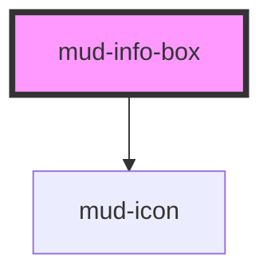

# mud-info-box

<!-- Auto Generated Below -->

## Overview

Informational Box — an inline, in-content callout that highlights key
messages, announcements, alerts, or explanations within the page flow.

Unlike `mud-toast` (a fixed-width corner toast) or `mud-banner` (a
full-width page-level bar), the info box sits inside the content column,
fills its container's width, and supports rich content: an optional bold
heading, a multi-line body (default slot), an optional inline action group
(`actions` slot — links/buttons) and an optional close button.

Two axes:
- `variant` — `info` (neutral icon), `info-moderate` (brand-blue icon),
  `warning`, or `error`.
- `emphasis` — `subtle` (neutral grey surface, coloured icon) or `strong`
  (a tinted semantic surface).

The box is static in-flow content, so it is **not** an ARIA live region
(that would re-announce on every render). The icon is decorative; the
heading and body are read in normal reading order. For transient, announced
messages use `mud-toast` / `mud-banner` instead.

## Properties

| Property     | Attribute     | Description                                                                                                              | Type                                                                                                                                                                                                                                                                                                                                                                                                                                                                                                                                                                                                                                                                                                                                                                                                                                                                                                                                                                                                                                                                                                                                                                                                                                                                                                                                                                                                                                                                                                                                                                                                                                                                                                                                                                                                                                                                                                                                                                                                                                                                                                                                                                                                                                                                                                                                                                                                                                                                                                                                                                                                                                                                                                                                                                                                                                                                                                                                                                                                                                                                                                                                                                                                                                                                                          | Default     |
| ------------ | ------------- | ------------------------------------------------------------------------------------------------------------------------ | --------------------------------------------------------------------------------------------------------------------------------------------------------------------------------------------------------------------------------------------------------------------------------------------------------------------------------------------------------------------------------------------------------------------------------------------------------------------------------------------------------------------------------------------------------------------------------------------------------------------------------------------------------------------------------------------------------------------------------------------------------------------------------------------------------------------------------------------------------------------------------------------------------------------------------------------------------------------------------------------------------------------------------------------------------------------------------------------------------------------------------------------------------------------------------------------------------------------------------------------------------------------------------------------------------------------------------------------------------------------------------------------------------------------------------------------------------------------------------------------------------------------------------------------------------------------------------------------------------------------------------------------------------------------------------------------------------------------------------------------------------------------------------------------------------------------------------------------------------------------------------------------------------------------------------------------------------------------------------------------------------------------------------------------------------------------------------------------------------------------------------------------------------------------------------------------------------------------------------------------------------------------------------------------------------------------------------------------------------------------------------------------------------------------------------------------------------------------------------------------------------------------------------------------------------------------------------------------------------------------------------------------------------------------------------------------------------------------------------------------------------------------------------------------------------------------------------------------------------------------------------------------------------------------------------------------------------------------------------------------------------------------------------------------------------------------------------------------------------------------------------------------------------------------------------------------------------------------------------------------------------------------------------------------- | ----------- |
| `closable`   | `closable`    | When `true`, renders a trailing close button. Activating it emits `mudClose`; the consumer removes the box from the DOM. | `boolean`                                                                                                                                                                                                                                                                                                                                                                                                                                                                                                                                                                                                                                                                                                                                                                                                                                                                                                                                                                                                                                                                                                                                                                                                                                                                                                                                                                                                                                                                                                                                                                                                                                                                                                                                                                                                                                                                                                                                                                                                                                                                                                                                                                                                                                                                                                                                                                                                                                                                                                                                                                                                                                                                                                                                                                                                                                                                                                                                                                                                                                                                                                                                                                                                                                                                                     | `false`     |
| `closeLabel` | `close-label` | Close-button accessible label. Defaults to the Romanian "Închide".                                                       | `string`                                                                                                                                                                                                                                                                                                                                                                                                                                                                                                                                                                                                                                                                                                                                                                                                                                                                                                                                                                                                                                                                                                                                                                                                                                                                                                                                                                                                                                                                                                                                                                                                                                                                                                                                                                                                                                                                                                                                                                                                                                                                                                                                                                                                                                                                                                                                                                                                                                                                                                                                                                                                                                                                                                                                                                                                                                                                                                                                                                                                                                                                                                                                                                                                                                                                                      | `'Închide'` |
| `emphasis`   | `emphasis`    | Visual emphasis — `subtle` (neutral grey surface) or `strong` (tinted semantic surface).                                 | `"strong" \| "subtle"`                                                                                                                                                                                                                                                                                                                                                                                                                                                                                                                                                                                                                                                                                                                                                                                                                                                                                                                                                                                                                                                                                                                                                                                                                                                                                                                                                                                                                                                                                                                                                                                                                                                                                                                                                                                                                                                                                                                                                                                                                                                                                                                                                                                                                                                                                                                                                                                                                                                                                                                                                                                                                                                                                                                                                                                                                                                                                                                                                                                                                                                                                                                                                                                                                                                                        | `'subtle'`  |
| `hideIcon`   | `hide-icon`   | Suppress the leading icon entirely (the `icon-none` variation).                                                          | `boolean`                                                                                                                                                                                                                                                                                                                                                                                                                                                                                                                                                                                                                                                                                                                                                                                                                                                                                                                                                                                                                                                                                                                                                                                                                                                                                                                                                                                                                                                                                                                                                                                                                                                                                                                                                                                                                                                                                                                                                                                                                                                                                                                                                                                                                                                                                                                                                                                                                                                                                                                                                                                                                                                                                                                                                                                                                                                                                                                                                                                                                                                                                                                                                                                                                                                                                     | `false`     |
| `iconName`   | `icon-name`   | Override the default per-variant `mud-icon` name. Ignored when the `icon-start` slot is populated or `hideIcon` is set.  | `"add-cart" \| "alarm" \| "arrow-down" \| "arrow-left" \| "arrow-right" \| "arrow-up" \| "arrow-up-right" \| "asterisk" \| "attachment" \| "award" \| "backspace" \| "barcode" \| "barrier" \| "book" \| "bookmark" \| "bubble-alert" \| "bubble-heart" \| "bubble-question" \| "building" \| "bullet-list" \| "business" \| "business-filled" \| "calculator" \| "calendar" \| "calendar-add" \| "calendar-edit" \| "calendar-filled" \| "calendar-remove" \| "calendar-remove-filled" \| "car" \| "card-link" \| "carousel" \| "cart" \| "chart" \| "check-all" \| "checklist" \| "checkmark-large" \| "checkmark-small" \| "chevron-bottom" \| "chevron-bottom-filled" \| "chevron-bottom-medium" \| "chevron-bottom-small" \| "chevron-grabber" \| "chevron-left" \| "chevron-left-small" \| "chevron-right" \| "chevron-right-small" \| "chevron-top" \| "chevron-top-small" \| "child" \| "circle-checkmark-filled" \| "circle-download" \| "circle-error" \| "circle-error-filled" \| "circle-info" \| "circle-info-filled" \| "clock" \| "cloud-upload" \| "coins" \| "contacts" \| "copy" \| "credit-card" \| "cross-large" \| "cross-small" \| "data-access" \| "delete" \| "delete-filled" \| "direction" \| "dislike" \| "document" \| "document-filled" \| "document-info-filled" \| "dot" \| "dot-grid" \| "download" \| "drag" \| "edit" \| "education" \| "electronic-signature" \| "empty-bin" \| "envelope" \| "envelope-filled" \| "exclamation" \| "external-link" \| "eye-open" \| "face-id" \| "facebook-filled" \| "faq" \| "feedback" \| "file-download" \| "filter" \| "flag" \| "flash-filled" \| "flash-off-filled" \| "globe" \| "group" \| "group-filled" \| "hashtag" \| "health" \| "help" \| "history" \| "home-line" \| "home-line-filled" \| "home-round-door" \| "house" \| "id-card" \| "id-card-filled" \| "identity" \| "image" \| "instagram-filled" \| "judge-gavel" \| "light-bulb" \| "like" \| "linkedin-filled" \| "lock" \| "logout" \| "map-pin" \| "map-pin-filled" \| "mark-all" \| "menu" \| "minus-small" \| "mobile-phone" \| "moon" \| "more-horizontal" \| "more-vertical" \| "notification" \| "old-man" \| "organisation" \| "page-add" \| "page-child" \| "page-download" \| "page-download-filled" \| "page-house" \| "page-text" \| "page-text-lock" \| "page-upload" \| "page-upload-filled" \| "passport" \| "pdf-file" \| "people" \| "people-like" \| "permission" \| "person" \| "phone" \| "phone-filled" \| "pin" \| "plus-large" \| "plus-small" \| "qr-code" \| "receipt-bill" \| "receipt-check" \| "receipt-check-filled" \| "reorder" \| "reschedule" \| "resize" \| "rotate-arrow" \| "scan" \| "search" \| "services" \| "settings" \| "share-android" \| "share-ios" \| "shield" \| "shield-keyhole" \| "shield-user" \| "sidebar" \| "sidebar-filled" \| "signal" \| "signature" \| "sort" \| "sparkles-filled" \| "stamp" \| "store" \| "suitcase" \| "suitcase-2" \| "sun" \| "support" \| "templates" \| "tiktok" \| "time" \| "time-filled" \| "tree" \| "umbrella" \| "unlocked-filled" \| "upload" \| "user-account" \| "user-account-filled" \| "vacation" \| "visiting-card" \| "voucher" \| "wallet" \| "wallet-filled" \| "warning" \| "warning-filled" \| "wheelchair" \| "youtube-filled" \| undefined` | `undefined` |
| `titleText`  | `title-text`  | Optional bold heading rendered above the body.                                                                           | `string \| undefined`                                                                                                                                                                                                                                                                                                                                                                                                                                                                                                                                                                                                                                                                                                                                                                                                                                                                                                                                                                                                                                                                                                                                                                                                                                                                                                                                                                                                                                                                                                                                                                                                                                                                                                                                                                                                                                                                                                                                                                                                                                                                                                                                                                                                                                                                                                                                                                                                                                                                                                                                                                                                                                                                                                                                                                                                                                                                                                                                                                                                                                                                                                                                                                                                                                                                         | `undefined` |
| `variant`    | `variant`     | Semantic variant. `info` uses a neutral icon; `info-moderate` uses the brand-blue icon.                                  | `"error" \| "info" \| "info-moderate" \| "warning"`                                                                                                                                                                                                                                                                                                                                                                                                                                                                                                                                                                                                                                                                                                                                                                                                                                                                                                                                                                                                                                                                                                                                                                                                                                                                                                                                                                                                                                                                                                                                                                                                                                                                                                                                                                                                                                                                                                                                                                                                                                                                                                                                                                                                                                                                                                                                                                                                                                                                                                                                                                                                                                                                                                                                                                                                                                                                                                                                                                                                                                                                                                                                                                                                                                           | `'info'`    |

## Events

| Event      | Description                                                                                                                        | Type                |
| ---------- | ---------------------------------------------------------------------------------------------------------------------------------- | ------------------- |
| `mudClose` | Fires when the user activates the close button. Payload is `void` — the consumer is responsible for removing the box from the DOM. | `CustomEvent<void>` |

## Slots

| Slot           | Description                                                                                            |
| -------------- | ------------------------------------------------------------------------------------------------------ |
|                | (default) The body content. Plain text or rich inline/block content.                                   |
| `"actions"`    | Optional inline action group (typically `mud-link` or           `mud-button`) rendered below the body. |
| `"icon-start"` | Optional override for the leading icon. Ignored when              `hideIcon` is set.                   |

## Dependencies

### Depends on

- [mud-icon](../mud-icon)

### Graph

----------------------------------------------

*Built with [StencilJS](https://stenciljs.com/)*
