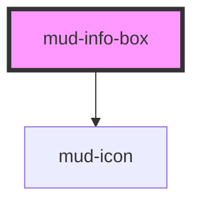

# mud-info-box

<!-- Auto Generated Below -->

## Overview

Informational Box — an inline, in-content callout that highlights key
messages, announcements, alerts, or explanations within the page flow.

Unlike `mud-toast` (a fixed-width corner toast) or `mud-banner` (a
full-width page-level bar), the info box sits inside the content column,
fills its container's width, and supports rich content: an optional bold
heading, a multi-line body (default slot), an optional inline action group
(`actions` slot — links/buttons) and an optional close button.

Two axes:
- `variant` — `info` (neutral icon), `info-moderate` (brand-blue icon),
  `warning`, or `error`.
- `emphasis` — `subtle` (neutral grey surface, coloured icon) or `strong`
  (a tinted semantic surface).

The box is static in-flow content, so it is **not** an ARIA live region
(that would re-announce on every render). The icon is decorative; the
heading and body are read in normal reading order. For transient, announced
messages use `mud-toast` / `mud-banner` instead.

## Properties

| Property     | Attribute     | Description                                                                                                              | Type                                                | Default     |
| ------------ | ------------- | ------------------------------------------------------------------------------------------------------------------------ | --------------------------------------------------- | ----------- |
| `closable`   | `closable`    | When `true`, renders a trailing close button. Activating it emits `mudClose`; the consumer removes the box from the DOM. | `boolean`                                           | `false`     |
| `closeLabel` | `close-label` | Close-button accessible label. Defaults to the Romanian "Închide".                                                       | `string`                                            | `'Închide'` |
| `emphasis`   | `emphasis`    | Visual emphasis — `subtle` (neutral grey surface) or `strong` (tinted semantic surface).                                 | `"strong" \| "subtle"`                              | `'subtle'`  |
| `hideIcon`   | `hide-icon`   | Suppress the leading icon entirely (the `icon-none` variation).                                                          | `boolean`                                           | `false`     |
| `iconName`   | `icon-name`   | Override the default per-variant `mud-icon` name. Ignored when the `icon-start` slot is populated or `hideIcon` is set.  | `string \| undefined`                               | `undefined` |
| `titleText`  | `title-text`  | Optional bold heading rendered above the body.                                                                           | `string \| undefined`                               | `undefined` |
| `variant`    | `variant`     | Semantic variant. `info` uses a neutral icon; `info-moderate` uses the brand-blue icon.                                  | `"error" \| "info" \| "info-moderate" \| "warning"` | `'info'`    |

## Events

| Event      | Description                                                                                                                        | Type                |
| ---------- | ---------------------------------------------------------------------------------------------------------------------------------- | ------------------- |
| `mudClose` | Fires when the user activates the close button. Payload is `void` — the consumer is responsible for removing the box from the DOM. | `CustomEvent<void>` |

## Slots

| Slot           | Description                                                                                            |
| -------------- | ------------------------------------------------------------------------------------------------------ |
|                | (default) The body content. Plain text or rich inline/block content.                                   |
| `"actions"`    | Optional inline action group (typically `mud-link` or           `mud-button`) rendered below the body. |
| `"icon-start"` | Optional override for the leading icon. Ignored when              `hideIcon` is set.                   |

## Dependencies

### Depends on

- [mud-icon](../mud-icon)

### Graph

----------------------------------------------

*Built with [StencilJS](https://stenciljs.com/)*
