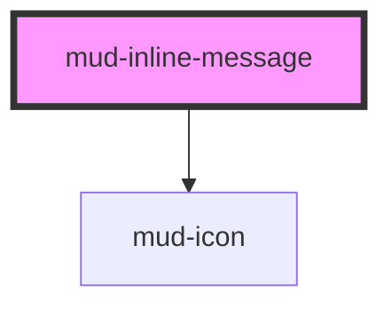

# mud-inline-message

<!-- Auto Generated Below -->

## Overview

Inline Message — lightweight, in-context feedback rendered as a coloured
leading icon plus a short text line (no surface, border, or padding).

Used alongside inputs, form fields, or any UI element to give immediate
guidance — the same visual pattern the form controls render as their
assistive / error text, exposed here as a standalone atom for use outside a
specific control.

`variant` selects the semantic colour (`info` keeps neutral text with a
brand-blue icon; `warning` / `success` / `error` colour both). `size` is
`small` (12px) or `medium` (14px).

It is plain in-flow text, **not** an ARIA live region. When used as form
feedback, associate it with the field via `aria-describedby` (and
`aria-invalid` for errors) on the consumer side; for a transient, announced
message use `mud-toast` / `mud-banner`. The icon is decorative.

## Properties

| Property   | Attribute   | Description                                                                                                                             | Type                                                                                                                                                                                                                                                                                                                                                                                                                                                                                                                                                                                                                                                                                                                                                                                                                                                                                                                                                                                                                                                                                                                                                                                                                                                                                                                                                                                                                                                                                                                                                                                                                                                                                                                                                                                                                                                                                                                                                                                                                                                                                                                                                                                                                                                                                                                                                                                                                                                                                                                                                                                                                                                                                                                  | Default     |
| ---------- | ----------- | --------------------------------------------------------------------------------------------------------------------------------------- | --------------------------------------------------------------------------------------------------------------------------------------------------------------------------------------------------------------------------------------------------------------------------------------------------------------------------------------------------------------------------------------------------------------------------------------------------------------------------------------------------------------------------------------------------------------------------------------------------------------------------------------------------------------------------------------------------------------------------------------------------------------------------------------------------------------------------------------------------------------------------------------------------------------------------------------------------------------------------------------------------------------------------------------------------------------------------------------------------------------------------------------------------------------------------------------------------------------------------------------------------------------------------------------------------------------------------------------------------------------------------------------------------------------------------------------------------------------------------------------------------------------------------------------------------------------------------------------------------------------------------------------------------------------------------------------------------------------------------------------------------------------------------------------------------------------------------------------------------------------------------------------------------------------------------------------------------------------------------------------------------------------------------------------------------------------------------------------------------------------------------------------------------------------------------------------------------------------------------------------------------------------------------------------------------------------------------------------------------------------------------------------------------------------------------------------------------------------------------------------------------------------------------------------------------------------------------------------------------------------------------------------------------------------------------------------------------------------------- | ----------- |
| `hideIcon` | `hide-icon` | Suppress the leading icon (the `icon-none` variation).                                                                                  | `boolean`                                                                                                                                                                                                                                                                                                                                                                                                                                                                                                                                                                                                                                                                                                                                                                                                                                                                                                                                                                                                                                                                                                                                                                                                                                                                                                                                                                                                                                                                                                                                                                                                                                                                                                                                                                                                                                                                                                                                                                                                                                                                                                                                                                                                                                                                                                                                                                                                                                                                                                                                                                                                                                                                                                             | `false`     |
| `iconName` | `icon-name` | Override the default per-variant `mud-icon` name.                                                                                       | `"add-cart" \| "alarm" \| "arrow-down" \| "arrow-left" \| "arrow-right" \| "arrow-up" \| "arrow-up-right" \| "asterisk" \| "attachment" \| "award" \| "backspace" \| "barcode" \| "barrier" \| "book" \| "bookmark" \| "bubble-alert" \| "bubble-heart" \| "bubble-question" \| "building" \| "bullet-list" \| "business" \| "calculator" \| "calendar" \| "calendar-add" \| "calendar-edit" \| "calendar-remove" \| "car" \| "card-link" \| "carousel" \| "cart" \| "chart" \| "check-all" \| "checklist" \| "checkmark-large" \| "checkmark-small" \| "chevron-bottom" \| "chevron-bottom-medium" \| "chevron-bottom-small" \| "chevron-grabber" \| "chevron-left" \| "chevron-left-small" \| "chevron-right" \| "chevron-right-small" \| "chevron-top" \| "chevron-top-small" \| "child" \| "circle-checkmark" \| "circle-download" \| "circle-error" \| "circle-info" \| "clock" \| "cloud-upload" \| "coins" \| "contacts" \| "copy" \| "credit-card" \| "cross-large" \| "cross-small" \| "data-access" \| "delete" \| "direction" \| "dislike" \| "document" \| "document-info" \| "dot" \| "dot-grid" \| "download" \| "drag" \| "edit" \| "education" \| "electronic-signature" \| "empty-bin" \| "envelope" \| "exclamation" \| "external-link" \| "eye-open" \| "face-id" \| "facebook" \| "faq" \| "feedback" \| "file-download" \| "filter" \| "flag" \| "flash" \| "flash-off" \| "globe" \| "group" \| "hashtag" \| "health" \| "help" \| "history" \| "home-line" \| "home-round-door" \| "house" \| "id-card" \| "identity" \| "image" \| "instagram" \| "judge-gavel" \| "light-bulb" \| "like" \| "linkedin" \| "lock" \| "logout" \| "map-pin" \| "mark-all" \| "menu" \| "minus-small" \| "mobile-phone" \| "moon" \| "more-horizontal" \| "more-vertical" \| "notification" \| "old-man" \| "organisation" \| "page-add" \| "page-child" \| "page-download" \| "page-house" \| "page-text" \| "page-text-lock" \| "page-upload" \| "passport" \| "pdf-file" \| "people" \| "people-like" \| "permission" \| "person" \| "phone" \| "pin" \| "plus-large" \| "plus-small" \| "qr-code" \| "receipt-bill" \| "receipt-check" \| "reorder" \| "reschedule" \| "resize" \| "rotate-arrow" \| "scan" \| "search" \| "services" \| "settings" \| "share-android" \| "share-ios" \| "shield" \| "shield-keyhole" \| "shield-user" \| "sidebar" \| "signal" \| "signature" \| "sort" \| "sparkles" \| "stamp" \| "store" \| "suitcase" \| "suitcase-2" \| "sun" \| "support" \| "templates" \| "tiktok" \| "time" \| "tree" \| "umbrella" \| "unlocked" \| "upload" \| "user-account" \| "vacation" \| "visiting-card" \| "voucher" \| "wallet" \| "warning" \| "wheelchair" \| "youtube" \| undefined` | `undefined` |
| `size`     | `size`      | Size rung — `small` (12px / 16px icon) or `medium` (14px / 20px icon).                                                                  | `"medium" \| "small"`                                                                                                                                                                                                                                                                                                                                                                                                                                                                                                                                                                                                                                                                                                                                                                                                                                                                                                                                                                                                                                                                                                                                                                                                                                                                                                                                                                                                                                                                                                                                                                                                                                                                                                                                                                                                                                                                                                                                                                                                                                                                                                                                                                                                                                                                                                                                                                                                                                                                                                                                                                                                                                                                                                 | `'medium'`  |
| `variant`  | `variant`   | Semantic variant. `info` (default) uses neutral text with a brand-blue icon; `warning` / `success` / `error` colour both icon and text. | `"error" \| "info" \| "success" \| "warning"`                                                                                                                                                                                                                                                                                                                                                                                                                                                                                                                                                                                                                                                                                                                                                                                                                                                                                                                                                                                                                                                                                                                                                                                                                                                                                                                                                                                                                                                                                                                                                                                                                                                                                                                                                                                                                                                                                                                                                                                                                                                                                                                                                                                                                                                                                                                                                                                                                                                                                                                                                                                                                                                                         | `'info'`    |

## Slots

| Slot | Description                 |
| ---- | --------------------------- |
|      | (default) The message text. |

## Dependencies

### Depends on

- [mud-icon](../mud-icon)

### Graph

----------------------------------------------

*Built with [StencilJS](https://stenciljs.com/)*
