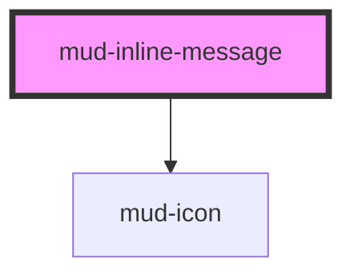

# mud-inline-message

<!-- Auto Generated Below -->

## Overview

Inline Message — lightweight, in-context feedback rendered as a coloured
leading icon plus a short text line (no surface, border, or padding).

Used alongside inputs, form fields, or any UI element to give immediate
guidance — the same visual pattern the form controls render as their
assistive / error text, exposed here as a standalone atom for use outside a
specific control.

`variant` selects the semantic colour (`info` keeps neutral text with a
brand-blue icon; `warning` / `success` / `error` colour both). `size` is
`small` (12px) or `medium` (14px).

It is plain in-flow text, **not** an ARIA live region. When used as form
feedback, associate it with the field via `aria-describedby` (and
`aria-invalid` for errors) on the consumer side; for a transient, announced
message use `mud-notification` / `mud-banner`. The icon is decorative.

## Properties

| Property   | Attribute   | Description                                                                                                                             | Type                                          | Default     |
| ---------- | ----------- | --------------------------------------------------------------------------------------------------------------------------------------- | --------------------------------------------- | ----------- |
| `hideIcon` | `hide-icon` | Suppress the leading icon (the `icon-none` variation).                                                                                  | `boolean`                                     | `false`     |
| `iconName` | `icon-name` | Override the default per-variant `mud-icon` name.                                                                                       | `string \| undefined`                         | `undefined` |
| `size`     | `size`      | Size rung — `small` (12px / 16px icon) or `medium` (14px / 20px icon).                                                                  | `"medium" \| "small"`                         | `'medium'`  |
| `variant`  | `variant`   | Semantic variant. `info` (default) uses neutral text with a brand-blue icon; `warning` / `success` / `error` colour both icon and text. | `"error" \| "info" \| "success" \| "warning"` | `'info'`    |

## Slots

| Slot | Description                 |
| ---- | --------------------------- |
|      | (default) The message text. |

## Dependencies

### Depends on

- [mud-icon](../mud-icon)

### Graph

----------------------------------------------

*Built with [StencilJS](https://stenciljs.com/)*
