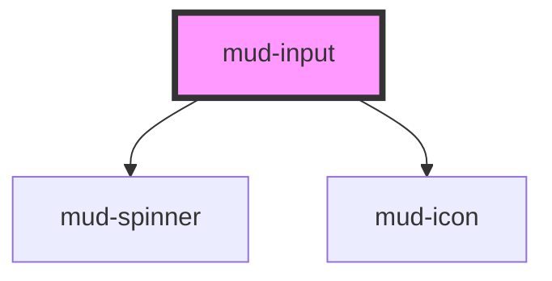

# mud-input

<!-- Auto Generated Below -->

## Overview

Input — single-line text-entry control.

Pattern B (atom-interactive, form-associated): renders its own `<input>`
inside shadow DOM. Form participation works via `formAssociated` +
`ElementInternals`. The component is the canonical text-input primitive;
specialised inputs (date, search, phone, etc.) compose around it.

## Properties

| Property       | Attribute      | Description                                                                                                                                                                                                                                                                         | Type                                                            | Default     |
| -------------- | -------------- | ----------------------------------------------------------------------------------------------------------------------------------------------------------------------------------------------------------------------------------------------------------------------------------- | --------------------------------------------------------------- | ----------- |
| `ariaLabel`    | `aria-label`   | Accessible name. Mirrors to the internal control's `aria-label` when no visible label is present. Setting `aria-label` directly on the host also works — captured on connect into `resolvedAriaLabel` and stripped to avoid Stencil's attribute-observer / render-loop antipattern. | `string \| undefined`                                           | `undefined` |
| `autocomplete` | `autocomplete` | Native `autocomplete` attribute forwarded to the internal control.                                                                                                                                                                                                                  | `string \| undefined`                                           | `undefined` |
| `disabled`     | `disabled`     | Disables interactivity. The internal control receives `aria-disabled` and the native `disabled` attribute.                                                                                                                                                                          | `boolean`                                                       | `false`     |
| `errorText`    | `error-text`   | Plain-text error message shown below the control when `invalid` is set. When present it replaces `helperText` and pairs with the error icon.                                                                                                                                        | `string \| undefined`                                           | `undefined` |
| `helperText`   | `helper-text`  | Plain-text helper / hint shown below the control.                                                                                                                                                                                                                                   | `string \| undefined`                                           | `undefined` |
| `inputmode`    | `inputmode`    | Native `inputmode` hint forwarded to the internal control.                                                                                                                                                                                                                          | `string \| undefined`                                           | `undefined` |
| `invalid`      | `invalid`      | Forces destructive visuals regardless of `variant`. Sets `aria-invalid`. Use together with `errorText` to surface the message.                                                                                                                                                      | `boolean`                                                       | `false`     |
| `label`        | `label`        | Plain-text label. Use the `label` slot for richer content.                                                                                                                                                                                                                          | `string \| undefined`                                           | `undefined` |
| `loading`      | `loading`      | Loading state. When true the control becomes uninteractive and a trailing spinner replaces the `icon-end` slot. The host carries `aria-busy="true"` for assistive technologies.                                                                                                     | `boolean`                                                       | `false`     |
| `maxLength`    | `maxlength`    | Native `maxlength` constraint.                                                                                                                                                                                                                                                      | `number \| undefined`                                           | `undefined` |
| `minLength`    | `minlength`    | Native `minlength` constraint.                                                                                                                                                                                                                                                      | `number \| undefined`                                           | `undefined` |
| `name`         | `name`         | Form-control `name`. Used during form submission.                                                                                                                                                                                                                                   | `string \| undefined`                                           | `undefined` |
| `pattern`      | `pattern`      | Native `pattern` regex forwarded to the internal control.                                                                                                                                                                                                                           | `string \| undefined`                                           | `undefined` |
| `placeholder`  | `placeholder`  | Placeholder shown when the control is empty.                                                                                                                                                                                                                                        | `string \| undefined`                                           | `undefined` |
| `readonly`     | `readonly`     | Renders the field read-only. The control remains focusable and copyable.                                                                                                                                                                                                            | `boolean`                                                       | `false`     |
| `required`     | `required`     | Marks the field as mandatory. Adds a red asterisk to the label and sets `aria-required` on the internal control.                                                                                                                                                                    | `boolean`                                                       | `false`     |
| `size`         | `size`         | Visual size rung.                                                                                                                                                                                                                                                                   | `"lg" \| "md"`                                                  | `'md'`      |
| `type`         | `type`         | Native input `type`.                                                                                                                                                                                                                                                                | `"email" \| "password" \| "search" \| "tel" \| "text" \| "url"` | `'text'`    |
| `value`        | `value`        | Current value of the control. Reflects to the host attribute.                                                                                                                                                                                                                       | `string`                                                        | `''`        |
| `variant`      | `variant`      | Color treatment. `destructive` is forced when `invalid` is set.                                                                                                                                                                                                                     | `"default" \| "destructive" \| "success" \| "warning"`          | `'default'` |

## Events

| Event       | Description                                                                                                | Type                             |
| ----------- | ---------------------------------------------------------------------------------------------------------- | -------------------------------- |
| `mudBlur`   | Fires when the internal control loses focus. The native `FocusEvent` is forwarded as-is.                   | `CustomEvent<FocusEvent>`        |
| `mudChange` | Fires when the value is committed (typically on `blur` or `Enter`). `detail.value` is the committed value. | `CustomEvent<InputChangeDetail>` |
| `mudFocus`  | Fires when the internal control gains focus. The native `FocusEvent` is forwarded as-is.                   | `CustomEvent<FocusEvent>`        |
| `mudInput`  | Fires on every keystroke. `detail.value` is the current control value.                                     | `CustomEvent<InputChangeDetail>` |

## Slots

| Slot           | Description                                                                                             |
| -------------- | ------------------------------------------------------------------------------------------------------- |
| `"helper"`     | Rich helper / hint content, replaces the `helper-text` prop. Hidden when invalid + error-text is shown. |
| `"icon-end"`   | Trailing `mud-icon` rendered inside the input control.                                                  |
| `"icon-start"` | Leading `mud-icon` rendered inside the input control.                                                   |
| `"label"`      | Rich label content, replaces the `label` prop when present.                                             |

## Shadow Parts

| Part              | Description |
| ----------------- | ----------- |
| `"control"`       |             |
| `"error"`         |             |
| `"helper"`        |             |
| `"label"`         |             |
| `"native"`        |             |
| `"required-mark"` |             |
| `"spinner"`       |             |

## Dependencies

### Depends on

- [mud-spinner](../mud-spinner)
- [mud-icon](../mud-icon)

### Graph

----------------------------------------------

*Built with [StencilJS](https://stenciljs.com/)*
