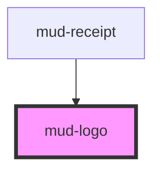

# mud-logo

<!-- Auto Generated Below -->

## Overview

Brand logo for Moldovan M-products.

Each `name` resolves to a single self-contained SVG asset under `./assets/`.
The component fetches and renders that SVG into shadow DOM; the host's
dimensions follow the SVG's intrinsic `width`/`height`/`viewBox` exactly as
exported from Figma — so a future asset with non-standard dimensions
"just works" without a CSS contract change.

Consumers that need to reserve layout space before the async fetch
resolves (e.g. above-the-fold marketing, dense grids) should wrap the
logo in a sized container — `mud-service-button` does this for its
`badge` slot (24 × 24).

## Properties

| Property    | Attribute    | Description                                                                                                                                                              | Type                                                                                                                                                                                                                                                                                                                                                                                                                                                                                                                                                                                                                                                                                                                                                                                                                                                                                                                                                                                                                                                                                                                                                                                                                                                                                                                                                                                                                                                                                                                                                                                                                                                                                                                                                                                                                                            | Default                     |
| ----------- | ------------ | ------------------------------------------------------------------------------------------------------------------------------------------------------------------------ | ----------------------------------------------------------------------------------------------------------------------------------------------------------------------------------------------------------------------------------------------------------------------------------------------------------------------------------------------------------------------------------------------------------------------------------------------------------------------------------------------------------------------------------------------------------------------------------------------------------------------------------------------------------------------------------------------------------------------------------------------------------------------------------------------------------------------------------------------------------------------------------------------------------------------------------------------------------------------------------------------------------------------------------------------------------------------------------------------------------------------------------------------------------------------------------------------------------------------------------------------------------------------------------------------------------------------------------------------------------------------------------------------------------------------------------------------------------------------------------------------------------------------------------------------------------------------------------------------------------------------------------------------------------------------------------------------------------------------------------------------------------------------------------------------------------------------------------------------- | --------------------------- |
| `ariaLabel` | `aria-label` | Accessible label. When provided (and non-whitespace), the logo is announced as an image; when omitted or whitespace-only the logo is decorative (aria-hidden).           | `string \| undefined`                                                                                                                                                                                                                                                                                                                                                                                                                                                                                                                                                                                                                                                                                                                                                                                                                                                                                                                                                                                                                                                                                                                                                                                                                                                                                                                                                                                                                                                                                                                                                                                                                                                                                                                                                                                                                           | `undefined`                 |
| `name`      | `name`       | Logo asset identifier — the bare filename (without `.svg`) of an asset in `./assets/`. Format: `{service}-logo-{layout}`. See `LOGO_NAMES` for the complete enumeration. | `"mcloud-logo-logomark-only" \| "mcloud-logo-with-long-name-large" \| "mcloud-logo-with-long-name-medium" \| "mcloud-logo-with-name" \| "mcloud-logo-with-verb" \| "mconnect-logo-logomark-only" \| "mconnect-logo-with-long-name-large" \| "mconnect-logo-with-long-name-medium" \| "mconnect-logo-with-name" \| "mconnect-logo-with-verb" \| "mdelivery-logo-logomark-only" \| "mdelivery-logo-with-long-name-large" \| "mdelivery-logo-with-long-name-medium" \| "mdelivery-logo-with-name" \| "mdelivery-logo-with-verb" \| "mdocs-logo-logomark-only" \| "mdocs-logo-with-long-name-large" \| "mdocs-logo-with-long-name-medium" \| "mdocs-logo-with-name" \| "mdocs-logo-with-verb" \| "mlearn-logo-logomark-only" \| "mlearn-logo-with-long-name-large" \| "mlearn-logo-with-long-name-medium" \| "mlearn-logo-with-name" \| "mlearn-logo-with-verb" \| "mlog-logo-logomark-only" \| "mlog-logo-with-long-name-large" \| "mlog-logo-with-long-name-medium" \| "mlog-logo-with-name" \| "mlog-logo-with-verb" \| "mnotify-logo-logomark-only" \| "mnotify-logo-with-long-name-large" \| "mnotify-logo-with-long-name-medium" \| "mnotify-logo-with-name" \| "mnotify-logo-with-verb" \| "mpass-logo-logomark-only" \| "mpass-logo-with-long-name-large" \| "mpass-logo-with-long-name-medium" \| "mpass-logo-with-name" \| "mpass-logo-with-verb" \| "mpay-logo-logomark-only" \| "mpay-logo-with-long-name-large" \| "mpay-logo-with-long-name-medium" \| "mpay-logo-with-name" \| "mpay-logo-with-verb" \| "mpower-logo-logomark-only" \| "mpower-logo-with-long-name-large" \| "mpower-logo-with-long-name-medium" \| "mpower-logo-with-name" \| "mpower-logo-with-verb" \| "msign-logo-logomark-only" \| "msign-logo-with-long-name-large" \| "msign-logo-with-long-name-medium" \| "msign-logo-with-name" \| "msign-logo-with-verb"` | `'mpay-logo-logomark-only'` |

## Events

| Event          | Description                                                                                                                                                                                                                                                                                                                                                                                                                                                                                              | Type                                                                  |
| -------------- | -------------------------------------------------------------------------------------------------------------------------------------------------------------------------------------------------------------------------------------------------------------------------------------------------------------------------------------------------------------------------------------------------------------------------------------------------------------------------------------------------------- | --------------------------------------------------------------------- |
| `mudLogoError` | Emitted when an asset fails to load — either because the `name` is not in the manifest (`'unknown'`) or because the SVG fetch failed (`'fetch-failed'`). Lets consumers react in production where `console.warn` is invisible (telemetry, fallback UI, etc.).  Note: events emitted during `componentWillLoad` (initial mount) fire before consumer listeners can attach to a freshly-inserted host. Attach the listener BEFORE setting the `name` prop, or rely on the warning for mount-time failures. | `CustomEvent<{ name: string; reason: "unknown" \| "fetch-failed"; }>` |

## Dependencies

### Used by

 - [mud-receipt](../mud-receipt)

### Graph

----------------------------------------------

*Built with [StencilJS](https://stenciljs.com/)*
