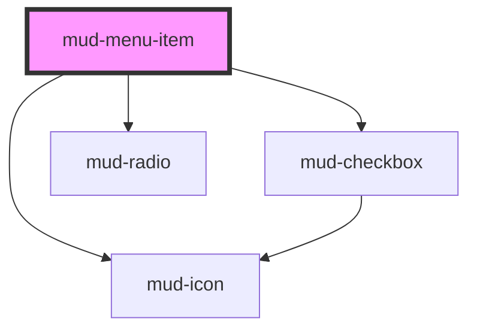

# mud-menu-item

<!-- Auto Generated Below -->

## Overview

Menu item — a single row inside a `mud-menu`.

Pattern: the host element is the focusable, role-bearing control. Roving
`tabindex` is managed imperatively by the parent `mud-menu`. The item emits
`mudMenuItemSelect` (bubbling) on activation; the parent coordinates selection.

## Properties

| Property   | Attribute  | Description                                                                         | Type                                        | Default     |
| ---------- | ---------- | ----------------------------------------------------------------------------------- | ------------------------------------------- | ----------- |
| `disabled` | `disabled` | Whether the item is disabled and non-interactive.                                   | `boolean`                                   | `false`     |
| `heading`  | `heading`  | Render as a non-interactive section heading (separator + tertiary label).           | `boolean`                                   | `false`     |
| `icon`     | `icon`     | Icon name to render when `leading="icon"`.                                          | `string \| undefined`                       | `undefined` |
| `label`    | `label`    | Fallback text label when no content is slotted.                                     | `string \| undefined`                       | `undefined` |
| `leading`  | `leading`  | Leading element rendered before the label.                                          | `"checkbox" \| "icon" \| "none" \| "radio"` | `'none'`    |
| `selected` | `selected` | Whether the item is selected (selection menus) or checked (checkbox/radio leading). | `boolean`                                   | `false`     |
| `value`    | `value`    | Value reported when the item is activated.                                          | `string \| undefined`                       | `undefined` |

## Events

| Event               | Description                                                 | Type                                |
| ------------------- | ----------------------------------------------------------- | ----------------------------------- |
| `mudMenuItemSelect` | Fired when the item is activated via click, Enter or Space. | `CustomEvent<MenuItemSelectDetail>` |

## Methods

### `setFocus() => Promise<void>`

Move keyboard focus to this item. Used by the parent for roving navigation.

#### Returns

Type: `Promise<void>`

## Slots

| Slot | Description               |
| ---- | ------------------------- |
|      | The item label / content. |

## Shadow Parts

| Part     | Description           |
| -------- | --------------------- |
| `"item"` | The item row wrapper. |

## Dependencies

### Depends on

- [mud-icon](../mud-icon)
- [mud-checkbox](../mud-checkbox)
- [mud-radio](../mud-radio)

### Graph

----------------------------------------------

*Built with [StencilJS](https://stenciljs.com/)*
