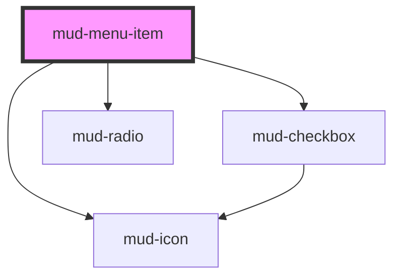

# mud-menu-item

<!-- Auto Generated Below -->

## Overview

Menu item — a single row inside a `mud-menu`.

Pattern: the host element is the focusable, role-bearing control. Roving
`tabindex` is managed imperatively by the parent `mud-menu`. The item emits
`mudMenuItemSelect` (bubbling) on activation; the parent coordinates selection.

## Properties

| Property   | Attribute  | Description                                                                         | Type                                                                                                                                                                                                                                                                                                                                                                                                                                                                                                                                                                                                                                                                                                                                                                                                                                                                                                                                                                                                                                                                                                                                                                                                                                                                                                                                                                                                                                                                                                                                                                                                                                                                                                                                                                                                                                                                                                                                                                                                                                                                                                                                                                                                                                                                                                                                                                                                                                                                                                                                                                                                                                                                                                                                                                                                                                                                                                                                                                                                                                                                                                                                                                                                                                                                                          | Default     |
| ---------- | ---------- | ----------------------------------------------------------------------------------- | --------------------------------------------------------------------------------------------------------------------------------------------------------------------------------------------------------------------------------------------------------------------------------------------------------------------------------------------------------------------------------------------------------------------------------------------------------------------------------------------------------------------------------------------------------------------------------------------------------------------------------------------------------------------------------------------------------------------------------------------------------------------------------------------------------------------------------------------------------------------------------------------------------------------------------------------------------------------------------------------------------------------------------------------------------------------------------------------------------------------------------------------------------------------------------------------------------------------------------------------------------------------------------------------------------------------------------------------------------------------------------------------------------------------------------------------------------------------------------------------------------------------------------------------------------------------------------------------------------------------------------------------------------------------------------------------------------------------------------------------------------------------------------------------------------------------------------------------------------------------------------------------------------------------------------------------------------------------------------------------------------------------------------------------------------------------------------------------------------------------------------------------------------------------------------------------------------------------------------------------------------------------------------------------------------------------------------------------------------------------------------------------------------------------------------------------------------------------------------------------------------------------------------------------------------------------------------------------------------------------------------------------------------------------------------------------------------------------------------------------------------------------------------------------------------------------------------------------------------------------------------------------------------------------------------------------------------------------------------------------------------------------------------------------------------------------------------------------------------------------------------------------------------------------------------------------------------------------------------------------------------------------------------------------- | ----------- |
| `disabled` | `disabled` | Whether the item is disabled and non-interactive.                                   | `boolean`                                                                                                                                                                                                                                                                                                                                                                                                                                                                                                                                                                                                                                                                                                                                                                                                                                                                                                                                                                                                                                                                                                                                                                                                                                                                                                                                                                                                                                                                                                                                                                                                                                                                                                                                                                                                                                                                                                                                                                                                                                                                                                                                                                                                                                                                                                                                                                                                                                                                                                                                                                                                                                                                                                                                                                                                                                                                                                                                                                                                                                                                                                                                                                                                                                                                                     | `false`     |
| `heading`  | `heading`  | Render as a non-interactive section heading (separator + tertiary label).           | `boolean`                                                                                                                                                                                                                                                                                                                                                                                                                                                                                                                                                                                                                                                                                                                                                                                                                                                                                                                                                                                                                                                                                                                                                                                                                                                                                                                                                                                                                                                                                                                                                                                                                                                                                                                                                                                                                                                                                                                                                                                                                                                                                                                                                                                                                                                                                                                                                                                                                                                                                                                                                                                                                                                                                                                                                                                                                                                                                                                                                                                                                                                                                                                                                                                                                                                                                     | `false`     |
| `icon`     | `icon`     | Icon name to render when `leading="icon"`.                                          | `"add-cart" \| "alarm" \| "arrow-down" \| "arrow-left" \| "arrow-right" \| "arrow-up" \| "arrow-up-right" \| "asterisk" \| "attachment" \| "award" \| "backspace" \| "barcode" \| "barrier" \| "book" \| "bookmark" \| "bubble-alert" \| "bubble-heart" \| "bubble-question" \| "building" \| "bullet-list" \| "business" \| "business-filled" \| "calculator" \| "calendar" \| "calendar-add" \| "calendar-edit" \| "calendar-filled" \| "calendar-remove" \| "calendar-remove-filled" \| "car" \| "card-link" \| "carousel" \| "cart" \| "chart" \| "check-all" \| "checklist" \| "checkmark-large" \| "checkmark-small" \| "chevron-bottom" \| "chevron-bottom-filled" \| "chevron-bottom-medium" \| "chevron-bottom-small" \| "chevron-grabber" \| "chevron-left" \| "chevron-left-small" \| "chevron-right" \| "chevron-right-small" \| "chevron-top" \| "chevron-top-small" \| "child" \| "circle-checkmark-filled" \| "circle-download" \| "circle-error" \| "circle-error-filled" \| "circle-info" \| "circle-info-filled" \| "clock" \| "cloud-upload" \| "coins" \| "contacts" \| "copy" \| "credit-card" \| "cross-large" \| "cross-small" \| "data-access" \| "delete" \| "delete-filled" \| "direction" \| "dislike" \| "document" \| "document-filled" \| "document-info-filled" \| "dot" \| "dot-grid" \| "download" \| "drag" \| "edit" \| "education" \| "electronic-signature" \| "empty-bin" \| "envelope" \| "envelope-filled" \| "exclamation" \| "external-link" \| "eye-open" \| "face-id" \| "facebook-filled" \| "faq" \| "feedback" \| "file-download" \| "filter" \| "flag" \| "flash-filled" \| "flash-off-filled" \| "globe" \| "group" \| "group-filled" \| "hashtag" \| "health" \| "help" \| "history" \| "home-line" \| "home-line-filled" \| "home-round-door" \| "house" \| "id-card" \| "id-card-filled" \| "identity" \| "image" \| "instagram-filled" \| "judge-gavel" \| "light-bulb" \| "like" \| "linkedin-filled" \| "lock" \| "logout" \| "map-pin" \| "map-pin-filled" \| "mark-all" \| "menu" \| "minus-small" \| "mobile-phone" \| "moon" \| "more-horizontal" \| "more-vertical" \| "notification" \| "old-man" \| "organisation" \| "page-add" \| "page-child" \| "page-download" \| "page-download-filled" \| "page-house" \| "page-text" \| "page-text-lock" \| "page-upload" \| "page-upload-filled" \| "passport" \| "pdf-file" \| "people" \| "people-like" \| "permission" \| "person" \| "phone" \| "phone-filled" \| "pin" \| "plus-large" \| "plus-small" \| "qr-code" \| "receipt-bill" \| "receipt-check" \| "receipt-check-filled" \| "reorder" \| "reschedule" \| "resize" \| "rotate-arrow" \| "scan" \| "search" \| "services" \| "settings" \| "share-android" \| "share-ios" \| "shield" \| "shield-keyhole" \| "shield-user" \| "sidebar" \| "sidebar-filled" \| "signal" \| "signature" \| "sort" \| "sparkles-filled" \| "stamp" \| "store" \| "suitcase" \| "suitcase-2" \| "sun" \| "support" \| "templates" \| "tiktok" \| "time" \| "time-filled" \| "tree" \| "umbrella" \| "unlocked-filled" \| "upload" \| "user-account" \| "user-account-filled" \| "vacation" \| "visiting-card" \| "voucher" \| "wallet" \| "wallet-filled" \| "warning" \| "warning-filled" \| "wheelchair" \| "youtube-filled" \| undefined` | `undefined` |
| `label`    | `label`    | Fallback text label when no content is slotted.                                     | `string \| undefined`                                                                                                                                                                                                                                                                                                                                                                                                                                                                                                                                                                                                                                                                                                                                                                                                                                                                                                                                                                                                                                                                                                                                                                                                                                                                                                                                                                                                                                                                                                                                                                                                                                                                                                                                                                                                                                                                                                                                                                                                                                                                                                                                                                                                                                                                                                                                                                                                                                                                                                                                                                                                                                                                                                                                                                                                                                                                                                                                                                                                                                                                                                                                                                                                                                                                         | `undefined` |
| `leading`  | `leading`  | Leading element rendered before the label.                                          | `"checkbox" \| "icon" \| "none" \| "radio"`                                                                                                                                                                                                                                                                                                                                                                                                                                                                                                                                                                                                                                                                                                                                                                                                                                                                                                                                                                                                                                                                                                                                                                                                                                                                                                                                                                                                                                                                                                                                                                                                                                                                                                                                                                                                                                                                                                                                                                                                                                                                                                                                                                                                                                                                                                                                                                                                                                                                                                                                                                                                                                                                                                                                                                                                                                                                                                                                                                                                                                                                                                                                                                                                                                                   | `'none'`    |
| `selected` | `selected` | Whether the item is selected (selection menus) or checked (checkbox/radio leading). | `boolean`                                                                                                                                                                                                                                                                                                                                                                                                                                                                                                                                                                                                                                                                                                                                                                                                                                                                                                                                                                                                                                                                                                                                                                                                                                                                                                                                                                                                                                                                                                                                                                                                                                                                                                                                                                                                                                                                                                                                                                                                                                                                                                                                                                                                                                                                                                                                                                                                                                                                                                                                                                                                                                                                                                                                                                                                                                                                                                                                                                                                                                                                                                                                                                                                                                                                                     | `false`     |
| `value`    | `value`    | Value reported when the item is activated.                                          | `string \| undefined`                                                                                                                                                                                                                                                                                                                                                                                                                                                                                                                                                                                                                                                                                                                                                                                                                                                                                                                                                                                                                                                                                                                                                                                                                                                                                                                                                                                                                                                                                                                                                                                                                                                                                                                                                                                                                                                                                                                                                                                                                                                                                                                                                                                                                                                                                                                                                                                                                                                                                                                                                                                                                                                                                                                                                                                                                                                                                                                                                                                                                                                                                                                                                                                                                                                                         | `undefined` |

## Events

| Event               | Description                                                 | Type                                |
| ------------------- | ----------------------------------------------------------- | ----------------------------------- |
| `mudMenuItemSelect` | Fired when the item is activated via click, Enter or Space. | `CustomEvent<MenuItemSelectDetail>` |

## Methods

### `setFocus() => Promise<void>`

Move keyboard focus to this item. Used by the parent for roving navigation.

#### Returns

Type: `Promise<void>`

## Slots

| Slot | Description               |
| ---- | ------------------------- |
|      | The item label / content. |

## Shadow Parts

| Part     | Description           |
| -------- | --------------------- |
| `"item"` | The item row wrapper. |

## Dependencies

### Depends on

- [mud-icon](../mud-icon)
- [mud-checkbox](../mud-checkbox)
- [mud-radio](../mud-radio)

### Graph

----------------------------------------------

*Built with [StencilJS](https://stenciljs.com/)*
