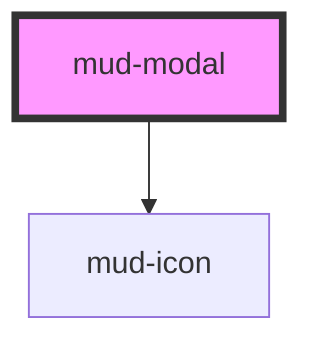

# mud-modal

<!-- Auto Generated Below -->

## Overview

Modal — overlay dialog molecule.

Renders a centered dialog card on top of a dimmed backdrop using the native
`<dialog>` element internally. The native element provides the focus trap,
ESC handling, and top-layer rendering required for WCAG 2.1 AA Modal
conformance (SC 2.1.2 No Keyboard Trap reversed: focus IS trapped inside an
active dialog and returned on close).

Pattern B (internal DOM): the dialog, backdrop, header, body and footer all
live inside shadow DOM. Consumers project content through five slots
(`title`, `icon`, `image`, default body, `actions`) and toggle visibility
via the `open` prop or the imperative `openModal()` / `closeModal()`
methods.

Variants control the header treatment:
- `default` — title + close button (text-only header)
- `with-image` — full-bleed hero image at top with overlaid close button
- `with-icon` — leading 48px icon above the body content (no top header bar)

Dismiss reasons routed through `mudClose<{reason}>`:
- `backdrop` — click on backdrop (suppressed by `closeOnBackdrop=false`)
- `escape` — ESC keypress (suppressed by `closeOnEscape=false`)
- `close-button` — trailing × button activated
- `action` — programmatic via `closeModal('action')`, used by footer buttons

## Properties

| Property          | Attribute           | Description                                                                                                                                                                                                                                                                                                                                                                                   | Type                                       | Default     |
| ----------------- | ------------------- | --------------------------------------------------------------------------------------------------------------------------------------------------------------------------------------------------------------------------------------------------------------------------------------------------------------------------------------------------------------------------------------------- | ------------------------------------------ | ----------- |
| `actionsLayout`   | `actions-layout`    | Footer button arrangement (Figma 358:16247). - `inline` — buttons sit side-by-side, right-aligned (default) - `stacked` — buttons span the full footer width, stacked vertically                                                                                                                                                                                                              | `"inline" \| "stacked"`                    | `'inline'`  |
| `closable`        | `closable`          | When `true`, renders a trailing × close button in the header. Activating it emits `mudClose` with `reason: 'close-button'`. Hide it for required confirmation flows by setting `closable=false`.                                                                                                                                                                                              | `boolean`                                  | `true`      |
| `closeLabel`      | `close-label`       | Accessible label for the close × button. Defaults to the Romanian "Închide".                                                                                                                                                                                                                                                                                                                  | `string`                                   | `'Închide'` |
| `closeOnBackdrop` | `close-on-backdrop` | Whether a click on the backdrop dismisses the modal. Disable for flows that demand an explicit decision (e.g. unsaved-changes confirmation).                                                                                                                                                                                                                                                  | `boolean`                                  | `true`      |
| `closeOnEscape`   | `close-on-escape`   | Whether pressing ESC dismisses the modal. Disable to enforce a deliberate confirmation; pair with `closable=false` and footer actions for the strictest dialog contract.                                                                                                                                                                                                                      | `boolean`                                  | `true`      |
| `destructive`     | `destructive`       | Styles the dialog frame and footer for an irreversible action (e.g. delete account). Adds a red top border accent and is intended to be paired with a destructive primary `mud-button` in the actions slot.                                                                                                                                                                                   | `boolean`                                  | `false`     |
| `imageAlt`        | `image-alt`         | Alt text for the prop-driven hero image. Use an empty string when the image is purely decorative and the title/body already describes the action.                                                                                                                                                                                                                                             | `string`                                   | `''`        |
| `imageSrc`        | `image-src`         | Hero image URL for the `with-image` variant. Rendered as the slot fallback — if a consumer projects their own `` / `<picture>` it wins. Pair with `imageAlt` for accessibility (empty alt is acceptable for decorative images).                                                                                                                                             | `string \| undefined`                      | `undefined` |
| `label`           | `label`             | Accessible name forwarded to the host as `aria-label`. Required when no title is provided. The consumer-supplied `aria-label` attribute is captured on connect into `resolvedAriaLabel` and stripped from the host to avoid Stencil's attribute-observer / render-loop antipattern (same pattern as mud-radio / mud-switch / mud-tooltip / mud-accordion / mud-breadcrumb / mud-date-picker). | `string \| undefined`                      | `undefined` |
| `open`            | `open`              | Whether the modal is currently shown. Reflected so consumers can target `mud-modal[open]` in selectors. Mutable so the component can flip it back to `false` on internal dismiss (backdrop / escape / close button).                                                                                                                                                                          | `boolean`                                  | `false`     |
| `size`            | `size`              | Visual size rung. Drives the dialog max-width and the typography scale of title and body copy.                                                                                                                                                                                                                                                                                                | `"lg" \| "md" \| "sm"`                     | `'md'`      |
| `titleText`       | `title-text`        | Title text rendered in the header. The named `title` slot, when filled, overrides this prop to allow rich content.                                                                                                                                                                                                                                                                            | `string \| undefined`                      | `undefined` |
| `variant`         | `variant`           | Header treatment. - `default` — title bar + close button - `with-image` — hero image as header (close button overlaid) - `with-icon` — leading 48px icon, no top bar                                                                                                                                                                                                                          | `"default" \| "with-icon" \| "with-image"` | `'default'` |

## Events

| Event      | Description                                                                                                                                                             | Type                                                                             |
| ---------- | ----------------------------------------------------------------------------------------------------------------------------------------------------------------------- | -------------------------------------------------------------------------------- |
| `mudClose` | Fires after the dialog has been dismissed. Payload carries the `reason` so consumers can distinguish backdrop vs. escape vs. close-button vs. footer-action dismissals. | `CustomEvent<{ reason: "backdrop" \| "escape" \| "close-button" \| "action"; }>` |
| `mudOpen`  | Fires after the dialog has been shown.                                                                                                                                  | `CustomEvent<void>`                                                              |

## Methods

### `closeModal(reason?: ModalCloseReason) => Promise<void>`

Imperatively close the dialog. Emits `mudClose` with the supplied reason
(defaults to `'action'`, intended for footer button handlers).

#### Parameters

| Name     | Type                                                   | Description |
| -------- | ------------------------------------------------------ | ----------- |
| `reason` | `"backdrop" \| "escape" \| "close-button" \| "action"` |             |

#### Returns

Type: `Promise<void>`

### `openModal() => Promise<void>`

Imperatively open the dialog. Equivalent to setting `open=true`.
Emits `mudOpen` once the dialog is visible.

#### Returns

Type: `Promise<void>`

## Slots

| Slot        | Description                                                    |
| ----------- | -------------------------------------------------------------- |
|             | (default) The dialog body content. Plain text or rich content. |
| `"actions"` | Footer action group. Typically `mud-button` instances.         |
| `"icon"`    | Leading 48px icon for the `with-icon` variant.                 |
| `"image"`   | Full-bleed hero image for the `with-image` variant.            |
| `"title"`   | Rich title content. Overrides the `title` prop when populated. |

## Dependencies

### Depends on

- [mud-icon](../mud-icon)

### Graph

----------------------------------------------

*Built with [StencilJS](https://stenciljs.com/)*
