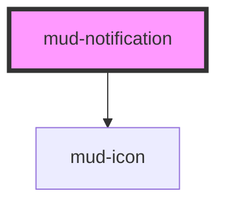

# mud-notification

<!-- Auto Generated Below -->

## Overview

Notification — semantic messaging banner.

Renders an optional leading icon, an optional bold title, the message body
(default slot), an optional inline action group (`actions` slot) and an
optional trailing close button.

Pattern B (atom-display + interactive close): the close affordance lives
inside shadow DOM so it participates in tab order with a real
`button` role. The body itself is not interactive.

`variant` selects the semantic color family (info / positive / warning /
danger / neutral). `notificationStyle` toggles between the soft tinted
background (`subtle`) and the filled high-emphasis treatment (`strong`).

Live-region routing:
- `info` / `positive` / `neutral` → `role="status"` + `aria-live="polite"`
- `warning` / `danger` → `role="alert"` + `aria-live="assertive"`

## Properties

| Property            | Attribute            | Description                                                                                                                                                                                                                                                                           | Type                                                         | Default     |
| ------------------- | -------------------- | ------------------------------------------------------------------------------------------------------------------------------------------------------------------------------------------------------------------------------------------------------------------------------------- | ------------------------------------------------------------ | ----------- |
| `ariaLabel`         | `aria-label`         | Forwarded to the host as `aria-label`. Use this to give the entire notification an explicit accessible name when the body content alone is not descriptive enough.                                                                                                                    | `string \| undefined`                                        | `undefined` |
| `closable`          | `closable`           | When `true`, renders a trailing close button. Activating it emits `mudClose`; the consumer is responsible for removing the notification from the DOM.                                                                                                                                 | `boolean`                                                    | `false`     |
| `closeLabel`        | `close-label`        | Close-button accessible label. Defaults to the Romanian "Închide". Provide an alternative for non-Romanian locales.                                                                                                                                                                   | `string`                                                     | `'Închide'` |
| `iconName`          | `icon-name`          | Override the default `mud-icon` name for the variant (e.g. swap `circle-info-filled` for a custom glyph). When the `icon-start` slot is populated, this prop is ignored.                                                                                                              | `string \| undefined`                                        | `undefined` |
| `notificationStyle` | `notification-style` | Visual intensity. `subtle` renders a tinted background with high-contrast dark text; `strong` renders a filled semantic background with on-color text. The attribute is reflected as `notification-style` to avoid colliding with the global `style` attribute on every HTML element. | `"strong" \| "subtle"`                                       | `'subtle'`  |
| `titleText`         | `title-text`         | Optional bold title rendered above the body.                                                                                                                                                                                                                                          | `string \| undefined`                                        | `undefined` |
| `variant`           | `variant`            | Semantic color family.                                                                                                                                                                                                                                                                | `"danger" \| "info" \| "neutral" \| "positive" \| "warning"` | `'info'`    |

## Events

| Event      | Description                                                                                                                              | Type                |
| ---------- | ---------------------------------------------------------------------------------------------------------------------------------------- | ------------------- |
| `mudClose` | Fires when the user activates the close button. Payload is `void` — the consumer is responsible for the dismiss animation / DOM removal. | `CustomEvent<void>` |

## Slots

| Slot           | Description                                                                                                                                                 |
| -------------- | ----------------------------------------------------------------------------------------------------------------------------------------------------------- |
|                | (default) The message body. Plain text or rich inline content.                                                                                              |
| `"actions"`    | Optional inline action group (typically `mud-button` or           `mud-link`). Aligned to the trailing edge before the close           button when present. |
| `"icon-start"` | Optional override for the leading icon. When supplied,              suppresses both the `iconName` prop and the per-variant              default icon.      |

## Dependencies

### Depends on

- [mud-icon](../mud-icon)

### Graph

----------------------------------------------

*Built with [StencilJS](https://stenciljs.com/)*
