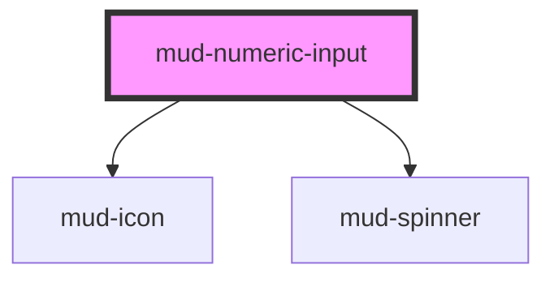

# mud-numeric-input

<!-- Auto Generated Below -->

## Overview

Numeric Input — numeric-entry control with stacked step buttons.

Pattern B (atom-interactive, form-associated): renders its own `<input>`
inside shadow DOM and pairs it with a trailing stepper stack (chevron-up
over chevron-bottom). Shares the visual primitives of `mud-input` (border,
focus ring, label, helper / error, sizes, states) and adds a
`--numeric-input-stepper-*` token namespace for the increment / decrement
affordance.

Why `<input type="text" inputmode="decimal">` instead of
`<input type="number">`: native `type="number"` mixes parsing, locale, and
UI affordances in ways that interact poorly with `precision` rounding and
`min`/`max` clamping. The component delegates parsing + clamping to its own
logic and exposes `inputmode="decimal"` so mobile devices still surface the
numeric keypad.

## Properties

| Property         | Attribute         | Description                                                                                                                                                                                                                                                                               | Type                                      | Default     |
| ---------------- | ----------------- | ----------------------------------------------------------------------------------------------------------------------------------------------------------------------------------------------------------------------------------------------------------------------------------------- | ----------------------------------------- | ----------- |
| `ariaLabel`      | `aria-label`      | Accessible name. Mirrors to the internal control's `aria-label` when no visible label is present. Setting `aria-label` directly on the host also works — captured on connect into `resolvedAriaLabel` and stripped to avoid Stencil's attribute-observer / render-loop antipattern.       | `string \| undefined`                     | `undefined` |
| `ariaValuetext`  | `aria-valuetext`  | Human-readable value announcement for screen readers (e.g. `"5 lei"`). Maps to the native `aria-valuetext` on the spinbutton. Same capture-and-strip pattern as `ariaLabel`.                                                                                                              | `string \| undefined`                     | `undefined` |
| `decrementLabel` | `decrement-label` | Accessible label for the decrement button. Defaults to Romanian "Scade".                                                                                                                                                                                                                  | `string`                                  | `'Scade'`   |
| `disabled`       | `disabled`        | Disables interactivity. The internal control receives `aria-disabled` and the native `disabled` attribute. Stepper buttons are also disabled.                                                                                                                                             | `boolean`                                 | `false`     |
| `errorText`      | `error-text`      | Plain-text error message shown below the control when `invalid` is set. When present it replaces `helperText` and pairs with the error icon.                                                                                                                                              | `string \| undefined`                     | `undefined` |
| `helperText`     | `helper-text`     | Plain-text helper / hint shown below the control.                                                                                                                                                                                                                                         | `string \| undefined`                     | `undefined` |
| `incrementLabel` | `increment-label` | Accessible label for the increment button. Defaults to Romanian "Crește" per the institutional voice.                                                                                                                                                                                     | `string`                                  | `'Crește'`  |
| `invalid`        | `invalid`         | Forces destructive visuals regardless of `variant`. Sets `aria-invalid`. Use together with `errorText` to surface the message.                                                                                                                                                            | `boolean`                                 | `false`     |
| `label`          | `label`           | Plain-text label. Use the `label` slot for richer content.                                                                                                                                                                                                                                | `string \| undefined`                     | `undefined` |
| `loading`        | `loading`         | Loading state. When true the control becomes uninteractive and a brand `mud-spinner` replaces the trailing stepper stack. The host carries `aria-busy="true"` for assistive technologies.                                                                                                 | `boolean`                                 | `false`     |
| `max`            | `max`             | Inclusive upper bound. Stepper-up disables at this value; manual entries above clamp on blur.                                                                                                                                                                                             | `number \| undefined`                     | `undefined` |
| `min`            | `min`             | Inclusive lower bound. Stepper-down disables at this value; manual entries below clamp on blur.                                                                                                                                                                                           | `number \| undefined`                     | `undefined` |
| `name`           | `name`            | Form-control `name`. Used during form submission.                                                                                                                                                                                                                                         | `string \| undefined`                     | `undefined` |
| `placeholder`    | `placeholder`     | Placeholder shown when the control is empty.                                                                                                                                                                                                                                              | `string \| undefined`                     | `undefined` |
| `precision`      | `precision`       | Decimal precision applied on blur (number of decimal places). When unset the value is preserved as typed (subject to clamping).                                                                                                                                                           | `number \| undefined`                     | `undefined` |
| `readonly`       | `readonly`        | Renders the field read-only. The control remains focusable; steppers are suppressed.                                                                                                                                                                                                      | `boolean`                                 | `false`     |
| `required`       | `required`        | Marks the field as mandatory. Adds a red asterisk to the label and sets `aria-required` on the internal control.                                                                                                                                                                          | `boolean`                                 | `false`     |
| `showSteppers`   | `show-steppers`   | Show the trailing stacked stepper (chevron-up / chevron-bottom) buttons. Off by default per Figma master, which renders the canonical numeric input without steppers (suffix-only). Opt in via `show-steppers` for compact quantity / rating fields where stepper affordance is valuable. | `boolean`                                 | `false`     |
| `size`           | `size`            | Visual size rung.                                                                                                                                                                                                                                                                         | `"lg" \| "md"`                            | `'md'`      |
| `step`           | `step`            | Increment / decrement amount applied by the stepper buttons and arrow keys.                                                                                                                                                                                                               | `number`                                  | `1`         |
| `value`          | `value`           | Current numeric value. `undefined` represents an empty field. Reflects to the host attribute when set.                                                                                                                                                                                    | `number \| undefined`                     | `undefined` |
| `variant`        | `variant`         | Color treatment. `destructive` is forced when `invalid` is set. Numeric inputs ship 3 styles per Figma (no Warning) — invalid numeric values are typically out-of-range (Destructive) or confirmed-valid (Success); there is no in-between state worth a Warning tone.                    | `"default" \| "destructive" \| "success"` | `'default'` |

## Events

| Event       | Description                                                                                                                   | Type                                    |
| ----------- | ----------------------------------------------------------------------------------------------------------------------------- | --------------------------------------- |
| `mudBlur`   | Fires when the internal control loses focus.                                                                                  | `CustomEvent<FocusEvent>`               |
| `mudChange` | Fires when the value is committed (blur / Enter / stepper). `detail.value` is the clamped, precision-rounded value or `null`. | `CustomEvent<NumericInputChangeDetail>` |
| `mudError`  | Fires when validation rejects the current input (out-of-range, NaN).                                                          | `CustomEvent<NumericInputErrorDetail>`  |
| `mudFocus`  | Fires when the internal control gains focus.                                                                                  | `CustomEvent<FocusEvent>`               |
| `mudInput`  | Fires on every keystroke. `detail.value` is the parsed current value or `null`.                                               | `CustomEvent<NumericInputChangeDetail>` |
| `mudStep`   | Fires when a stepper button (or arrow key) bumps the value.                                                                   | `CustomEvent<NumericInputStepDetail>`   |

## Slots

| Slot           | Description                                                                                                                                                                                                   |
| -------------- | ------------------------------------------------------------------------------------------------------------------------------------------------------------------------------------------------------------- |
| `"helper"`     | Rich helper / hint content, replaces the `helper-text` prop. Hidden when invalid + error-text is shown.                                                                                                       |
| `"icon-start"` | Leading slot rendered before the value. Accepts a `mud-icon` (icon-leading variant) OR a plain currency/unit text symbol (prefix variant, e.g. `€`, `$`, `MDL`) — Figma master treats these as the same slot. |
| `"label"`      | Rich label content, replaces the `label` prop when present.                                                                                                                                                   |
| `"suffix"`     | Trailing unit text rendered after the value (e.g. `lei`, `kg`). Sits before the stepper stack.                                                                                                                |

## Shadow Parts

| Part              | Description |
| ----------------- | ----------- |
| `"control"`       |             |
| `"error"`         |             |
| `"helper"`        |             |
| `"label"`         |             |
| `"native"`        |             |
| `"required-mark"` |             |
| `"spinner"`       |             |
| `"stepper"`       |             |
| `"stepper-down"`  |             |
| `"stepper-up"`    |             |
| `"suffix"`        |             |

## Dependencies

### Depends on

- [mud-icon](../mud-icon)
- [mud-spinner](../mud-spinner)

### Graph

----------------------------------------------

*Built with [StencilJS](https://stenciljs.com/)*
