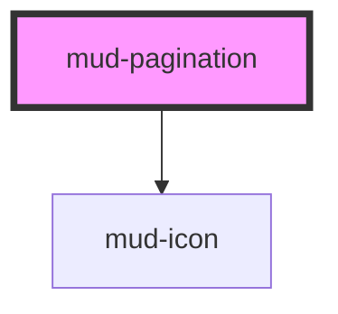

# mud-pagination

<!-- Auto Generated Below -->

## Overview

Pagination — navigation control for paged content.

Renders a list of page-number buttons flanked by Previous / Next controls.
The visible page list is computed from `currentPage`, `totalPages`,
`siblingCount`, and `boundaryCount`. When the total exceeds the visible
window, an interactive overflow button (`…`) collapses the skipped range
and lets users jump directly to any of those pages via a dropdown menu
(Figma "overflow-active" interaction).

The component is internally controlled but exposes a `mudChange` event so
the host can drive the active page. Updating `current-page` from outside
is also honoured (e.g. when the URL changes via routing).

Previous / Next buttons are hidden at the boundaries (page 1 hides Prev,
the last page hides Next) instead of being rendered in a disabled state —
this matches the Figma "first-page" / "last-page" specification.

## Properties

| Property            | Attribute             | Description                                                                                                                                                                                                                                                                                                                                                                                                                                                                             | Type                  | Default                                       |
| ------------------- | --------------------- | --------------------------------------------------------------------------------------------------------------------------------------------------------------------------------------------------------------------------------------------------------------------------------------------------------------------------------------------------------------------------------------------------------------------------------------------------------------------------------------- | --------------------- | --------------------------------------------- |
| `boundaryCount`     | `boundary-count`      | Number of page buttons shown at the start and end of the range (before / after the leading / trailing ellipsis).                                                                                                                                                                                                                                                                                                                                                                        | `number`              | `1`                                           |
| `currentPage`       | `current-page`        | The active page (1-indexed). Mutable so consumers can two-way bind.                                                                                                                                                                                                                                                                                                                                                                                                                     | `number`              | `1`                                           |
| `label`             | `label`               | Accessible name for the navigation landmark when no `aria-label` is set on the host. Defaults to "Navigare pagini". Setting `aria-label` directly on the host also works — the consumer-supplied attribute wins and is captured on connect into `resolvedAriaLabel`, then stripped from the host to avoid Stencil's attribute-observer / render-loop antipattern (same pattern as mud-radio / mud-switch / mud-tooltip / mud-accordion / mud-breadcrumb / mud-date-picker / mud-modal). | `string \| undefined` | `undefined`                                   |
| `nextAriaLabel`     | `next-aria-label`     | Accessible label template for the Next button. The `{page}` token is replaced with the target page number.                                                                                                                                                                                                                                                                                                                                                                              | `string`              | `'Pagina următoare, mergi la pagina {page}'`  |
| `nextLabel`         | `next-label`          | Visible label for the Next button (desktop only — hidden on `sm`).                                                                                                                                                                                                                                                                                                                                                                                                                      | `string`              | `'Următor'`                                   |
| `overflowAriaLabel` | `overflow-aria-label` | Accessible label template for the overflow ("…") button. The `{from}` and `{to}` tokens are replaced with the first and last page in the collapsed range.                                                                                                                                                                                                                                                                                                                               | `string`              | `'Arată paginile de la {from} la {to}'`       |
| `pageAriaLabel`     | `page-aria-label`     | Accessible label template for an individual page button. Tokens `{page}` and `{total}` are substituted with the page number and total page count.                                                                                                                                                                                                                                                                                                                                       | `string`              | `'Pagina {page} din {total}'`                 |
| `prevAriaLabel`     | `prev-aria-label`     | Accessible label template for the Previous button. The `{page}` token is replaced with the target page number.                                                                                                                                                                                                                                                                                                                                                                          | `string`              | `'Pagina anterioară, mergi la pagina {page}'` |
| `prevLabel`         | `prev-label`          | Visible label for the Previous button (desktop only — hidden on `sm`).                                                                                                                                                                                                                                                                                                                                                                                                                  | `string`              | `'Anterior'`                                  |
| `showPrevNext`      | `show-prev-next`      | Whether to render the Previous / Next navigation buttons at all. When `true` (default) they still hide individually at the corresponding boundary (page 1 hides Prev, last page hides Next).                                                                                                                                                                                                                                                                                            | `boolean`             | `true`                                        |
| `siblingCount`      | `sibling-count`       | Number of page buttons shown on each side of the active page.                                                                                                                                                                                                                                                                                                                                                                                                                           | `number`              | `1`                                           |
| `size`              | `size`                | Visual size rung. Mobile breakpoints typically use `sm` (32px) and desktop uses `md` (40px).                                                                                                                                                                                                                                                                                                                                                                                            | `"md" \| "sm"`        | `'md'`                                        |
| `totalPages`        | `total-pages`         | Total number of pages. When `<= 1` the component renders nothing.                                                                                                                                                                                                                                                                                                                                                                                                                       | `number`              | `1`                                           |

## Events

| Event       | Description                                                                                                                                                                                                                                | Type                                  |
| ----------- | ------------------------------------------------------------------------------------------------------------------------------------------------------------------------------------------------------------------------------------------ | ------------------------------------- |
| `mudChange` | Fires when the user activates a different page via click on a numbered button, the Previous / Next controls, or a page in the overflow dropdown. Carries the new and previous page numbers so consumers can drive routing or data fetches. | `CustomEvent<PaginationChangeDetail>` |

## Slots

| Slot          | Description                                                                                                        |
| ------------- | ------------------------------------------------------------------------------------------------------------------ |
| `"next-icon"` | Optional icon override for the Next button.             Defaults to a right chevron.                               |
| `"prev-icon"` | Optional icon override for the Previous button.             Defaults to a left chevron sized for the current rung. |

## Dependencies

### Depends on

- [mud-icon](../mud-icon)

### Graph

----------------------------------------------

*Built with [StencilJS](https://stenciljs.com/)*
