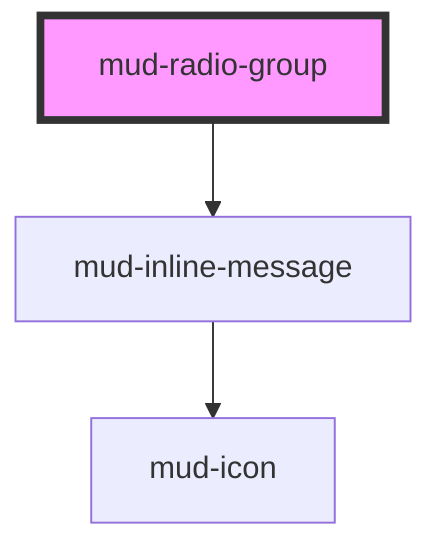

# mud-radio-group

<!-- Auto Generated Below -->

## Overview

Radio Group — a labelled set of `mud-radio` options with one selection.

Follows the WAI-ARIA radio group pattern: the group is a `radiogroup`
named by its `label`, and it is ONE Tab stop — the selected radio, or the
first enabled one when nothing is selected. The arrow keys move the
selection and focus to the next or previous enabled radio, wrapping at the
ends; Space selects the focused one.

The group owns `name`, `size`, `disabled` and `invalid` for every
`mud-radio` inside it, and keeps `value` in step with the selection. A
radio's own `mudChange` stays inside the group: listen to the group's
`mudChange`, which fires once per user selection, by pointer or keyboard.

## Properties

| Property      | Attribute     | Description                                                                                                                                         | Type                         | Default      |
| ------------- | ------------- | --------------------------------------------------------------------------------------------------------------------------------------------------- | ---------------------------- | ------------ |
| `disabled`    | `disabled`    | Disables every radio in the group. A radio disabled on its own stays disabled when the group is enabled again.                                      | `boolean`                    | `false`      |
| `errorText`   | `error-text`  | Plain-text error message shown under the options when `invalid` is set. Linked to the radiogroup through `aria-describedby`.                        | `string \| undefined`        | `undefined`  |
| `invalid`     | `invalid`     | Marks the selection invalid: every radio turns red and the radiogroup gets `aria-invalid`. Use together with `errorText` to show the message.       | `boolean`                    | `false`      |
| `label`       | `label`       | Visible group label, shown above the options. It names the radiogroup; without it, give the group an `aria-label`.                                  | `string \| undefined`        | `undefined`  |
| `name`        | `name`        | Form-control `name` given to every radio in the group. When unset, the group generates one, so its radios stay mutually exclusive.                  | `string \| undefined`        | `undefined`  |
| `orientation` | `orientation` | Layout of the options: stacked, or in a row that wraps.                                                                                             | `"horizontal" \| "vertical"` | `'vertical'` |
| `required`    | `required`    | Marks a selection as mandatory. Sets `aria-required` on the radiogroup.                                                                             | `boolean`                    | `false`      |
| `size`        | `size`        | Size rung given to every radio; it also sizes the group label.                                                                                      | `"md" \| "sm"`               | `'md'`       |
| `value`       | `value`       | `value` of the selected radio. Setting it selects the radio with that value, or clears the selection when none has it; a user selection updates it. | `string \| undefined`        | `undefined`  |

## Events

| Event       | Description                                                                                            | Type                                  |
| ----------- | ------------------------------------------------------------------------------------------------------ | ------------------------------------- |
| `mudChange` | Fires once per user selection, by pointer or keyboard. `detail.value` is the selected radio's `value`. | `CustomEvent<RadioGroupChangeDetail>` |

## Slots

| Slot | Description                                       |
| ---- | ------------------------------------------------- |
|      | The `mud-radio` options. Give each one a `value`. |

## Shadow Parts

| Part        | Description |
| ----------- | ----------- |
| `"error"`   |             |
| `"group"`   |             |
| `"label"`   |             |
| `"options"` |             |

## Dependencies

### Depends on

- [mud-inline-message](../mud-inline-message)

### Graph

----------------------------------------------

*Built with [StencilJS](https://stenciljs.com/)*
