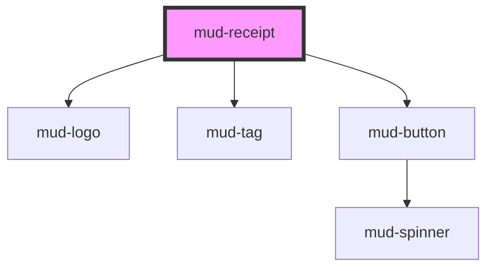

# mud-receipt

<!-- Auto Generated Below -->

## Overview

Receipt — confirmation surface for a finished Moldovan e-Gov transaction
(molecule).

Pattern B (composed molecule): renders its own header / amount block /
details list / QR / footer in shadow DOM. Composes `mud-logo`, `mud-tag`,
and `mud-button` for the interactive pieces.

Four sibling variants share one element via the `service` attribute —
each maps to one of the e-Gov properties:

- `service="mpay"` (default) — payment receipt
- `service="mpass"` — authentication session log
- `service="msign"` — signature receipt
- `service="mdelivery"` — delivery confirmation

The receipt is a presentational artifact. It does not fetch, validate,
or persist; callers pass already-formatted values. The QR (default slot
`qr` overrides) is generated client-side from the `qrData` prop via a
vendored byte-mode QR encoder — no runtime dependency, no network.

Print: the host carries `@media print` rules to hide action buttons,
drop shadows, and force ink-primary text so a citizen can print the
receipt without the surrounding UI bleeding through.

Romanian voice ships as defaults; every label is overridable via the
public `@Prop` surface for localisation.

## Properties

| Property             | Attribute              | Description                                                                                                                                                                                                                                                                                                                                                                                                                                     | Type                                                          | Default     |
| -------------------- | ---------------------- | ----------------------------------------------------------------------------------------------------------------------------------------------------------------------------------------------------------------------------------------------------------------------------------------------------------------------------------------------------------------------------------------------------------------------------------------------- | ------------------------------------------------------------- | ----------- |
| `amount`             | `amount`               | Pre-formatted amount string (e.g. `"150,00"`). The receipt does NOT format numbers — locale-aware grouping and decimal style belong to the caller. Omit to hide the amount panel entirely (used by mpass / msign receipts that carry no monetary value).                                                                                                                                                                                        | `string \| undefined`                                         | `undefined` |
| `amountLabel`        | `amount-label`         | "Suma" label preceding the amount value.                                                                                                                                                                                                                                                                                                                                                                                                        | `string \| undefined`                                         | `undefined` |
| `currency`           | `currency`             | Currency code rendered next to the amount.                                                                                                                                                                                                                                                                                                                                                                                                      | `string`                                                      | `'MDL'`     |
| `date`               | `date`                 | Date in ISO-8601 form (`"2026-05-22T14:32:00Z"`). Rendered via `Intl.DateTimeFormat(this.locale, …)`. Falls back to the raw string on a parse failure.                                                                                                                                                                                                                                                                                          | `string \| undefined`                                         | `undefined` |
| `dateLabel`          | `date-label`           | "Data" label preceding the date.                                                                                                                                                                                                                                                                                                                                                                                                                | `string \| undefined`                                         | `undefined` |
| `description`        | `description`          | Free-text description rendered as its own row.                                                                                                                                                                                                                                                                                                                                                                                                  | `string \| undefined`                                         | `undefined` |
| `descriptionLabel`   | `description-label`    | "Descriere" label preceding the free text.                                                                                                                                                                                                                                                                                                                                                                                                      | `string \| undefined`                                         | `undefined` |
| `downloadLabel`      | `download-label`       | "Descarcă PDF" button label.                                                                                                                                                                                                                                                                                                                                                                                                                    | `string \| undefined`                                         | `undefined` |
| `emailLabel`         | `email-label`          | "Trimite email" button label.                                                                                                                                                                                                                                                                                                                                                                                                                   | `string \| undefined`                                         | `undefined` |
| `label`              | `label`                | Override for the receipt's accessible name. Defaults to the resolved title plus status (e.g. "Bon de plată — Plătit"). Setting `aria-label` directly on the host also works — captured on connect into `resolvedAriaLabel` and stripped to avoid Stencil's attribute-observer / render-loop antipattern (same pattern as mud-radio / mud-switch / mud-tooltip / mud-accordion / mud-breadcrumb / mud-date-picker / mud-modal / mud-pagination). | `string \| undefined`                                         | `undefined` |
| `locale`             | `locale`               | BCP-47 locale used by the built-in date formatter. Override for non-Romanian surfaces.                                                                                                                                                                                                                                                                                                                                                          | `string`                                                      | `'ro-RO'`   |
| `printLabel`         | `print-label`          | "Imprimă" button label.                                                                                                                                                                                                                                                                                                                                                                                                                         | `string \| undefined`                                         | `undefined` |
| `qrAriaLabel`        | `qr-aria-label`        | "Cod QR pentru verificare" accessible label on the QR figure.                                                                                                                                                                                                                                                                                                                                                                                   | `string \| undefined`                                         | `undefined` |
| `qrCaption`          | `qr-caption`           | "Scanează pentru verificare" caption under the QR.                                                                                                                                                                                                                                                                                                                                                                                              | `string \| undefined`                                         | `undefined` |
| `qrData`             | `qr-data`              | Payload encoded into the QR. When empty AND no `qr` slot is provided, the QR panel is hidden entirely.                                                                                                                                                                                                                                                                                                                                          | `string \| undefined`                                         | `undefined` |
| `recipient`          | --                     | Recipient party. `idnp` is auto-masked.                                                                                                                                                                                                                                                                                                                                                                                                         | `ReceiptParty \| undefined`                                   | `undefined` |
| `recipientLabel`     | `recipient-label`      | "Beneficiar" label preceding the recipient.                                                                                                                                                                                                                                                                                                                                                                                                     | `string \| undefined`                                         | `undefined` |
| `sender`             | --                     | Sender party. `idnp` is auto-masked (`2002******789`).                                                                                                                                                                                                                                                                                                                                                                                          | `ReceiptParty \| undefined`                                   | `undefined` |
| `senderLabel`        | `sender-label`         | "Plătitor" label preceding the sender.                                                                                                                                                                                                                                                                                                                                                                                                          | `string \| undefined`                                         | `undefined` |
| `service`            | `service`              | Which e-Gov property this receipt belongs to. Drives the rendered logo, the default title, and the `service` attribute carried in event detail.                                                                                                                                                                                                                                                                                                 | `"mdelivery" \| "mpass" \| "mpay" \| "msign"`                 | `'mpay'`    |
| `shareLabel`         | `share-label`          | "Distribuie" button label.                                                                                                                                                                                                                                                                                                                                                                                                                      | `string \| undefined`                                         | `undefined` |
| `showActions`        | `show-actions`         | Whether the built-in action footer renders. Disable for read-only archival views.                                                                                                                                                                                                                                                                                                                                                               | `boolean`                                                     | `true`      |
| `status`             | `status`               | Transaction lifecycle state. Drives the status tag color + label.                                                                                                                                                                                                                                                                                                                                                                               | `"confirmed" \| "failed" \| "paid" \| "pending" \| undefined` | `undefined` |
| `statusLabel`        | `status-label`         | "Status:" inline label preceding the tag.                                                                                                                                                                                                                                                                                                                                                                                                       | `string \| undefined`                                         | `undefined` |
| `titleText`          | `title-text`           | Plain-text receipt title. Defaults to a Romanian per-service string (`Bon de plată`, `Confirmare autentificare`, `Confirmare semnătură`, `Confirmare livrare`).  Attribute name is `title-text` to avoid collision with the built-in HTML `title` global attribute (Stencil warns and the global wins at runtime). Prop name remains `titleText` for ergonomic JS access.                                                                       | `string \| undefined`                                         | `undefined` |
| `transactionId`      | `transaction-id`       | Opaque transaction identifier rendered in the footer caption.                                                                                                                                                                                                                                                                                                                                                                                   | `string \| undefined`                                         | `undefined` |
| `transactionIdLabel` | `transaction-id-label` | "Cod tranzacție" label preceding the transaction ID.                                                                                                                                                                                                                                                                                                                                                                                            | `string \| undefined`                                         | `undefined` |

## Events

| Event         | Description                                               | Type                               |
| ------------- | --------------------------------------------------------- | ---------------------------------- |
| `mudDownload` | Fires when the user activates the "Descarcă PDF" action.  | `CustomEvent<ReceiptActionDetail>` |
| `mudEmail`    | Fires when the user activates the "Trimite email" action. | `CustomEvent<ReceiptActionDetail>` |
| `mudPrint`    | Fires when the user activates the "Imprimă" action.       | `CustomEvent<ReceiptActionDetail>` |
| `mudShare`    | Fires when the user activates the "Distribuie" action.    | `CustomEvent<ReceiptActionDetail>` |

## Slots

| Slot        | Description                                                                                                                                                           |
| ----------- | --------------------------------------------------------------------------------------------------------------------------------------------------------------------- |
| `"actions"` | Override the footer action buttons. When populated, the           built-in `Imprimă / Descarcă PDF / Trimite email /           Distribuie` set is replaced wholesale. |
| `"extra"`   | Optional additional detail rows appended after the         built-in description / transaction-id block.                                                               |
| `"qr"`      | Override the generated QR. When populated, the built-in      encoder is skipped and the consumer takes full ownership of      the verification visual.                |

## Dependencies

### Depends on

- [mud-logo](../mud-logo)
- [mud-tag](../mud-tag)
- [mud-button](../mud-button)

### Graph

----------------------------------------------

*Built with [StencilJS](https://stenciljs.com/)*
