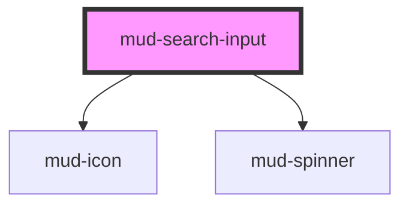

# mud-search-input

<!-- Auto Generated Below -->

## Overview

Search Input — single-line search-entry control.

Pattern B (atom-interactive, form-associated): renders its own
`<input type="search">` inside shadow DOM. Adds a leading magnifying-glass
icon and an optional trailing clear `×` button that appears whenever the
control carries a value. Visual primitives (border, focus ring, label,
helper, sizes, states) are shared with `mud-text-input`; specific
affordances (icon-start, icon-end-clear, submit-button) live in the
`--search-input-*` token namespace.

Per the Figma "Search Input" component the field has two silhouettes,
selected via the `shape` prop:
- `rectangular` (default) — corners use `borderRadius.8`.
- `circular` — corners flip to `borderRadius.full` (9999px), and the
  trailing submit button becomes a perfect circle.

Optional axes per Figma "Search Input":
- `loading` — async query is in flight; a trailing spinner appears next to
  the value/placeholder and the control is announced as `aria-busy`.
- `with-button` — adds a trailing brand-blue submit button that fires
  `mudSearch` on click. Coexists with the clear button and the loading
  spinner.

## Properties

| Property       | Attribute      | Description                                                                                                                                                                                                                                                                                                                                                                                    | Type                          | Default         |
| -------------- | -------------- | ---------------------------------------------------------------------------------------------------------------------------------------------------------------------------------------------------------------------------------------------------------------------------------------------------------------------------------------------------------------------------------------------- | ----------------------------- | --------------- |
| `ariaLabel`    | `aria-label`   | Accessible name. Mirrors to the internal control's `aria-label` when no visible label is present. Captured into `resolvedAriaLabel` on mount and the host attribute is stripped to avoid Stencil's auto-reflection loop.                                                                                                                                                                       | `string \| undefined`         | `undefined`     |
| `autocomplete` | `autocomplete` | Native `autocomplete` attribute forwarded to the internal control.                                                                                                                                                                                                                                                                                                                             | `string \| undefined`         | `undefined`     |
| `clearLabel`   | `clear-label`  | Accessible label for the trailing clear button. Defaults to Romanian "Șterge" per the institutional voice.                                                                                                                                                                                                                                                                                     | `string`                      | `'Șterge'`      |
| `clearable`    | `clearable`    | Shows the trailing clear `×` button when a value is present. Set to `false` to suppress the affordance entirely (useful for always-on filters).                                                                                                                                                                                                                                                | `boolean`                     | `true`          |
| `disabled`     | `disabled`     | Disables interactivity. The internal control receives the native `disabled` attribute.                                                                                                                                                                                                                                                                                                         | `boolean`                     | `false`         |
| `helperText`   | `helper-text`  | Plain-text helper / hint shown below the control.                                                                                                                                                                                                                                                                                                                                              | `string \| undefined`         | `undefined`     |
| `iconName`     | `icon-name`    | Icon name for the leading icon (rendered via the local SVG library). Override by providing an element to the `icon-start` slot.                                                                                                                                                                                                                                                                | `string`                      | `'search'`      |
| `label`        | `label`        | Plain-text label. Use the `label` slot for richer content.                                                                                                                                                                                                                                                                                                                                     | `string \| undefined`         | `undefined`     |
| `loading`      | `loading`      | Indicates an in-flight query. Keeps the leading magnifying-glass icon as the role indicator and reveals a trailing brand-coloured `mud-spinner` next to the value; the clear `×` is suppressed while the query is in flight and the control is announced as `aria-busy`. The field stays focusable; emitting `mudSearch` while loading is the consumer's responsibility (typically debounced). | `boolean`                     | `false`         |
| `maxLength`    | `maxlength`    | Native `maxlength` constraint.                                                                                                                                                                                                                                                                                                                                                                 | `number \| undefined`         | `undefined`     |
| `minLength`    | `minlength`    | Native `minlength` constraint.                                                                                                                                                                                                                                                                                                                                                                 | `number \| undefined`         | `undefined`     |
| `name`         | `name`         | Form-control `name`. Used during form submission.                                                                                                                                                                                                                                                                                                                                              | `string \| undefined`         | `undefined`     |
| `placeholder`  | `placeholder`  | Placeholder shown when the control is empty.                                                                                                                                                                                                                                                                                                                                                   | `string \| undefined`         | `undefined`     |
| `required`     | `required`     | Marks the field as mandatory. Adds a red asterisk to the label and sets `aria-required` on the internal control.                                                                                                                                                                                                                                                                               | `boolean`                     | `false`         |
| `shape`        | `shape`        | Silhouette. `rectangular` uses lightly-rounded corners; `circular` renders a fully-rounded (pill) field with a circular submit button.                                                                                                                                                                                                                                                         | `"circular" \| "rectangular"` | `'rectangular'` |
| `size`         | `size`         | Visual size rung. `sm` is 40px tall, `md` is 48px tall.                                                                                                                                                                                                                                                                                                                                        | `"md" \| "sm"`                | `'sm'`          |
| `submitLabel`  | `submit-label` | Accessible label for the trailing submit button. Defaults to Romanian "Caută" per the institutional voice.                                                                                                                                                                                                                                                                                     | `string`                      | `'Caută'`       |
| `value`        | `value`        | Current value of the control. Reflects to the host attribute.                                                                                                                                                                                                                                                                                                                                  | `string`                      | `''`            |
| `withButton`   | `with-button`  | Renders a trailing brand-blue submit button (the Figma "Button=True" axis). Clicking the button — or pressing Enter inside the input — dispatches `mudSearch` with the current value. When the field is empty or disabled, the button enters a disabled visual state and does not fire the event.                                                                                              | `boolean`                     | `false`         |

## Events

| Event       | Description                                                                                                | Type                                   |
| ----------- | ---------------------------------------------------------------------------------------------------------- | -------------------------------------- |
| `mudBlur`   | Fires when the internal control loses focus.                                                               | `CustomEvent<FocusEvent>`              |
| `mudChange` | Fires when the value is committed (typically on `blur`). `detail.value` is the committed value.            | `CustomEvent<SearchInputChangeDetail>` |
| `mudClear`  | Fires when the value is cleared by the user (clear button or Escape key).                                  | `CustomEvent<void>`                    |
| `mudFocus`  | Fires when the internal control gains focus.                                                               | `CustomEvent<FocusEvent>`              |
| `mudInput`  | Fires on every keystroke. `detail.value` is the current control value.                                     | `CustomEvent<SearchInputChangeDetail>` |
| `mudSearch` | Fires when the user submits the query (Enter key or submit button). `detail.value` is the submitted query. | `CustomEvent<SearchInputSearchDetail>` |

## Slots

| Slot           | Description                                                                            |
| -------------- | -------------------------------------------------------------------------------------- |
| `"helper"`     | Rich helper / hint content, replaces the `helper-text` prop.                           |
| `"icon-end"`   | Trailing slot. Suppresses the built-in clear `×` button when content is assigned here. |
| `"icon-start"` | Leading icon override. Defaults to `mud-icon[name="search"]`.                          |
| `"label"`      | Rich label content, replaces the `label` prop when present.                            |

## Shadow Parts

| Part              | Description |
| ----------------- | ----------- |
| `"clear-button"`  |             |
| `"control"`       |             |
| `"helper"`        |             |
| `"label"`         |             |
| `"native"`        |             |
| `"required-mark"` |             |
| `"spinner"`       |             |
| `"submit-button"` |             |

## Dependencies

### Depends on

- [mud-icon](../mud-icon)
- [mud-spinner](../mud-spinner)

### Graph

----------------------------------------------

*Built with [StencilJS](https://stenciljs.com/)*
