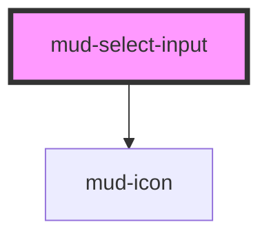

# mud-select-input

<!-- Auto Generated Below -->

## Overview

Select Input — single-select dropdown atom.

Pattern B (atom-interactive, form-associated): renders a custom-styled
trigger button and a listbox popover inside shadow DOM. Form participation
works via `formAssociated` + `ElementInternals`. Shares the visual primitives
of `mud-input` (border, focus ring, label, helper / error text, sizes,
states) and adds a trailing chevron icon, listbox menu, and keyboard
navigation (ArrowUp/Down/Home/End/Enter/Escape) per the WAI-ARIA combobox
pattern.

## Properties

| Property      | Attribute     | Description                                                                                                                                   | Type                          | Default     |
| ------------- | ------------- | --------------------------------------------------------------------------------------------------------------------------------------------- | ----------------------------- | ----------- |
| `ariaLabel`   | `aria-label`  | Accessible name. Mirrors to the trigger's `aria-label` when no visible label is present.                                                      | `string \| undefined`         | `undefined` |
| `disabled`    | `disabled`    | Disables interactivity. The trigger receives `aria-disabled` and the hidden native `<select>` receives the `disabled` attribute.              | `boolean`                     | `false`     |
| `errorText`   | `error-text`  | Plain-text error message shown below the control when `invalid` is set. When present it replaces `helperText` and pairs with the error icon.  | `string \| undefined`         | `undefined` |
| `helperText`  | `helper-text` | Plain-text helper / hint shown below the control.                                                                                             | `string \| undefined`         | `undefined` |
| `invalid`     | `invalid`     | Forces destructive visuals regardless of `variant`. Sets `aria-invalid`. Use together with `errorText` to surface the message.                | `boolean`                     | `false`     |
| `label`       | `label`       | Plain-text label. Use the `label` slot for richer content.                                                                                    | `string \| undefined`         | `undefined` |
| `name`        | `name`        | Form-control `name`. Used during form submission.                                                                                             | `string \| undefined`         | `undefined` |
| `open`        | `open`        | Reflects the open state of the listbox popover. Read-only externally — use `mudOpen` / `mudClose` to react to changes.                        | `boolean`                     | `false`     |
| `options`     | --            | Declarative option list. When omitted the component falls back to its default slot, allowing `<option>` children for HTML-native composition. | `SelectOption[] \| undefined` | `undefined` |
| `placeholder` | `placeholder` | Placeholder shown when no option is selected.                                                                                                 | `string \| undefined`         | `undefined` |
| `readonly`    | `readonly`    | Renders the field read-only. The trigger remains focusable but the listbox cannot be opened.                                                  | `boolean`                     | `false`     |
| `required`    | `required`    | Marks the field as mandatory. Adds a red asterisk to the label and sets `aria-required` on the trigger.                                       | `boolean`                     | `false`     |
| `size`        | `size`        | Visual size rung.                                                                                                                             | `"lg" \| "md"`                | `'md'`      |
| `value`       | `value`       | Selected value. Reflects to the host attribute. Set to empty string when no option is selected.                                               | `string`                      | `''`        |
| `variant`     | `variant`     | Color treatment. `destructive` is forced when `invalid` is set.                                                                               | `"default" \| "destructive"`  | `'default'` |

## Events

| Event       | Description                                                                     | Type                              |
| ----------- | ------------------------------------------------------------------------------- | --------------------------------- |
| `mudBlur`   | Fires when the trigger loses focus. The native `FocusEvent` is forwarded as-is. | `CustomEvent<FocusEvent>`         |
| `mudChange` | Fires when the selected value changes. `detail.value` is the new value.         | `CustomEvent<SelectChangeDetail>` |
| `mudClose`  | Fires when the listbox closes.                                                  | `CustomEvent<void>`               |
| `mudFocus`  | Fires when the trigger gains focus. The native `FocusEvent` is forwarded as-is. | `CustomEvent<FocusEvent>`         |
| `mudOpen`   | Fires when the listbox opens.                                                   | `CustomEvent<void>`               |

## Slots

| Slot           | Description                                                                                             |
| -------------- | ------------------------------------------------------------------------------------------------------- |
| `"helper"`     | Rich helper / hint content, replaces the `helper-text` prop. Hidden when invalid + error-text is shown. |
| `"icon-start"` | Leading `mud-icon` rendered inside the control row.                                                     |
| `"label"`      | Rich label content, replaces the `label` prop when present.                                             |

## Shadow Parts

| Part              | Description |
| ----------------- | ----------- |
| `"control"`       |             |
| `"error"`         |             |
| `"helper"`        |             |
| `"label"`         |             |
| `"listbox"`       |             |
| `"required-mark"` |             |
| `"trigger"`       |             |

## Dependencies

### Depends on

- [mud-icon](../mud-icon)

### Graph

----------------------------------------------

*Built with [StencilJS](https://stenciljs.com/)*
