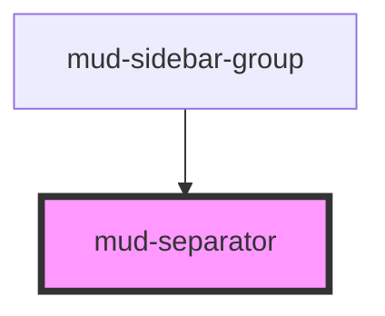

# mud-separator

<!-- Auto Generated Below -->

## Overview

Separator — visual divider between groups of content or UI components.

Pattern B (atom-visual): renders a 1D rule, optionally with an inline label.
No events, no interactivity. ARIA `separator` semantics. Most separators are
decorative; give one the native `aria-label` attribute when it marks a
boundary worth announcing — it stays on the host, which carries the role.

## Properties

| Property      | Attribute     | Description                                                                                                                                                | Type                                            | Default        |
| ------------- | ------------- | ---------------------------------------------------------------------------------------------------------------------------------------------------------- | ----------------------------------------------- | -------------- |
| `inset`       | `inset`       | Adds outer spacing on the cross axis. Typical when the separator sits between items in a list or menu.                                                     | `boolean`                                       | `false`        |
| `label`       | `label`       | Optional plain-text label rendered inline at the center of the separator. For richer label content (e.g. an icon plus text), use the default slot instead. | `string \| undefined`                           | `undefined`    |
| `orientation` | `orientation` | Layout orientation of the separator.                                                                                                                       | `"horizontal" \| "vertical"`                    | `'horizontal'` |
| `size`        | `size`        | Visual thickness of the rule.                                                                                                                              | `"extra-thin" \| "medium" \| "thick" \| "thin"` | `'thin'`       |
| `variant`     | `variant`     | Color treatment / emphasis.                                                                                                                                | `"mild" \| "strong" \| "subtle"`                | `'subtle'`     |

## Slots

| Slot | Description                                                                                                                   |
| ---- | ----------------------------------------------------------------------------------------------------------------------------- |
|      | Optional rich label content (e.g. icon + text). Use either the   `label` prop for plain text or this slot for richer content. |

## Shadow Parts

| Part       | Description |
| ---------- | ----------- |
| `"label"`  |             |
| `"layout"` |             |
| `"line"`   |             |

## Dependencies

### Used by

 - [mud-sidebar-group](../mud-sidebar)

### Graph

----------------------------------------------

*Built with [StencilJS](https://stenciljs.com/)*
