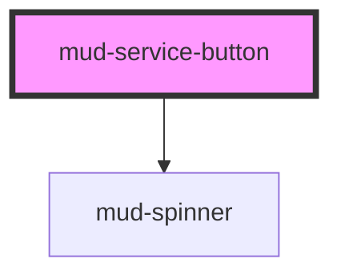

# mud-service-button

<!-- Auto Generated Below -->

## Overview

Service Button — interactive control for Moldovan M-products (mpay, mpass,
msign, mpower, mdelivery).

A specialised filled button with a logo badge embedded on the inline-start
edge of the geometry. Fixed 48 px height (= minimum touch target) and
asymmetric padding (16 start / 20 end) per Figma spec.

Slot `badge` reserves a 24×24 box for a `<mud-logo>` rendering a
`*-logo-logomark-only` asset (or any other element rendered at that size).
The default slot carries the label text.

## Properties

| Property     | Attribute    | Description                                                                                                                        | Type                              | Default     |
| ------------ | ------------ | ---------------------------------------------------------------------------------------------------------------------------------- | --------------------------------- | ----------- |
| `appearance` | `appearance` | Visual treatment. - `primary` — solid brand background, white label - `neutral` — light surface background, dark label             | `"neutral" \| "primary"`          | `'primary'` |
| `disabled`   | `disabled`   | Disables interactivity.                                                                                                            | `boolean`                         | `false`     |
| `fullWidth`  | `full-width` | Makes the button expand to fill the inline-size of its container.                                                                  | `boolean`                         | `false`     |
| `href`       | `href`       | If set, the button renders as `<a href="…">` and behaves as a link. `type`, `name`, and `value` are ignored in this mode.          | `string \| undefined`             | `undefined` |
| `label`      | `label`      | Accessible name override. When omitted, the visible default-slot text is used as the accessible name (the standard pattern).       | `string \| undefined`             | `undefined` |
| `loading`    | `loading`    | Renders a centred spinner and blocks interactivity while preserving the accessible name. Sets `aria-busy` on the internal control. | `boolean`                         | `false`     |
| `name`       | `name`       | Form-control `name`. Used when `type="submit"` and a value is submitted.                                                           | `string \| undefined`             | `undefined` |
| `rel`        | `rel`        | `rel` for the anchor when `href` is set.                                                                                           | `string \| undefined`             | `undefined` |
| `target`     | `target`     | `target` for the anchor when `href` is set.                                                                                        | `string \| undefined`             | `undefined` |
| `type`       | `type`       | Native button `type` attribute. Ignored when `href` is set.                                                                        | `"button" \| "reset" \| "submit"` | `'button'`  |
| `value`      | `value`      | Form-control `value` submitted alongside `name`.                                                                                   | `string \| undefined`             | `undefined` |

## Slots

| Slot      | Description                                                                                              |
| --------- | -------------------------------------------------------------------------------------------------------- |
|           | (default) The label text (e.g. "Plătește cu mpay").                                                      |
| `"badge"` | The service logomark, sized 24×24. Typically `<mud-logo slot="badge" name="mpay-logo-logomark-only" />`. |

## Dependencies

### Depends on

- [mud-spinner](../mud-spinner)

### Graph

----------------------------------------------

*Built with [StencilJS](https://stenciljs.com/)*
