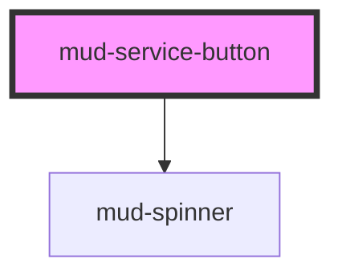

# mud-service-button

<!-- Auto Generated Below -->

## Properties

| Property     | Attribute    | Description                                                                                                                                                                                                                                                                                                                                                                       | Type                              | Default     |
| ------------ | ------------ | --------------------------------------------------------------------------------------------------------------------------------------------------------------------------------------------------------------------------------------------------------------------------------------------------------------------------------------------------------------------------------- | --------------------------------- | ----------- |
| `appearance` | `appearance` | Visual treatment. - `primary` — solid brand background, white label - `neutral` — light surface background, dark label                                                                                                                                                                                                                                                            | `"neutral" \| "primary"`          | `'primary'` |
| `disabled`   | `disabled`   | Disables interactivity.                                                                                                                                                                                                                                                                                                                                                           | `boolean`                         | `false`     |
| `fullWidth`  | `full-width` | Makes the button expand to fill the inline-size of its container.                                                                                                                                                                                                                                                                                                                 | `boolean`                         | `false`     |
| `href`       | `href`       | If set, the button renders as `<a href="…">` and behaves as a link. `type`, `name`, and `value` are ignored in this mode.                                                                                                                                                                                                                                                         | `string \| undefined`             | `undefined` |
| `label`      | `label`      | **[DEPRECATED]** `label` means visible text everywhere else in the library. Set the native `aria-label` attribute instead; `label` goes away in the next major.  Accessible name override. When omitted, the visible default-slot text is used as the accessible name (the standard pattern). The host's native `aria-label` wins over it. | `string \| undefined`             | `undefined` |
| `loading`    | `loading`    | Renders a centred spinner and blocks interactivity while preserving the accessible name. Sets `aria-busy` on the internal control.                                                                                                                                                                                                                                                | `boolean`                         | `false`     |
| `name`       | `name`       | Form-control `name`. Used when `type="submit"` and a value is submitted.                                                                                                                                                                                                                                                                                                          | `string \| undefined`             | `undefined` |
| `rel`        | `rel`        | `rel` for the anchor when `href` is set.                                                                                                                                                                                                                                                                                                                                          | `string \| undefined`             | `undefined` |
| `target`     | `target`     | `target` for the anchor when `href` is set.                                                                                                                                                                                                                                                                                                                                       | `string \| undefined`             | `undefined` |
| `type`       | `type`       | Native button `type` attribute. Ignored when `href` is set.                                                                                                                                                                                                                                                                                                                       | `"button" \| "reset" \| "submit"` | `'button'`  |
| `value`      | `value`      | Form-control `value` submitted alongside `name`.                                                                                                                                                                                                                                                                                                                                  | `string \| undefined`             | `undefined` |

## Slots

| Slot      | Description      |
| --------- | ---------------- |
|           | The default slot |
| `"badge"` |                  |

## Dependencies

### Depends on

- [mud-spinner](../mud-spinner)

### Graph

```mermaid
graph TD;
  mud-service-button --> mud-spinner
  style mud-service-button fill:#f9f,stroke:#333,stroke-width:4px
```

----------------------------------------------

*Built with [StencilJS](https://stenciljs.com/)*
