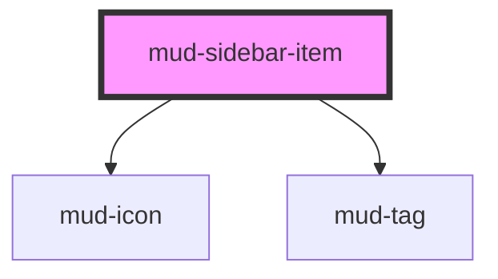

# mud-sidebar-item

<!-- Auto Generated Below -->

## Overview

Sidebar item — a single navigation row inside a `mud-sidebar` / `mud-sidebar-group`.

Renders as a link when `href` is set, otherwise a button. Expandable items
toggle a nested list (the `children` slot) and rotate a chevron.

## Properties

| Property     | Attribute     | Description                                                                        | Type                  | Default     |
| ------------ | ------------- | ---------------------------------------------------------------------------------- | --------------------- | ----------- |
| `active`     | `active`      | Whether this item represents the current page/section.                             | `boolean`             | `false`     |
| `badge`      | `badge`       | Optional trailing numbered badge count (rendered as a `mud-badge`).                | `number \| undefined` | `undefined` |
| `disabled`   | `disabled`    | Whether the item is disabled.                                                      | `boolean`             | `false`     |
| `expandable` | `expandable`  | Whether the item expands a nested list of children.                                | `boolean`             | `false`     |
| `expanded`   | `expanded`    | Whether the nested list is expanded.                                               | `boolean`             | `false`     |
| `href`       | `href`        | Render as a link to this destination.                                              | `string \| undefined` | `undefined` |
| `icon`       | `icon`        | Leading icon name.                                                                 | `string \| undefined` | `undefined` |
| `iconActive` | `icon-active` | Leading icon name used while active (e.g. a filled variant). Falls back to `icon`. | `string \| undefined` | `undefined` |
| `label`      | `label`       | Primary label (overridden by slotted content).                                     | `string \| undefined` | `undefined` |
| `secondary`  | `secondary`   | Optional right-aligned secondary label.                                            | `string \| undefined` | `undefined` |
| `tag`        | `tag`         | Optional trailing tag text (rendered as an outlined `mud-tag`).                    | `string \| undefined` | `undefined` |
| `value`      | `value`       | Value reported when the item is activated.                                         | `string \| undefined` | `undefined` |

## Events

| Event       | Description                                             | Type                                   |
| ----------- | ------------------------------------------------------- | -------------------------------------- |
| `mudSelect` | Fired when a non-expandable item is activated.          | `CustomEvent<SidebarItemSelectDetail>` |
| `mudToggle` | Fired when an expandable item is expanded or collapsed. | `CustomEvent<SidebarItemToggleDetail>` |

## Slots

| Slot         | Description                                                |
| ------------ | ---------------------------------------------------------- |
|              | The primary label (overrides the `label` prop).            |
| `"children"` | Nested `mud-sidebar-item` elements revealed when expanded. |

## Shadow Parts

| Part     | Description          |
| -------- | -------------------- |
| `"item"` | The interactive row. |

## Dependencies

### Depends on

- [mud-icon](../mud-icon)
- [mud-tag](../mud-tag)

### Graph

----------------------------------------------

*Built with [StencilJS](https://stenciljs.com/)*
