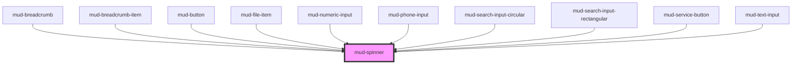

# mud-spinner

<!-- Auto Generated Below -->

## Overview

Spinner — animated circular loading indicator.

Pattern B (atom-visual): renders a CSS-only rotating arc.
No slots, no events, no interactivity.

## Properties

| Property  | Attribute | Description                          | Type                                               | Default     |
| --------- | --------- | ------------------------------------ | -------------------------------------------------- | ----------- |
| `label`   | `label`   | Accessible label for screen readers. | `string`                                           | `'Loading'` |
| `size`    | `size`    | Visual size rung.                    | `"lg" \| "md" \| "sm" \| "xs"`                     | `'md'`      |
| `variant` | `variant` | Color treatment.                     | `"brand" \| "dark" \| "light" \| "light-on-color"` | `'brand'`   |

## Dependencies

### Used by

 - [mud-breadcrumb](../mud-breadcrumb)
 - [mud-breadcrumb-item](../mud-breadcrumb)
 - [mud-button](../mud-button)
 - [mud-file-item](../mud-file-item)
 - [mud-numeric-input](../mud-numeric-input)
 - [mud-phone-input](../mud-phone-input)
 - [mud-search-input-circular](../mud-search-input-circular)
 - [mud-search-input-rectangular](../mud-search-input-rectangular)
 - [mud-service-button](../mud-service-button)
 - [mud-text-input](../mud-text-input)

### Graph

----------------------------------------------

*Built with [StencilJS](https://stenciljs.com/)*
