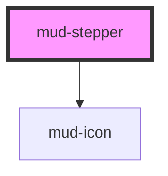

# mud-stepper

<!-- Auto Generated Below -->

## Overview

Stepper — visualises a user's position in a multi-step process.

Matches the Figma `progress-tracker` component (page "Progress Tracker
(Stepper)", node 267:6905) — kept here under the shorter `mud-stepper` name.

Two flavours:

- **Display stepper** (`interactive=false`, default) — read-only. Each step is a
  `<li>` carrying ARIA semantics. Use for sign-up wizards, KYC flows, document
  submissions where the parent app drives navigation.
- **Interactive stepper** (`interactive=true`) — each completed (and the current)
  step renders as a `<button>` and emits `mudStepClick`. Pending steps remain
  non-actionable per the WAI-ARIA stepper pattern.

State legend (Figma node 634:10573):
  - `pending`    — neutral grey ring + faded number, non-navigable
  - `current`    — brand ring + brand number, neutral label
  - `completed`  — brand filled circle + white checkmark (brand underlined link label when interactive)
  - `available`  — brand outline ring + brand number, navigable forward (brand underlined link label when interactive)
  - `error`      — danger ring + danger cross, neutral label

The component renders an ordered list with `role="list"` for AT compatibility
(Safari + VoiceOver strip implicit list roles when `list-style: none` is set).

## Properties

| Property      | Attribute      | Description                                                                                                                                                                                                                                                                                                                                                                                                                                                                                                                                                                                                                                                                                                                                                                                                                                                                                      | Type                         | Default        |
| ------------- | -------------- | ------------------------------------------------------------------------------------------------------------------------------------------------------------------------------------------------------------------------------------------------------------------------------------------------------------------------------------------------------------------------------------------------------------------------------------------------------------------------------------------------------------------------------------------------------------------------------------------------------------------------------------------------------------------------------------------------------------------------------------------------------------------------------------------------------------------------------------------------------------------------------------------------ | ---------------------------- | -------------- |
| `ariaLabel`   | `aria-label`   | Accessible name for the surrounding list landmark. Falls back to `'Progress tracker'` (English) — Romanian consumers can pass `'Pași'`.                                                                                                                                                                                                                                                                                                                                                                                                                                                                                                                                                                                                                                                                                                                                                          | `string \| undefined`        | `undefined`    |
| `compact`     | `compact`      | Compact "dot rail" rendering — the mobile breakpoint from Figma. Hides the step numbers and labels, leaving a rail of dots; per-status fills convey progress (filled brand + checkmark = completed, hollow ring = current / available / pending, danger ring + cross = error). Status icons are kept; only the numeric indicators and text labels are hidden. Works in both orientations.                                                                                                                                                                                                                                                                                                                                                                                                                                                                                                        | `boolean`                    | `false`        |
| `currentStep` | `current-step` | Optional **zero-based** index of the current step (so the 3rd step is `currentStep={2}`). When set it drives the whole progression and the per-item `status` in `steps` is ignored: every step **before** the index renders `'completed'`, the step **at** the index renders `'current'`, every step **after** renders `'pending'`. Pass `currentStep={steps.length}` (one past the last index) to mark the flow finished — every step then renders `'completed'`.  The one exception: a step whose `status` is `'error'` keeps `'error'` regardless of position (a failed step stays failed while you navigate). A negative or non-integer value is ignored and the array's own statuses stand. Use this for parent-driven flows that track a single number; for mixed states (`'available'` future steps, several errors, etc.) drive each step through `steps` and leave `currentStep` unset. | `number \| undefined`        | `undefined`    |
| `interactive` | `interactive`  | When true, completed, current, and available steps render as `<button>` elements and emit `mudStepClick`. Pending and error steps remain non-actionable in this mode.                                                                                                                                                                                                                                                                                                                                                                                                                                                                                                                                                                                                                                                                                                                            | `boolean`                    | `false`        |
| `orientation` | `orientation`  | Layout orientation.   - `horizontal` (default): steps flow left to right; labels render under indicators.   - `vertical`: steps stack top to bottom; labels render to the right of indicators.                                                                                                                                                                                                                                                                                                                                                                                                                                                                                                                                                                                                                                                                                                   | `"horizontal" \| "vertical"` | `'horizontal'` |
| `steps`       | --             | Declarative step list. Each item: `{ id?, label, supportingText?, status, iconName?, disabled? }`. `status` drives the visual state and ARIA semantics — see {@link StepperStepStatus}.                                                                                                                                                                                                                                                                                                                                                                                                                                                                                                                                                                                                                                                                                                          | `StepperStep[] \| undefined` | `undefined`    |

## Events

| Event          | Description                                                                                                                                                                                                        | Type                                                 |
| -------------- | ------------------------------------------------------------------------------------------------------------------------------------------------------------------------------------------------------------------ | ---------------------------------------------------- |
| `mudStepClick` | Emitted when an interactive step is activated via mouse, keyboard, or AT. Detail carries the `index` and the full `step` object that was clicked. Only fires when `interactive=true` and the step is not disabled. | `CustomEvent<{ index: number; step: StepperStep; }>` |

## Slots

| Slot | Description                                                                                                     |
| ---- | --------------------------------------------------------------------------------------------------------------- |
|      | (default) Reserved for future slot-mode authoring. Currently unused —   consumers should pass the `steps` prop. |

## Dependencies

### Depends on

- [mud-icon](../mud-icon)

### Graph

----------------------------------------------

*Built with [StencilJS](https://stenciljs.com/)*
