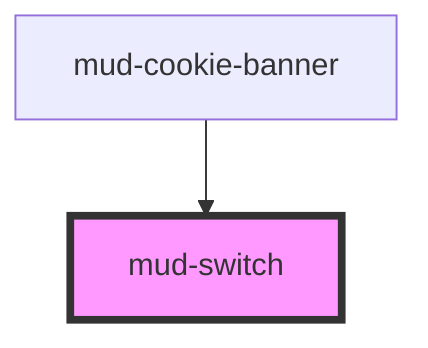

# mud-switch

<!-- Auto Generated Below -->

## Overview

Switch — binary on/off toggle atom (form-associated).

Pattern B (atom-interactive, form-associated): renders its own
`<input type="checkbox" role="switch">` inside shadow DOM and paints the
visual track + thumb with CSS. Implements the WAI-ARIA switch pattern, not
the checkbox pattern — `role="switch"` with `aria-checked="true|false"`.
Space toggles per native checkbox semantics; the role swap does not break
keyboard activation.

The visible track is 48 × 28px; the hit area expands to 32px on
pointer-devices and 40px on touch-devices (via `pointer: coarse`) per the
Figma "Target Sizes" spec, achieved with a `::before` pseudo-element so the
visual footprint stays untouched.

## Properties

| Property         | Attribute         | Description                                                                                                                                                                                                                        | Type                  | Default     |
| ---------------- | ----------------- | ---------------------------------------------------------------------------------------------------------------------------------------------------------------------------------------------------------------------------------- | --------------------- | ----------- |
| `ariaLabel`      | `aria-label`      | Consumer-set `aria-label` on the host. The component caches the value (see `resolvedAriaLabel`) and strips the host attribute on mount to avoid the `aria-prohibited-attr` axe rule on the custom-element host.                    | `string \| undefined` | `undefined` |
| `ariaLabelledby` | `aria-labelledby` | Consumer-set `aria-labelledby`. Same strip + cache pattern as `ariaLabel`.                                                                                                                                                         | `string \| undefined` | `undefined` |
| `checked`        | `checked`         | Whether the switch is currently on.                                                                                                                                                                                                | `boolean`             | `false`     |
| `disabled`       | `disabled`        | Disables interactivity. The internal control receives `aria-disabled` and the native `disabled` attribute.                                                                                                                         | `boolean`             | `false`     |
| `label`          | `label`           | Accessible-name fallback. Used as `aria-label` on the internal input when no `label` slot is provided. Does NOT render visible text — use the `label` slot for that. Matches the mud-button / mud-checkbox / mud-radio convention. | `string \| undefined` | `undefined` |
| `name`           | `name`            | Form-control `name`. Used during form submission.                                                                                                                                                                                  | `string \| undefined` | `undefined` |
| `required`       | `required`        | Marks the field as mandatory. Sets `aria-required` on the internal control.                                                                                                                                                        | `boolean`             | `false`     |
| `value`          | `value`           | Value submitted with the form when this switch is on.                                                                                                                                                                              | `string \| undefined` | `undefined` |

## Events

| Event       | Description                                                                              | Type                              |
| ----------- | ---------------------------------------------------------------------------------------- | --------------------------------- |
| `mudBlur`   | Fires when the internal control loses focus. The native `FocusEvent` is forwarded as-is. | `CustomEvent<FocusEvent>`         |
| `mudChange` | Fires whenever the checked state changes. `detail.checked` is the new state.             | `CustomEvent<SwitchChangeDetail>` |
| `mudFocus`  | Fires when the internal control gains focus. The native `FocusEvent` is forwarded as-is. | `CustomEvent<FocusEvent>`         |

## Slots

| Slot      | Description                                                 |
| --------- | ----------------------------------------------------------- |
| `"label"` | Rich label content, replaces the `label` prop when present. |

## Shadow Parts

| Part        | Description |
| ----------- | ----------- |
| `"control"` |             |
| `"label"`   |             |
| `"layout"`  |             |
| `"native"`  |             |
| `"text"`    |             |
| `"thumb"`   |             |
| `"track"`   |             |

## Dependencies

### Used by

 - [mud-cookie-banner](../mud-cookie-banner)

### Graph

----------------------------------------------

*Built with [StencilJS](https://stenciljs.com/)*
