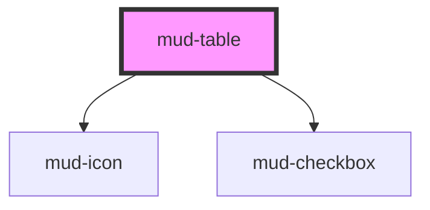

# mud-table

<!-- Auto Generated Below -->

## Overview

Table — data table molecule for tabular content with optional sorting,
selection, and responsive mobile collapse.

Pattern B (molecule, internal DOM): renders a native `<table>` inside
shadow DOM for full a11y semantics (`role="table"`, `role="columnheader"`,
`aria-sort`, `aria-selected`). Composes existing primitives — `mud-checkbox`
for the selection column, `mud-icon` for sort chevrons. Status badges and
row actions are projected via named slots so consumers can drop in
`mud-tag`, `mud-button`, or any custom content per cell.

At ≤640 px container width the inline padding shrinks from 24 → 16 to
match Figma's "Mobile" breakpoint specs (table-header `4930:14358`,
table-cell `649:4296`). The table structure itself is preserved; consumers
who need a card-stack layout on narrow screens should wrap their own
presentation around the data.

## Properties

| Property        | Attribute        | Description                                                                                                                                                                                                                      | Type                                   | Default     |
| --------------- | ---------------- | -------------------------------------------------------------------------------------------------------------------------------------------------------------------------------------------------------------------------------- | -------------------------------------- | ----------- |
| `ariaLabel`     | `aria-label`     | Accessible label propagated to the rendered `<table>` element. Captured into `resolvedAriaLabel` on mount and the host attribute is stripped to avoid Stencil's auto-reflection loop.                                            | `string \| undefined`                  | `undefined` |
| `columns`       | --               | Column definitions. Each entry maps a row field (`key`) to a header `label`, an optional `sortable` flag, alignment, and width.                                                                                                  | `TableColumn[] \| undefined`           | `undefined` |
| `headerStyle`   | `header-style`   | Header treatment. `default` is the subtle gray header used on light surfaces; `inverted` is the strong dark-on-light header for emphasis.                                                                                        | `"default" \| "inverted" \| "white"`   | `'default'` |
| `hoverable`     | `hoverable`      | Enables hover highlight on rows. Independent of selection.                                                                                                                                                                       | `boolean`                              | `false`     |
| `rowIdField`    | `row-id-field`   | Field used to uniquely identify a row. Used for selection state and stable React-like keys.                                                                                                                                      | `string`                               | `'id'`      |
| `rowStyle`      | `row-style`      | Row treatment. - `divided` (default) — horizontal divider line below every row. - `zebra` — alternating row backgrounds (no dividers). - `borderless` — flat rows, no dividers, no zebra.                                        | `"borderless" \| "divided" \| "zebra"` | `'divided'` |
| `rows`          | --               | Row data. Each row is keyed by the field declared in `rowIdField` (defaults to `id`). Missing IDs fall back to row index.                                                                                                        | `TableRowData[] \| undefined`          | `undefined` |
| `selectable`    | `selectable`     | Renders a leading checkbox column for multi-row selection.                                                                                                                                                                       | `boolean`                              | `false`     |
| `selectedRows`  | --               | Selected row IDs (controlled). Each entry must correspond to a row's `rowIdField` value (stringified). Toggling rows or the master checkbox emits `mudSelectionChange` — the consumer reflects the new array back via this prop. | `string[] \| undefined`                | `undefined` |
| `sortColumn`    | `sort-column`    | Currently sorted column key (controlled). When unset no sort glyph is highlighted.                                                                                                                                               | `string \| undefined`                  | `undefined` |
| `sortDirection` | `sort-direction` | Sort direction for `sortColumn`. Ignored when `sortColumn` is unset.                                                                                                                                                             | `"asc" \| "desc" \| undefined`         | `undefined` |

## Events

| Event                | Description                                                            | Type                                      |
| -------------------- | ---------------------------------------------------------------------- | ----------------------------------------- |
| `mudRowClick`        | Emitted when a row body is clicked (excluding the selection checkbox). | `CustomEvent<TableRowClickDetail>`        |
| `mudSelectionChange` | Emitted when the selection set changes.                                | `CustomEvent<TableSelectionChangeDetail>` |
| `mudSort`            | Emitted when the user activates a sortable header.                     | `CustomEvent<TableSortChangeDetail>`      |

## Slots

| Slot                  | Description                                                                                                                                                                                                                                                  |
| --------------------- | ------------------------------------------------------------------------------------------------------------------------------------------------------------------------------------------------------------------------------------------------------------ |
| `"cell-{key}"`        | Custom rendering for cells in a specific column. Useful for              status tags, action buttons, or any non-text content. The              consumer is responsible for providing one slotted element              per row (matched in order to `rows`). |
| `"empty"`             | Custom empty-state content when `rows` is empty or undefined.                                                                                                                                                                                                |
| `"header-cell-{key}"` | Custom rendering for a specific column header.                      Replaces the auto-rendered label + sort affordance.                                                                                                                                      |

## Dependencies

### Depends on

- [mud-icon](../mud-icon)
- [mud-checkbox](../mud-checkbox)

### Graph

----------------------------------------------

*Built with [StencilJS](https://stenciljs.com/)*
