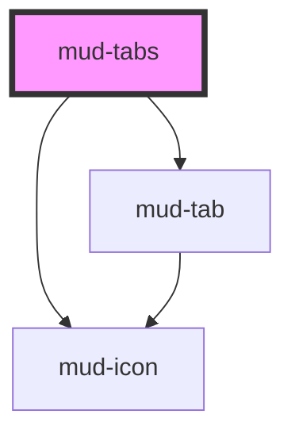

# mud-tabs

<!-- Auto Generated Below -->

## Overview

`mud-tabs` — horizontal tablist that switches the currently visible panel.

Two composition modes:
 1. **Declarative** (recommended for static menus): slot `<mud-tab>` children
    into the default slot and matching `
` blocks
    into the panel slots.
 2. **Data-driven**: pass a `tabs` array. The component renders each entry
    as a child `mud-tab` and exposes panels via `
`
    elements supplied by the consumer.

Pattern A (molecule, slot-based). The host carries `role="tablist"`; the
tabs are rendered children with `role="tab"`; the panels are slotted into
named `panel-{value}` slots and receive `role="tabpanel"` + the matching
`aria-labelledby`.

Keyboard contract (WAI-ARIA Authoring Practices, automatic activation):
- `Tab` focuses the currently selected tab (single tab stop into the group)
- `ArrowLeft` / `ArrowRight` move selection between enabled tabs (wraps)
- `Home` / `End` jump to the first / last enabled tab
- `Enter` / `Space` activate the focused tab (no-op for selected/disabled)

Overflow: when the rendered tabs are wider than the host, the component
exposes leading + trailing chevron buttons that scroll the strip. Both
chevrons are mouse-only; their `aria-hidden="true"` keeps them out of the
keyboard order (arrow keys already move selection without overflow help).

## Properties

| Property         | Attribute         | Description                                                                                                                                                                                   | Type                           | Default     |
| ---------------- | ----------------- | --------------------------------------------------------------------------------------------------------------------------------------------------------------------------------------------- | ------------------------------ | ----------- |
| `ariaLabel`      | `aria-label`      | Accessible name for the tablist. Captured into `resolvedAriaLabel` on mount and the host attribute is stripped to avoid Stencil's auto-reflection loop.                                       | `string \| undefined`          | `undefined` |
| `ariaLabelledby` | `aria-labelledby` | Id of an external labelling element (overrides `aria-label`).                                                                                                                                 | `string \| undefined`          | `undefined` |
| `size`           | `size`            | Size rung. `md` is 48 px tall; `sm` is 40 px tall (mobile + dense layouts).                                                                                                                   | `"md" \| "sm"`                 | `'md'`      |
| `tabs`           | --                | Data-driven tab list. When supplied, the component renders one `<mud-tab>` per entry. Mutually compatible with slotted children — the slotted variant takes precedence when both are present. | `TabDescriptor[] \| undefined` | `undefined` |
| `value`          | `value`           | Value of the currently selected tab. Mutable so that uncontrolled usage (click + keyboard) keeps the host attribute in sync.                                                                  | `string \| undefined`          | `undefined` |

## Events

| Event       | Description                                                               | Type                            |
| ----------- | ------------------------------------------------------------------------- | ------------------------------- |
| `mudChange` | Fires when the selected tab changes. `detail.value` is the new selection. | `CustomEvent<TabsChangeDetail>` |

## Slots

| Slot              | Description                                                                                         |
| ----------------- | --------------------------------------------------------------------------------------------------- |
|                   | Default slot for `<mud-tab>` children.                                                              |
| `"panel-{value}"` | Tab-panel content keyed by the `value` of the matching tab. Exactly one panel is visible at a time. |

## Shadow Parts

| Part              | Description |
| ----------------- | ----------- |
| `"chevron-end"`   |             |
| `"chevron-start"` |             |
| `"panels"`        |             |
| `"scroller"`      |             |
| `"track"`         |             |

## Dependencies

### Depends on

- [mud-tab](.)
- [mud-icon](../mud-icon)

### Graph

----------------------------------------------

*Built with [StencilJS](https://stenciljs.com/)*
