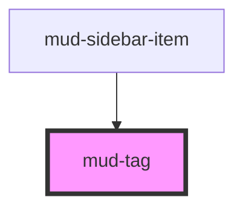

# mud-tag

<!-- Auto Generated Below -->

## Overview

Tag — compact, non-interactive label used to mark state, category,
or supplementary metadata.

Pattern B (atom-visual): the host paints; consumers compose icons
through named slots. Two visual scales coexist behind the same
element:

- `variant="status"` (default) — the standard Status Tag used for
  state ("Activ", "În așteptare", "Refuzat"). Medium-weight label,
  three surface treatments (`subtle`, `strong`, `outlined`) across
  six semantic colors (`muted`, `neutral`, `accent`, `success`,
  `brand`, `danger`).
- `variant="info"` — a lighter inline tag for metadata embedded in
  body text. Regular-weight label, tighter padding. Honors the same
  `type` and `semantic` axes.

Tags are decorative by default. When a tag conveys a dynamic state
to assistive tech ("Procesare în curs"), set the native `aria-label`
attribute and the host will adopt `role="status"` automatically —
otherwise the host stays silent so visual-only tags don't pollute the
a11y tree.

For horizontally stacked groups (8 px gutter, wrap on overflow),
compose multiple tags inside a `mud-tag-group` slot wrapper —
available as a CSS utility on this element via the `group` data
attribute on the parent.

## Properties

| Property   | Attribute  | Description                                                                                                                                                                                        | Type                                                                   | Default     |
| ---------- | ---------- | -------------------------------------------------------------------------------------------------------------------------------------------------------------------------------------------------- | ---------------------------------------------------------------------- | ----------- |
| `disabled` | `disabled` | Renders the disabled design, replacing the `type` × `semantic` colors. Visual only — the tag is not interactive, so the disabled state is announced by the container that owns it, not by the tag. | `boolean`                                                              | `false`     |
| `label`    | `label`    | Fallback label text rendered when the default slot is empty. Plain text only.                                                                                                                      | `string \| undefined`                                                  | `undefined` |
| `semantic` | `semantic` | Semantic color role.                                                                                                                                                                               | `"accent" \| "brand" \| "danger" \| "muted" \| "neutral" \| "success"` | `'neutral'` |
| `size`     | `size`     | Size rung — affects height, padding, icon size, and typography. `md` = 24 px, `sm` = 20 px.                                                                                                        | `"md" \| "sm"`                                                         | `'md'`      |
| `type`     | `type`     | Surface treatment. - `subtle` — tinted background, semantic foreground (default). - `strong` — saturated background, on-color foreground. - `outlined` — transparent fill, semantic 1 px border.   | `"outlined" \| "strong" \| "subtle"`                                   | `'subtle'`  |
| `variant`  | `variant`  | Visual scale. `status` is the standard Status Tag (medium label, three types). `info` is the lighter inline tag for metadata.                                                                      | `"info" \| "status"`                                                   | `'status'`  |

## Slots

| Slot           | Description                                                                                        |
| -------------- | -------------------------------------------------------------------------------------------------- |
|                | (default) The label text. Falls back to the `label` prop.                                          |
| `"icon-end"`   | Optional trailing 16 × 16 visual. Same contract            as `icon-start`.                        |
| `"icon-start"` | Optional leading 16 × 16 visual (`mud-icon`).              Inherits text color via `currentColor`. |

## Dependencies

### Used by

 - [mud-sidebar-item](../mud-sidebar)

### Graph

----------------------------------------------

*Built with [StencilJS](https://stenciljs.com/)*
