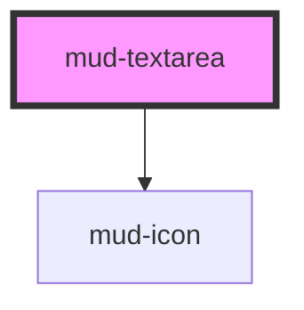

# mud-textarea

<!-- Auto Generated Below -->

## Overview

Text Area — multi-line text-entry control.

Pattern B (atom-interactive, form-associated): renders its own `<textarea>`
inside shadow DOM. Form participation works via `formAssociated` +
`ElementInternals`. Mirrors the `mud-input` contract for label, helper,
error and variant treatment, and adds a vertical resize handle plus an
optional character counter.

## Properties

| Property      | Attribute      | Description                                                                                                                                                                                                              | Type                                                   | Default      |
| ------------- | -------------- | ------------------------------------------------------------------------------------------------------------------------------------------------------------------------------------------------------------------------ | ------------------------------------------------------ | ------------ |
| `ariaLabel`   | `aria-label`   | Accessible name. Mirrors to the internal control's `aria-label` when no visible label is present. Captured into `resolvedAriaLabel` on mount and the host attribute is stripped to avoid Stencil's auto-reflection loop. | `string \| undefined`                                  | `undefined`  |
| `disabled`    | `disabled`     | Disables interactivity. The internal control receives `aria-disabled` and the native `disabled` attribute.                                                                                                               | `boolean`                                              | `false`      |
| `errorText`   | `error-text`   | Plain-text error message shown below the control when `invalid` is set. When present it replaces `helperText` and pairs with the error icon.                                                                             | `string \| undefined`                                  | `undefined`  |
| `helperText`  | `helper-text`  | Plain-text helper / hint shown below the control.                                                                                                                                                                        | `string \| undefined`                                  | `undefined`  |
| `invalid`     | `invalid`      | Forces destructive visuals regardless of `variant`. Sets `aria-invalid`. Use together with `errorText` to surface the message.                                                                                           | `boolean`                                              | `false`      |
| `label`       | `label`        | Plain-text label. Use the `label` slot for richer content.                                                                                                                                                               | `string \| undefined`                                  | `undefined`  |
| `maxLength`   | `maxlength`    | Maximum character length. When set, a character counter renders in the bottom-right corner unless `showCounter` is explicitly `false`.                                                                                   | `number \| undefined`                                  | `undefined`  |
| `name`        | `name`         | Form-control `name`. Used during form submission.                                                                                                                                                                        | `string \| undefined`                                  | `undefined`  |
| `placeholder` | `placeholder`  | Placeholder shown when the control is empty.                                                                                                                                                                             | `string \| undefined`                                  | `undefined`  |
| `readonly`    | `readonly`     | Renders the field read-only. The control remains focusable and copyable.                                                                                                                                                 | `boolean`                                              | `false`      |
| `required`    | `required`     | Marks the field as mandatory. Adds a red asterisk to the label and sets `aria-required` on the internal control.                                                                                                         | `boolean`                                              | `false`      |
| `resize`      | `resize`       | User resize affordance. `'vertical'` lets the user drag the bottom-right grip to grow the control downward; `'none'` locks the height to `rows`.                                                                         | `"none" \| "vertical"`                                 | `'vertical'` |
| `rows`        | `rows`         | Minimum visible rows for the native control. Drives the initial height floor before the user resizes vertically.                                                                                                         | `number`                                               | `4`          |
| `showCounter` | `show-counter` | Force the character counter to show or hide. When `maxLength` is set the counter auto-shows; pass `false` to suppress it. Without `maxLength` the counter is hidden regardless.                                          | `boolean`                                              | `true`       |
| `size`        | `size`         | Visual size rung.                                                                                                                                                                                                        | `"lg" \| "md"`                                         | `'md'`       |
| `value`       | `value`        | Current value of the control. Reflects to the host attribute.                                                                                                                                                            | `string`                                               | `''`         |
| `variant`     | `variant`      | Color treatment. `destructive` is forced when `invalid` is set.                                                                                                                                                          | `"default" \| "destructive" \| "success" \| "warning"` | `'default'`  |

## Events

| Event       | Description                                                                                     | Type                                |
| ----------- | ----------------------------------------------------------------------------------------------- | ----------------------------------- |
| `mudBlur`   | Fires when the internal control loses focus. The native `FocusEvent` is forwarded as-is.        | `CustomEvent<FocusEvent>`           |
| `mudChange` | Fires when the value is committed (typically on `blur`). `detail.value` is the committed value. | `CustomEvent<TextareaChangeDetail>` |
| `mudFocus`  | Fires when the internal control gains focus. The native `FocusEvent` is forwarded as-is.        | `CustomEvent<FocusEvent>`           |
| `mudInput`  | Fires on every keystroke. `detail.value` is the current control value.                          | `CustomEvent<TextareaChangeDetail>` |

## Slots

| Slot       | Description                                                                                             |
| ---------- | ------------------------------------------------------------------------------------------------------- |
| `"helper"` | Rich helper / hint content, replaces the `helper-text` prop. Hidden when invalid + error-text is shown. |
| `"label"`  | Rich label content, replaces the `label` prop when present.                                             |

## Shadow Parts

| Part              | Description |
| ----------------- | ----------- |
| `"captions"`      |             |
| `"control"`       |             |
| `"counter"`       |             |
| `"error"`         |             |
| `"helper"`        |             |
| `"label"`         |             |
| `"native"`        |             |
| `"required-mark"` |             |
| `"resize-grip"`   |             |

## Dependencies

### Depends on

- [mud-icon](../mud-icon)

### Graph

----------------------------------------------

*Built with [StencilJS](https://stenciljs.com/)*
