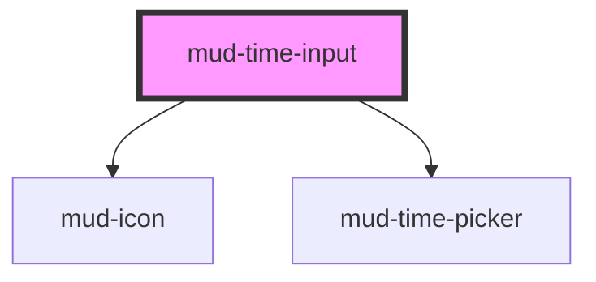

# mud-time-input

<!-- Auto Generated Below -->

## Overview

Time Input — segment-masked `HH:MM` entry with an hour / minute picker.

Pattern B (atom-interactive, form-associated): renders its own `<input>`
inside shadow DOM, like `mud-date-input`, and overlays a ghost format hint
that keeps the unfilled segments visible while the user types. The clock
button opens `mud-time-picker` (Figma Time frame 13807:8471).

## Properties

| Property            | Attribute             | Description                                                                                                                                      | Type                         | Default                                    |
| ------------------- | --------------------- | ------------------------------------------------------------------------------------------------------------------------------------------------ | ---------------------------- | ------------------------------------------ |
| `clearLabel`        | `clear-label`         | Accessible label for the clear (×) button.                                                                                                       | `string`                     | `'Șterge'`                                 |
| `clearable`         | `clearable`           | Shows a trailing clear (×) button while the field holds a value (Figma `👁️ Clear Button` axis). Never shown while empty, disabled or read-only. | `boolean`                    | `false`                                    |
| `disabled`          | `disabled`            | Disables interactivity. The internal control receives `aria-disabled` and the native `disabled` attribute.                                       | `boolean`                    | `false`                                    |
| `errorText`         | `error-text`          | Plain-text error message shown below the control when `invalid` is set. When present it replaces `helperText` and pairs with the error icon.     | `string \| undefined`        | `undefined`                                |
| `helperText`        | `helper-text`         | Plain-text helper / hint shown below the control.                                                                                                | `string \| undefined`        | `undefined`                                |
| `hourErrorText`     | `hour-error-text`     | Message shown when a complete hour segment is outside 00–23.                                                                                     | `string`                     | `'Ora trebuie să fie între 00 și 23'`      |
| `invalid`           | `invalid`             | Forces destructive visuals regardless of `variant`. Sets `aria-invalid`. Use together with `errorText` to surface the message.                   | `boolean`                    | `false`                                    |
| `label`             | `label`               | Plain-text label. Use the `label` slot for richer content.                                                                                       | `string \| undefined`        | `undefined`                                |
| `max`               | `max`                 | Latest accepted time, `HH:MM` inclusive. Later entries get a `range` error.                                                                      | `string \| undefined`        | `undefined`                                |
| `min`               | `min`                 | Earliest accepted time, `HH:MM` inclusive. Earlier entries get a `range` error.                                                                  | `string \| undefined`        | `undefined`                                |
| `minuteErrorText`   | `minute-error-text`   | Message shown when a complete minute segment is outside 00–59.                                                                                   | `string`                     | `'Minutele trebuie să fie între 00 și 59'` |
| `name`              | `name`                | Form-control `name`. Used during form submission.                                                                                                | `string \| undefined`        | `undefined`                                |
| `pickerLabel`       | `picker-label`        | Accessible name of the picker dialog.                                                                                                            | `string`                     | `'Selectează ora'`                         |
| `placeholder`       | `placeholder`         | Placeholder shown when the control is empty. Defaults to `HH:MM`.                                                                                | `string \| undefined`        | `undefined`                                |
| `rangeErrorText`    | `range-error-text`    | Message shown when a complete time is outside `min` / `max`.                                                                                     | `string`                     | `'Ora este în afara intervalului permis'`  |
| `readonly`          | `readonly`            | Renders the field read-only. The control remains focusable and copyable.                                                                         | `boolean`                    | `false`                                    |
| `required`          | `required`            | Marks the field as mandatory. Adds a red asterisk to the label and sets `aria-required` on the internal control.                                 | `boolean`                    | `false`                                    |
| `requiredErrorText` | `required-error-text` | Message shown when a `required` field is empty and a form submit found it so. The same text is the form's validation message.                    | `string`                     | `'Introduceți ora'`                        |
| `size`              | `size`                | Visual size rung.                                                                                                                                | `"lg" \| "md"`               | `'md'`                                     |
| `triggerLabel`      | `trigger-label`       | Accessible label for the clock button that opens the picker.                                                                                     | `string`                     | `'Deschide selectorul de oră'`             |
| `value`             | `value`               | Current display value, `HH:MM` (24-hour). Reflects to the host attribute; typing rewrites it, so consumers can read it back at any time.         | `string`                     | `''`                                       |
| `variant`           | `variant`             | Color treatment. `destructive` is forced when `invalid` is set.                                                                                  | `"default" \| "destructive"` | `'default'`                                |

## Events

| Event       | Description                                                                                                                                                                                              | Type                                 |
| ----------- | -------------------------------------------------------------------------------------------------------------------------------------------------------------------------------------------------------- | ------------------------------------ |
| `mudBlur`   | Fires when the internal control loses focus. The native `FocusEvent` is forwarded as-is.                                                                                                                 | `CustomEvent<FocusEvent>`            |
| `mudChange` | Fires when the value is committed — on `change` (blur), a picker selection or the clear button.                                                                                                          | `CustomEvent<TimeInputChangeDetail>` |
| `mudClear`  | Fires when the user empties the field via the clear (×) button.                                                                                                                                          | `CustomEvent<void>`                  |
| `mudFocus`  | Fires when the internal control gains focus. The native `FocusEvent` is forwarded as-is.                                                                                                                 | `CustomEvent<FocusEvent>`            |
| `mudInput`  | Fires on every keystroke. `detail.value` is the current display value; `detail.isoValue` is the `HH:MM` time when complete and valid, otherwise `null`. `detail.segment` is the segment under the caret. | `CustomEvent<TimeInputTypingDetail>` |

## Slots

| Slot       | Description                                                                                         |
| ---------- | --------------------------------------------------------------------------------------------------- |
| `"helper"` | Rich helper / hint content, replaces the `helper-text` prop. Hidden when an error message is shown. |
| `"label"`  | Rich label content, replaces the `label` prop when present.                                         |

## Shadow Parts

| Part               | Description |
| ------------------ | ----------- |
| `"clear-button"`   |             |
| `"control"`        |             |
| `"error"`          |             |
| `"ghost"`          |             |
| `"helper"`         |             |
| `"label"`          |             |
| `"native"`         |             |
| `"picker-popover"` |             |
| `"required-mark"`  |             |
| `"trailing-icon"`  |             |

## Dependencies

### Depends on

- [mud-icon](../mud-icon)
- [mud-time-picker](../mud-time-picker)

### Graph

----------------------------------------------

*Built with [StencilJS](https://stenciljs.com/)*
