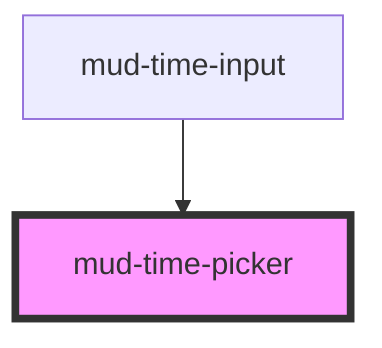

# mud-time-picker

<!-- Auto Generated Below -->

## Overview

Time picker — an hour column and a minute column, the dropdown of
`mud-time-input` (Figma Time frame 13807:8471, dropdown 13810:9450).

The selected value of the column being edited is solid (`.day-cell` Active);
the other column's selected value is tinted (`.day-cell` Middle). Picking an
hour moves on to the minutes while no minute is chosen, and stays on the hour
when one is; picking a minute completes the time and fires `mudChange`.

Keyboard: each column is a listbox with one tab stop. Up / Down move within a
column, Home / End jump to its ends, Left / Right switch columns, Enter or
Space picks the focused option.

## Properties

| Property       | Attribute       | Description                                                                                                                     | Type                                                        | Default     |
| -------------- | --------------- | ------------------------------------------------------------------------------------------------------------------------------- | ----------------------------------------------------------- | ----------- |
| `hoursLabel`   | `hours-label`   | Accessible name of the hour column. Overrides the `locale`'s copy when set to a non-empty string.                               | `string \| undefined`                                       | `undefined` |
| `label`        | `label`         | Accessible name of the picker. Overrides the `locale`'s copy when set to a non-empty string.                                    | `string \| undefined`                                       | `undefined` |
| `locale`       | `locale`        | Language of the built-in copy. Unset, the component follows the closest ancestor `lang` (`<html lang>` included), else `ro-MD`. | `"en-US" \| "ro-MD" \| "ru-MD" \| string & {} \| undefined` | `undefined` |
| `max`          | `max`           | Latest selectable time, `HH:MM` inclusive.                                                                                      | `string \| undefined`                                       | `undefined` |
| `min`          | `min`           | Earliest selectable time, `HH:MM` inclusive.                                                                                    | `string \| undefined`                                       | `undefined` |
| `minutesLabel` | `minutes-label` | Accessible name of the minute column. Overrides the `locale`'s copy when set to a non-empty string.                             | `string \| undefined`                                       | `undefined` |
| `value`        | `value`         | Selected time, `HH:MM` (24-hour). Updated when a time is completed.                                                             | `string \| undefined`                                       | `undefined` |

## Events

| Event       | Description                                                              | Type                                  |
| ----------- | ------------------------------------------------------------------------ | ------------------------------------- |
| `mudChange` | Fires when a time is complete — a minute is picked while an hour is set. | `CustomEvent<TimePickerChangeDetail>` |

## Shadow Parts

| Part          | Description |
| ------------- | ----------- |
| `"columns"`   |             |
| `"option"`    |             |
| `"separator"` |             |

## Dependencies

### Used by

 - [mud-time-input](../mud-time-input)

### Graph

----------------------------------------------

*Built with [StencilJS](https://stenciljs.com/)*
